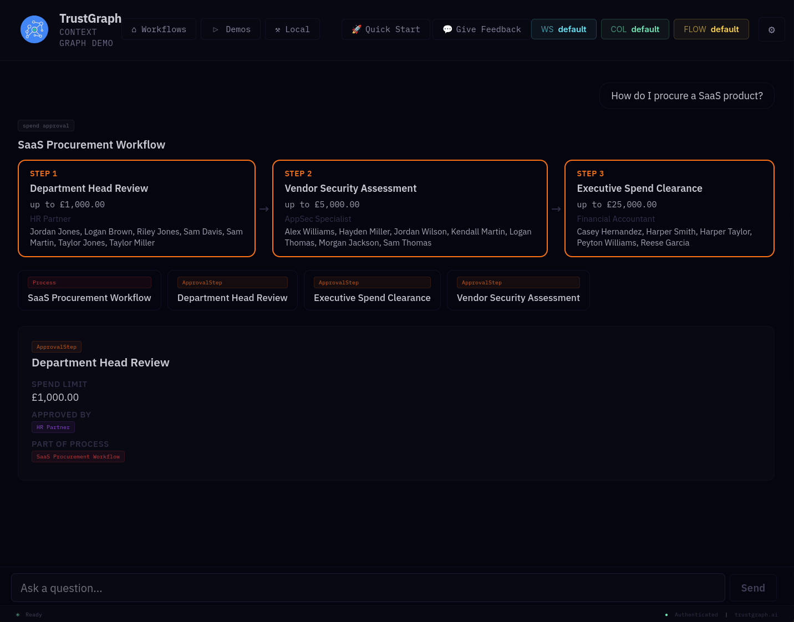

# Build an App

This guide walks you through building a TrustGraph UI plugin from
scratch — from setting up the development environment to a working
application backed by a knowledge graph.

## What you're going to build

An **Office Onboarding & "Who Knows What?" Bot** — a plugin that
indexes a company's internal tools, team roles, project ownership,
and communication channels. The quickstart query: *"Who owns the
payment gateway service, and who can approve my access?"*

This scenario works because everyone understands office hierarchy and
tool access. It showcases a simple 3-hop relationship (Employee → Role
→ Service → Approver) using an everyday workplace scenario.

## The approach

This is a **data-first** process. Before writing any UI code, you'll:

1. Create a simple ontology using a code assistant (or use our
   ready-made example)
2. Generate and load data into the knowledge graph
3. Validate the data with SPARQL queries
4. *Then* build the UI on top of a working data layer

## What you'll need

- A running TrustGraph instance (see the
  [Quickstart](../quickstart/) if you don't have one)
- **Node.js** and **npm** installed
- **Git** for cloning repositories
- A **code assistant** (ChatGPT, Claude, Copilot) — recommended but
  not required. We'll provide ready-made alternatives at each step
- Basic familiarity with React and TypeScript

## Next

[Set up the dev environment](dev-environment) — clone the repos and
get a local UI running.
