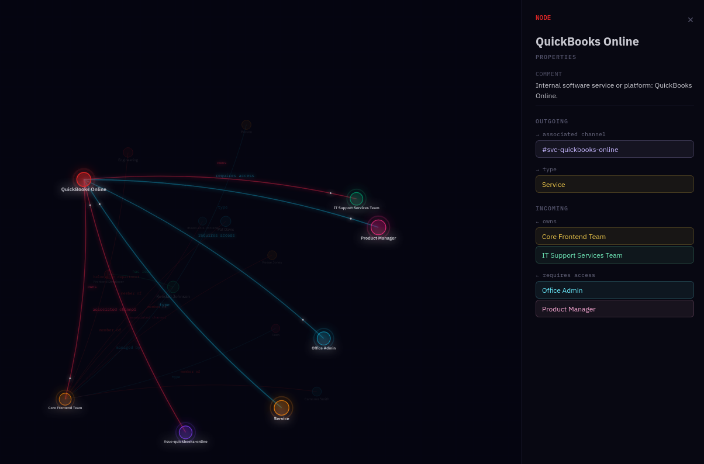

# Load the data

You have a Turtle file with your generated knowledge graph data.
Before loading it, there's an important point to understand.

## Why you need to load both ontology and data

When you load documents through TrustGraph's normal extraction
pipeline, the ontology is used during extraction to guide what
knowledge gets pulled out — and the ontology metadata is stored
alongside the extracted data automatically.

Because we're loading raw Turtle data directly, we're bypassing
that extraction step. The knowledge graph won't have the ontology
metadata unless we load it separately. So we need to load **both**
the ontology and the data into the knowledge graph.

## Load the ontology

```sh
tg-load-knowledge -i urn:doc:onboarding-ontology onboarding.ttl
```

## Load the data

```sh
tg-load-knowledge -i urn:doc:onboarding-data onboarding-data.ttl
```

The `-i` flag sets a document ID — this needs to be an IRI. A simple
`urn:doc:` prefix works fine here.

{: .note }
`tg-load-knowledge` doesn't just load triples into the knowledge
graph — it also arranges for graph embeddings to be computed and
stored in the vector store. This means graph nodes can be discovered
via semantic similarity search, which is how Graph RAG finds
relevant starting points when answering questions.

## Explore the knowledge graph

In the UI, go to the **Workflows** page and select **Graph
Explorer**. You should see the office structure: people, teams,
services, approval chains — all connected according to the ontology.



Click through the nodes and relationships to verify the data looks
right. Try the **Search** to find specific entities — search for a
service name or a person and check their connections.

## Next

[Run queries](queries) — generate documentation and test the data
with SPARQL.
