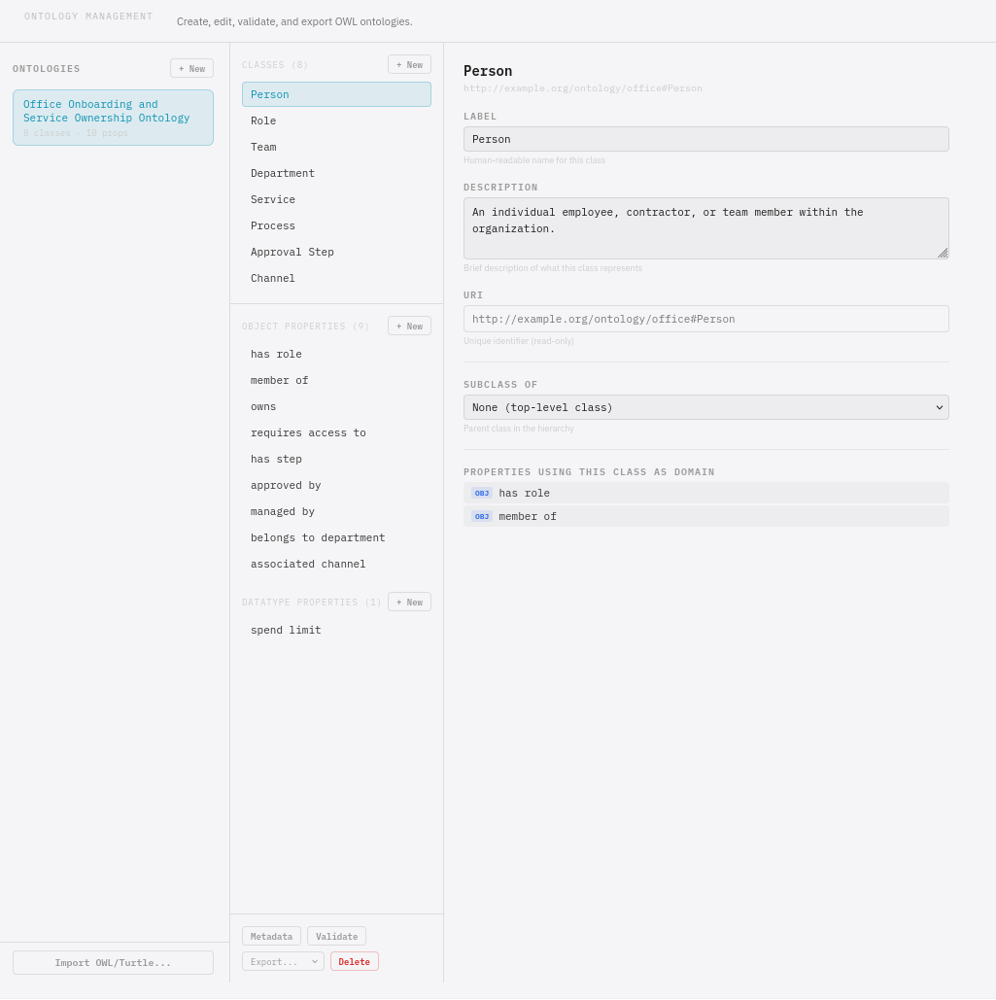

# Load the ontology

You've got an ontology — either generated with a code assistant or
the ready-made one. Now load it into TrustGraph and check it looks
right.

## Import the ontology

In the TrustGraph UI, go to the **Workflows** page and select
**Ontology Management**.

In the bottom left, click **Import OWL/Turtle...**. A file dialogue
opens — select the `.ttl` file you created (or the ready-made
`onboarding.ttl`).

The ontology should load and you'll see the classes and properties
displayed in the viewer.

## Check it looks right

Review what was imported:

- Are all the expected classes there? (Person, Role, Team,
  Department, Service, Process, ApprovalStep, Channel)
- Do the object properties connect the right classes? (hasRole,
  memberOf, owns, requiresAccess, hasStep, approvedBy, managedBy)
- Are the labels and comments present and readable?

## Next

[Generate data](generate-data) — create a knowledge graph for the
onboarding scenario.
