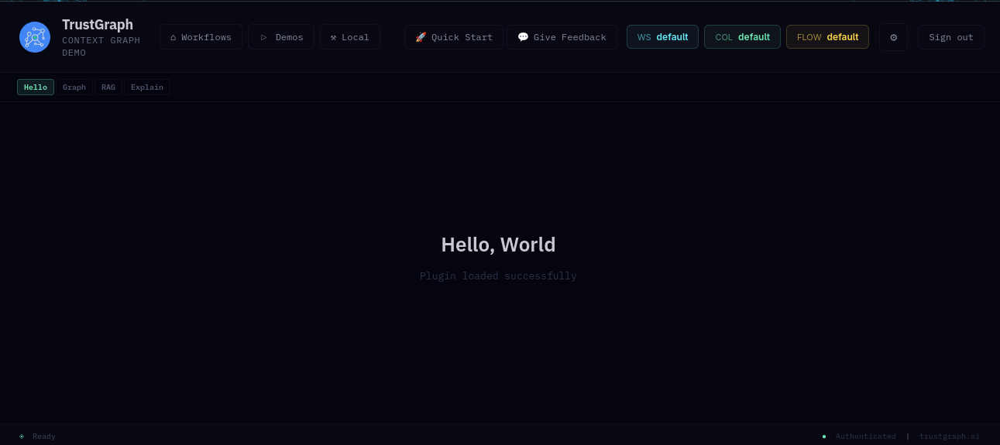

# Set up the plugin

Now that the UI is running locally, you need a plugin to work with.
The plugin template gives you a working starting point.

## Clone the plugin template

In a separate directory (not inside `trustgraph-ui`):

```sh
git clone https://github.com/trustgraph-ai/ui-plugin-template.git
cd ui-plugin-template
npm install
npm run build
```

This builds the plugin so it's ready to load.

## Configure the plugin build output

By default the template builds to `template.iife.js`. To rename it
to `onboarding.iife.js`, make two changes in the plugin directory:

1. In `package.json`, replace `template.iife.js` with
   `onboarding.iife.js`
2. In `vite.config.js`, replace `template` with `onboarding`

Then rebuild:

```sh
npm run build
```

Check that `dist/onboarding.iife.js` exists — if it's still called
`template.iife.js`, double-check the changes above.

## Link the plugin into the UI

The UI loads plugins from the `packages/portal/public/plugins/`
directory. When you build the plugin, the output goes into the `dist/`
directory in the plugin repo. Symlink this into the UI so the dev
server picks it up automatically whenever you rebuild the plugin:

```sh
cd trustgraph-ui
ln -s /path/to/ui-plugin-template/dist/onboarding.iife.js \
  packages/portal/public/plugins/onboarding.iife.js
```

Replace `/path/to/ui-plugin-template` with the actual path to your
cloned plugin directory.

Verify the symlink works:

```sh
cat packages/portal/public/plugins/onboarding.iife.js | head -1
```

You should see the first line of the built JavaScript. If you get a
"No such file or directory" error, check the symlink path and make
sure you've run `npm run build` in the plugin directory.

## Register the plugin

Edit `packages/portal/public/config/components.json`. This file
contains an array of tab groups, each with a `components` array. Find
the **Demos** tab and add an entry for your plugin:

```json
{
  "id": "onboarding",
  "title": "Onboarding Bot",
  "icon": "△",
  "paletteKey": "cyan",
  "description": "Office onboarding and 'who knows what?' bot.",
  "url": "/plugins/onboarding.iife.js",
  "globalName": "TemplatePlugin"
}
```

The `url` must match the symlinked filename. The `globalName` must
match the global name exported by the plugin build. Our template uses
TemplatePlugin.  Make sure the new entry is separated from adjacent
entries by commas - missing commas in JSON are a common source of load
failures.

In your browser, do a hard reload (Shift-reload) to pick up the
new configuration. Navigate to the **Demos** tab — you should see
your Onboarding Bot plugin listed. Click it to confirm it loads.

The template plugin has a few tabs — the first is a "Hello World"
tab. If you can see that, the plugin is loaded and working.



{: .note }
If the plugin doesn't appear, open your browser's developer tools
(F12) and check the Console tab for plugin load errors — this will
usually tell you if the filename, path, or `globalName` doesn't
match.

## Next

[Test the round-trip](round-trip) — make a small change and confirm
the edit-build-reload cycle works.
