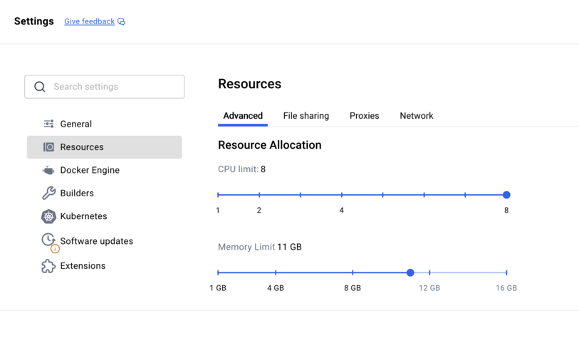
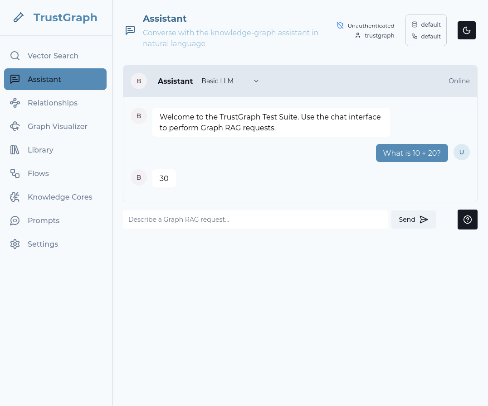
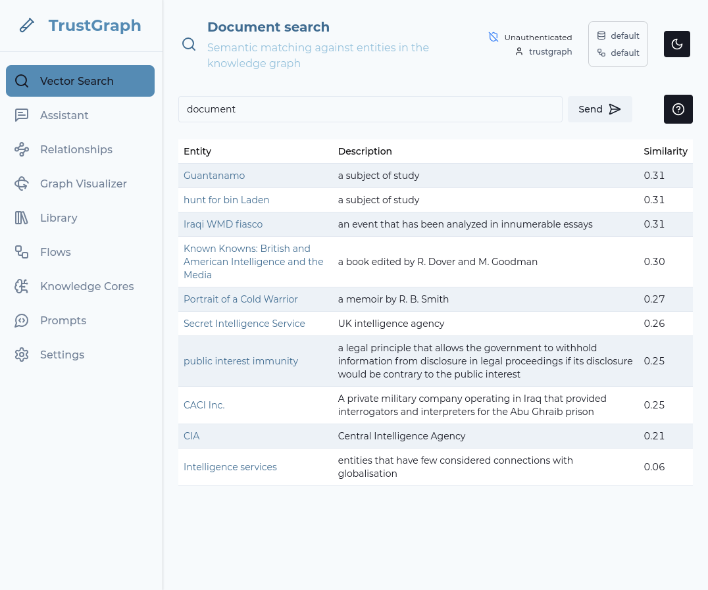
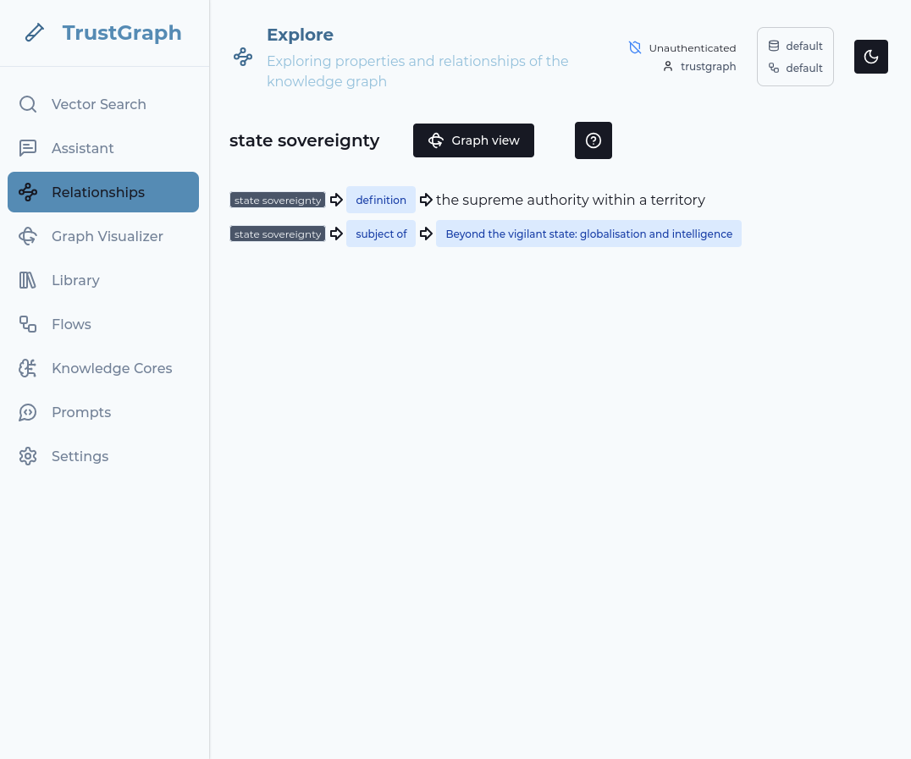

# Docker/Podman compose deployment


<ul style="margin: 0; padding-left: 20px;">
<li>Machine with 12GB+ RAM and 8 CPUs available for TrustGraph to use - a 16GB Macbook or laptop will probably cope</li>
<li>Docker Engine or Podman installed (see below)</li>
<li>Python 3 for CLI tools (see below)</li>
<li>Access to an LLM (cloud service like VertexAI, AWS Bedrock, or local with Ollama)</li>
<li>Basic command-line familiarity</li>
</ul>




## Overview

Docker and Podman are popular container hosting environments which run on
many types of system.  Docker was the original container engine and runs on
Linux, MacOS and Windows.  Podman uses the Linux-kernel container
capabilities, and can also run on MacOS.  Podman is an open-source alternative
built to be highly compatible with Docker engine.

Docker and Podman both have a "compose" utility which lets you easily
manage a group of running containers.  This guide takes you through
launching TrustGraph using Docker/Podman compose.

Using Docker/Podman is the easiest way to launch a TrustGraph, because you
can run it on a standalone environment.  If you have a desktop/laptop
with enough resources, you can run TrustGraph directly on that device.

This is a good way to get started for local development and testing,
proof-of-concept building, small-scale experiments, or just to learn more.

## Getting ready

### System resources

As mentioned above, you need a machine with at least 12GB of RAM and 8 CPUs
available for TrustGraph.  That means if you're running other significant
resources on it, it will probably fail. We can run TrustGraph on 16GB
Macbook, but not when other things are running.

You can also deploy an instance to your favourite cloud provider and use
that.

This has been tested with Linux, MacOS and Windows devices.

### Python

You need to have Python 3 installed to run the command-line tools.  You
should use a newer version, Python 3.11 or later.

<details>

<summary>Specific guidance for MacOS</summary>

<div markdown="1">
MacOS X-Code is the usual way to get developer tools on your Macbook.  Note
that X-Code doesn't track later Python versions (Python 3.9)?  If you're
on MacOS you should consider using Homebrew to install Python3, and
making sure that the Homebrew version of Python takes priority over
the default OS version.  You can run the `python` command to see what
version of Python you have installed as the default.
</div>

<div markdown="1">
```
Python 3.14.2 (main, Dec  5 2025, 00:00:00) [GCC 15.2.1 20251111 (Red
Hat 15.2.1-4)] on linux
Type "help", "copyright", "credits" or "license" for more information.
>>> 
```
</div>

</details>

### Docker / Podman

For Windows / MacOS it is recommended to use Docker.  For Linux, Podman is
natively available with all major distributions.  You will need to have this
installed before running this installation.

- [Install Docker Engine](https://docs.docker.com/engine/install/)
- [Install Podman Machine](http://podman.io/)

{: .note }
If you are using Docker desktop, you may need to review the resource settings
as described in this section.

<details>

<summary>Resource settings for Docker desktop</summary>

<div>
Note that if you are using Docker desktop, there are CPU and memory limits
which can be applied to limit the resources set aside for containers.
If you find that containers get stuck unresourced, you will need to allocate
more resources.  We run with 12GB of RAM and 8 CPUs allocated to TrustGraph.
These settings are on the *Settings* tab under *Resources*.
</div>



</details>

### Large Language Model

You need to have access to an LLM.  TrustGraph can work with many different
kinds of LLM.  You can use a cloud-hosted service, or have an LLM hosted
locally on your device or network.  TrustGraph can work with small models
which you can run on standard home/office equipment,
but small models are still demanding on resources.  A 16GB Macbook is able to
run an LLM but likely not at the same time as running all the containers which
make up a TrustGraph deployment.

Here are some example ways to get an LLM to run:

| Provider | Description | Access type |
|----------|-------------|----------|
| **Google Cloud VertexAI** | This is a subscription-based service which is part of Google Cloud. The Gemini models are good and cost-effective.  There are free credits for new users. | Cloud subscription |
| **AWS Bedrock** | Amazon's managed LLM service with Claude, Mistral, and other models available. Running Claude on Bedrock is a good option. | Cloud subscription |
| **Azure** | Microsoft's cloud subscription services include Machine Learning Services (MLS) and Cognitive Services (CS). The TrustGraph *Azure* integration can use the MLS service, while *Azure OpenAI* can use CS models. | Cloud subscription |
| **Anthropic Claude** | Integrates with Anthropic's APIs directly for access to the Claude models. Claude models are very capable. | API subscription |
| **Mistral AI** | Integrates with Mistral's APIs directly for access to the Mistral models. | API subscription |
| **OpenAI** | Integrates with OpenAI's API for GPT models | API subscription |
| **Ollama** | Run models locally on your machine. Supports Llama, Mistral, and many others. | Self-hosted |
| **vLLM** | The most comprehensive self-hosted model engine | Self-hosted |
| **LMStudio** | Desktop application for running local LLMs with an OpenAI-compatible API. LMStudio is a very user-friendly experience, which makes it easier to diagnose and solve hosting problems. Note: LMStudio is free, but only for non-work-related use. | Self-hosted |

Using a cloud-hosted service is a good starting point - you will need a
subscription, but no extra hardware.  If you do want to run an LLM locally,
you will need a device with a good GPU, and likely some experience of
running this yourself as you may need to debug model / hosting issues.

### A word on networking and self-hosting

If you are self-hosting a model on the same device you are intending
to run TrustGraph, you will need to understand how to get TrustGraph
to talk to your model service.

If you are trying to connect TrustGraph to a service running on the host,
read [Container networking and self-hosted models](container-networking).

If you are trying to connect TrustGraph to a service running on WSL,
read [WSL networking and self-hosted models](wsl-networking).

## Prepare the deployment

### Create configuration

Use the
[TrustGraph Configuration Builder](https://config-ui.demo.trustgraph.ai/)
to generate your deployment configuration.  By default, the configurator
selects the newest stable deployment.  To be compatible with this installation guide, you should make sure to use a version later than 1.8.9.

{: .note }
Remember the version number it is set up to deploy, you will need to know that to install CLI tools!

1. **Select Deployment**: Choose Docker Compose or Podman Compose
2. **Graph Store**: Select Cassandra (recommended for ease of use)
3. **Vector Store**: Select Qdrant (recommended for ease of use)
4. **Chunker Settings**: 
   - Type: Recursive
5. **LLM Model**: Choose your preferred model as discussed above
6. **Output Tokens**: 2048 is a safe default, 4096 works for most models,
   8192 for the biggest models
7. **Customization**: Leave defaults
8. **Finish Deployment**: Click 'Generate' and then Download the
   deployment bundle
   
## Unpack the configuration

The configuration builder will download a `.zip` file containing your
deployment configuration which will be downloaded to your device in
e.g. a Downloads directory.  You need to find that zip file, and interact
with it in a terminal.  You can use the `unzip` command to list the
contents of the ZIP file.  There should be a `docker-compose.yaml` file
which is used to launch TrustGraph.  There are also various configuration
files for TrustGraph, Grafana, Garage, Loki and Prometheus.

```sh
unzip -l deploy.zip 
```

The output should look something like this:

```sh
Archive:  deploy.zip
  Length      Date    Time    Name
---------  ---------- -----   ----
    26353  01-06-2026 23:04   docker-compose.yaml
   208539  01-06-2026 23:04   trustgraph/config.json
      581  01-06-2026 23:04   garage/garage.toml
     4084  01-06-2026 23:04   grafana/dashboards/log-dashboard.json
    36032  01-06-2026 23:04   grafana/dashboards/overview-dashboard.json
      336  01-06-2026 23:04   grafana/provisioning/dashboard.yml
      773  01-06-2026 23:04   grafana/provisioning/datasource.yml
     1518  01-06-2026 23:04   loki/local-config.yaml
     5259  01-06-2026 23:04   prometheus/prometheus.yml
---------                     -------
   283475                     9 files
```

You should use the terminal window to create a suitable directory for your
work and unpack the ZIP file e.g.

```sh
mkdir -p ~/trustgraph
cd ~/trustgraph
unzip ~/Downloads/deploy.zip
```

It is possible that this is all you need to prepare to launch the
containers.  If you are having problems launching TrustGraph you might
consider modifying the unpacked configuration for environments
where container engines use stricter access policies:

<details>
<summary>Remove file access restrictions</summary>

<div markdown="1">
The first thing you might try doing is add read permissions to the files
for any user on your system.  This may be necessary if your system has
stricter access control policies on the files that can be read by containers.
</div>

<div markdown="1">
```sh
find garage/ loki/ prometheus/ grafana/ trustgraph/ -type f | xargs chmod 644
find garage/ loki/ prometheus/ grafana/ trustgraph/ -type d | xargs chmod 755
```
</div>

<div markdown="1">
This adds global-read access of these configuration files to any user on your
system, which may be a problem if you have multiple users accessing the
system.
</div>

</details>

<details>
<summary>Configure SElinux access controls</summary>

<div markdown="1">
On Linux, if you are running SElinux, it may also be necessary to grant
particular SElinux permissions to the configuration files so that they
can be read by Linux:
</div>

<div markdown="1">
```sh
sudo chcon -Rt svirt_sandbox_file_t garage/ loki/ grafana/ prometheus/ trustgraph/
```
</div>

</details>

## Install CLI tools

You need to have access to TrustGraph client tools.  In the terminal
window you created above, install a virtual environment, and the
TrustGraph CLI tools.  Make sure the version number of the CLI tools
matches the version you chose to build a configuration for earlier.
i.e. replace `1.8.9` with the version you used earlier.

```sh
python3 -m venv env
. env/bin/activate
pip install trustgraph-cli==1.8.9
```

## Configure LLM

Depending on which LLM you selected, there are some configuration settings
you need to prepare:

<details>
<summary>Specific guidance for Azure</summary>
<div markdown="1">
There are 2 hosted model options for Azure:

- Machine Learning Services (MLS)
- Cognitive Services (CS)

TrustGraph's *Azure* is for integration with MLS.  *Azure OpenAI* is for
integration with CS.  If you are using the *Azure* / MLS integration, you
should make sure you know your model endpoint, and the token granted for the
endpoint, and configure these values thus:
```
export AZURE_ENDPOINT=https://ENDPOINT.API.HOST.GOES.HERE/
export AZURE_TOKEN=TOKEN-GOES-HERE
```
If you are using the *Azure OpenAI* / CS integration, you should make sure
you know your model endpoint, the token and configure them thus:
```
export AZURE_ENDPOINT=https://ENDPOINT.API.HOST.GOES.HERE/
export AZURE_TOKEN=TOKEN-GOES-HERE
```
</div>
</details>

<details>
<summary>Specific guidance for AWS Bedrock</summary>
<div markdown="1">
To use Bedrock, you need to have AWS credentials provisioned.
The easiest way is to create an IAM user, and create credentials for this
user.  When you provision the user, you will be asked to give the user
permissions.  To allow Bedrock access, the `AmazonBedrockFullAccess`
role should be added.

You would then provision credentials which would give you an *access key ID*
and a *secret access key*.  You should pick the identifier of an
AWS region to connect to e.g. `eu-west-2`.  In order to prepare to deploy,
you should set three environment variables using the information.

```
export AWS_ACCESS_KEY_ID=ID-KEY-HERE
export AWS_SECRET_ACCESS_KEY=TOKEN-GOES-HERE
export AWS_DEFAULT_REGION=AWS-REGION-HERE
```

Note: You should be very careful with AWS cloud credentials provisioned
this way: if lost or leaked this provides a malicious person access to the
AWS resources you gave this user.
</div>
</details>

<details>
<summary>Specific guidance for Anthropic Claude</summary>
<div markdown="1">
To use Anthropic's Claude models directly, sign up for API access at
[console.anthropic.com](https://console.anthropic.com/). Create an API key
from the dashboard. Set the key as an environment variable:

```
export CLAUDE_KEY=sk-ant-api03-xxxxx
```
</div>
</details>

<details>
<summary>Specific guidance for Cohere</summary>
<div markdown="1">
To use Cohere's models, sign up at [cohere.com](https://cohere.com/) and
create an API key from your dashboard. Set the key as an environment variable:

```
export COHERE_KEY=your-cohere-api-key-here
```
</div>
</details>

<details>
<summary>Specific guidance for Google AI Studio</summary>
<div markdown="1">
To use Google's Gemini models via AI Studio, visit
[aistudio.google.com](https://aistudio.google.com/) and generate an API key.
Set the key as an environment variable:

```
export GOOGLE_AI_STUDIO_KEY=your-api-key-here
```
</div>
</details>

<details>
<summary>Specific guidance for Llamafile / llama.cpp server</summary>
<div markdown="1">
If running a llamafile or llama.cpp server locally, configure the URL to point
to your server. The URL must include the `/v1` path:

```
export LLAMAFILE_URL=http://host.containers.internal:7000/v1
```

Note: Use `host.containers.internal` to reference services on your host machine
from within containers.
</div>
</details>

## Launch TrustGraph


```sh
docker-compose -f docker-compose.yaml up -d
```



```sh
podman-compose -f docker-compose.yaml up -d
```




### Verify startup

It can take around 40 - 120 seconds for all services to stabilize. Services
like Pulsar and Cassandra need time to initialize properly.
There is a utility which runs a series of checks to verify the system
as it starts and reports when the system is working successfully.

```sh
tg-verify-system-status
```

If everything is working, the output looks something like this:

```
============================================================
TrustGraph System Status Verification
============================================================

Phase 1: Infrastructure
------------------------------------------------------------
[00:00] ⏳ Checking Pulsar...
[00:03] ⏳ Checking Pulsar... (attempt 2)
[00:03] ✓ Pulsar: Pulsar healthy (0 cluster(s))
[00:03] ⏳ Checking API Gateway...
[00:03] ✓ API Gateway: API Gateway is responding

Phase 2: Core Services
------------------------------------------------------------
[00:03] ⏳ Checking Processors...
[00:03] ✓ Processors: Found 34 processors (≥ 15)
[00:03] ⏳ Checking Flow Classes...
[00:06] ⏳ Checking Flow Classes... (attempt 2)
[00:09] ⏳ Checking Flow Classes... (attempt 3)
[00:22] ⏳ Checking Flow Classes... (attempt 4)
[00:35] ⏳ Checking Flow Classes... (attempt 5)
[00:38] ⏳ Checking Flow Classes... (attempt 6)
[00:38] ✓ Flow Classes: Found 9 flow class(es)
[00:38] ⏳ Checking Flows...
[00:38] ✓ Flows: Flow manager responding (1 flow(s))
[00:38] ⏳ Checking Prompts...
[00:38] ✓ Prompts: Found 16 prompt(s)

Phase 3: Data Services
------------------------------------------------------------
[00:38] ⏳ Checking Library...
[00:38] ✓ Library: Library responding (0 document(s))

Phase 4: User Interface
------------------------------------------------------------
[00:38] ⏳ Checking Workbench UI...
[00:38] ✓ Workbench UI: Workbench UI is responding

============================================================
Summary
============================================================
Checks passed: 8/8
Checks failed: 0/8
Total time: 00:38

✓ System is healthy!
```

The *Checks failed* line is the most interesting and is hopefully zero.  If
you are having issues, look at the troubleshooting section later.

If everything appears to be working, the following parts of the deployment
guide are a whistle-stop tour through various parts of the system.

## Load sample documents

There is a utility which loads a small set of sample documents into the
library.  This does not initiate processing, but gives you a set of documents
to test with:

```sh
tg-load-sample-documents
```

This downloads documents from the internet and caches them in a local
directory, so that the load is quicker if you need to do it again.
The download can take a little time to run.

## Workbench

TrustGraph is bundled with a simple web interface which exercises most of
the functionality.

Access the TrustGraph workbench at
[http://localhost:8888/](http://localhost:8888/)

By default, there are no credentials.

You should be able to navigate to the Flows tab, and see a single
*default* flow running.  The guide will return to the workbench to load
a document.

## Monitoring dashboard

Access Grafana monitoring at [http://localhost:3000/](http://localhost:3000/)

**Default credentials:**
- Username: `admin`
- Password: `admin`

All TrustGraph components collect metrics using Prometheus and make these
available using this Grafana workbench.  The Grafana deployment is
configured with 2 dashboards, the first is an Overview metrics dashboard
which shows processing metrics.  For a newly launched system, the metrics
won't be particularly interesting.

There is also a Logs dashboard which shows collated TrustGraph container
logs.

## Check the LLM is working

Back in the workbench, select the *Assistant* tab.

In the top line next to the *Assistant* word change the mode to *Basic LLM*.

Enter a question in the prompt box at the bottom of the tab and press
*Send*.  If everything works, after a short period you should see
a response to your query.



If LLM interactions are not working, this needs to be diagnosed and fixed
prior to continuing.  You should check the logs in Grafana to see if there
are errors.

## Working with a document

### Load a document

Back in the workbench:

1. Navigate to the Library page
2. In the upper right-hand corner, there is a dark/light mode widget.
   To its left, is a selector width.  Ensure the top and bottom lines say
   "default".  If not click on the widget and change.
2. On the library tab, select a document (e.g., "Beyond State Vigilance")
3. Click Submit on the action bar
4. Choose a processing flow (use Default processing flow)
5. Click Submit to process

Beyond State Vigilance is a relatively short document, so a good one to
start with.

### Use Vector search

Select the *Vector Search* tab.  Enter a string e.g. "document" in the search
bar, and hit RETURN.  The search term doesn't matter a great deal.  If
information has started to load, you should see some search results.

The vector search attempts to find up to 10 terms which are the closest
matches for your search term.  It does this even if the search terms are not
a strong match, so this is a simple way to observe whether data has loaded.



### Look at knowledge graph

Click on one of the Vector Search results terms on the left-hand-side.
This shows relationships in the graph from the knowledge graph linking to
that term.



You can then click on the *Graph view* button to go to a 3D view of the
discovered relationships.

### Query with Graph RAG

1. Navigate to *Assistant* tab
2. Change the Assistant mode to GraphRAG
3. Enter your question (e.g., "What is this document about?")
4. You will see the answer to your question after a short period

## Shutting down

### Clean shutdown

Once you have finished with your system, you can close it down.
The easiest way is to reverse the launch operation you ran up:


```bash
docker-compose -f docker-compose.yaml down -v -t 0
```



```bash
podman-compose -f docker-compose.yaml down -v -t 0
```




The `-v` option specifies to delete all data volumes.  The `-t 0` option
directs to close down containers without delay - the default is to wait for
clean shutdown.

### Manual cleanup

If the compose shutdown has problems, you can check and see what containers
are running with the `docker`/`podman` tools.



```bash
# Confirm no containers running
docker ps

# Confirm volumes removed
docker volume ls
```



```bash
# Confirm no containers running
podman ps

# Confirm volumes removed
podman volume ls
```




## Troubleshooting

### Common Issues

**Services Not Starting:**
- Wait 120 seconds for full initialization
- Check container status: `docker ps -a`
- Review logs: `docker-compose logs [service-name]`

**Memory Issues:**
- Ensure sufficient RAM (8GB recommended)
- Monitor resource usage: `docker stats`

**Connection Issues:**
- Verify ports are available (8888, 3000)
- Check firewall settings
- Ensure Docker daemon is running

### Debugging Commands

```bash
# Check all containers
docker ps -a

# View logs for specific service
docker-compose logs [service-name]

# Check system resources
docker stats

# Verify TrustGraph flows
tg-show-flows

# Check processor state
tg-show-processor-state
```

## Next Steps

- **Guides**: See [Guides](../guides) for things you can do with your running
  TrustGraph

MODEL STUFF

Ollama:

export OLLAMA_HOST=http://ollama-host:11434


    
    


export LLAMAFILE_URL=LLAMAFILE-URL

export LMSTUDIO_URL=http://localhost:1234

export MISTRAL_TOKEN=TOKEN-GOES-HERE

export OLLAMA_HOST=http://ollama-host:11434

export OPENAI_TOKEN=TOKEN-GOES-HERE


chcon -Rt svirt_sandbox_file_t vertexai/


MCP_SERVER_SECRET


GATEWAY_SECRET


