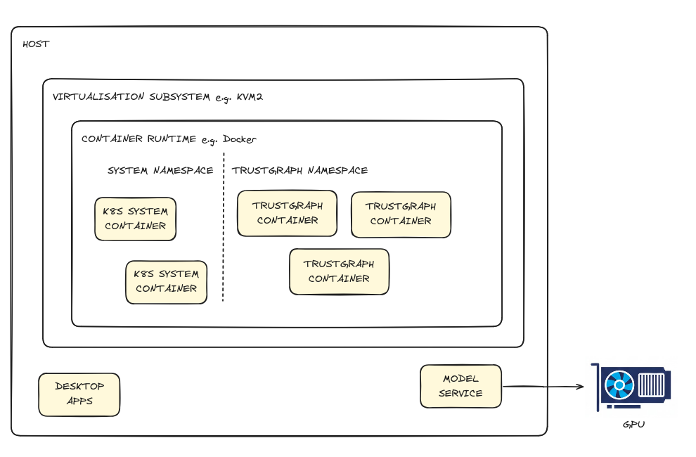

# Minikube Deployment


<ul style="margin: 0; padding-left: 20px;">
<li>Machine with 14.5GB RAM and 9 virtual CPUs / threads available for TrustGraph to use - a 16GB laptop is going to be too limited</li>
<li>Minikube installed and configured</li>
<li>kubectl command-line tool</li>
<li>Python 3.11+ for CLI tools</li>
<li>Access to an LLM (cloud service like VertexAI, AWS Bedrock, or local with Ollama)</li>
<li>Basic command-line and basic Minikube familiarity</li>
</ul>




## Overview

Minikube is a tool that runs a single-node Kubernetes cluster on your local
machine. It's designed for developers who want to learn Kubernetes or test
applications in a Kubernetes environment without needing access to a full
cloud-based cluster.

Running TrustGraph on Minikube provides a production-like environment for
development and testing. This deployment method offers:

- **Kubernetes-native deployment** with local development capabilities
- **Production-like environment** for testing in a more realistic environment
  than Docker Compose.
- **Resource isolation** and management
- **LoadBalancer** and service discovery testing

This is a good way to learn TrustGraph in a Kubernetes environment before
deploying to production clusters, or to test Kubernetes-specific features
locally.

{: .note }
We also describe a [Docker Compose/Podman Compose](compose) deployment.
The Minikube deployment requires more resources for the cluster.

## Getting ready

### System resources

As mentioned above, you need a machine with at least 14.5GB of RAM and 9 CPUs
available for TrustGraph. That means if you're running other significant
workloads on it, it will probably fail. A 16GB device is too
limited.

A Kubernetes deployment is a little more demanding than a Docker Compose
deployment, because:
- With a Kubernetes deployment, there are Kubernetes system services which
  are deployed alongside your application, and count as part of the resource
  requirement.
- Kubernetes has a stricter resource allocation mechanism when resource
  constraints are defined.  The Kubernetes resource allocation approach has
  a major advantage for production / persistent deployments because there
  are guarantees that the resources are available as the system gets loaded.

You can also deploy an instance to your favourite cloud provider, and
run Minikube on that if you don't have a device with enough resources.

This has been tested with Linux.  Minikube will run on MacOS and Windows, 
but it has not been tested.

### Python

You need to have Python 3 installed to run the command-line tools. You
should use a newer version, Python 3.11 or later.

<details>

<summary>Specific guidance for MacOS</summary>

<div markdown="1">
MacOS X-Code is the usual way to get developer tools on your Macbook. Note
that X-Code doesn't track later Python versions (Python 3.9)? If you're
on MacOS you should consider using Homebrew to install Python3, and
making sure that the Homebrew version of Python takes priority over
the default OS version. You can run the `python` command to see what
version of Python you have installed as the default.
</div>

<div markdown="1">
```
Python 3.14.2 (main, Dec  5 2025, 00:00:00) [GCC 15.2.1 20251111 (Red
Hat 15.2.1-4)] on linux
Type "help", "copyright", "credits" or "license" for more information.
>>>
```
</div>

</details>

### Minikube and kubectl

You need to have Minikube and kubectl installed:

- [Install Minikube](https://minikube.sigs.k8s.io/docs/start/)
- [Install kubectl](https://kubernetes.io/docs/tasks/tools/)

Minikube requires a driver for virtualization.  Minikube supports many
driver types - the level of support and maturity differs between them.
Docker is commonly used.  We've had most success with the `kvm2` driver.
This has been supported by Minikube for a long period.  The `podman`
driver has been well supported for a while.

- [Full Minikube driver documentation](https://minikube.sigs.k8s.io/docs/drivers/)

### Large Language Model



### A word on networking and self-hosting

If you are self-hosting a model on the same device you are intending
to run Minikube, you will need to understand how to get TrustGraph
to talk to your model service.

Minikube has many options for how things are deployed, so it is beyond
the scope of this guide to cover all of them.  Minikube works by using
a virtualisation system to run the container engine, but there are several
layers:
- The host device, that runs everything, including desktop apps if you
  are on a desktop device.
- Minikube runs a virtualisation layer on the host, there are many options
  for the virtualisation layer, including Docker.
- The virtualisation layer is used to run a container runtime, and there
  are several options for that as well, including a Docker runtime.
- The Kubernetes control play and various Containers run inside this
  container runtime.
  


It's too complicated to explain all of the intricacies that emerge
from this arrangement.  Minikube simplifies host access by making the
hostname `host.minikube.internal` map to the host from within containers.
So, to access ollama on your host machine on port 11434, you would configure
access to the address

```
http://host.minikube.internal:11434
```

## Prepare the deployment

## Start Minikube

Minikube needs to be started with enough resources. As mentioned earlier,
this is roughly 9 CPUs and 14.5GB of memory.  You can specify the
virtualisation driver here.  Minikube supports many virtualisation
mechanisms, KVM2 is the driver we have used with most consistent results.

```bash
minikube start --cpus=9 --memory=14848 --driver=kvm2
```

Startup looks something liek this:
```
😄  minikube v1.37.0 on Ubuntu 25.10
✨  Using the kvm2 driver based on user configuration
👍  Starting "minikube" primary control-plane node in "minikube" cluster
🔥  Creating kvm2 VM (CPUs=9, Memory=14848MB, Disk=20000MB) ...
🐳  Preparing Kubernetes v1.34.0 on Docker 28.4.0 ...
🔗  Configuring bridge CNI (Container Networking Interface) ...
🔎  Verifying Kubernetes components...
    ▪ Using image gcr.io/k8s-minikube/storage-provisioner:v5
🌟  Enabled addons: storage-provisioner, default-storageclass
🏄  Done! kubectl is now configured to use "minikube" cluster and "default" namespace by default
```

By default, Minikube deploys 20GB of storage for the Kubernetes deployment.
You can change this with the `--disk-size` option.

When Minikube starts, it configures access to the Kubernetes cluster
in your default `~/.kube/config` so that you can use `kubectl` to access
the cluster.

### Verify Minikube

You can check the status of the Minikube cluster:

```sh
minikube status
```

You can check the status of the Kubernetes cluster:

```sh
kubectl cluster-info
```

And see the nodes.  Minikube only supports a single node:

```sh
kubectl get nodes
```

### Create configuration

Use the
[TrustGraph Configuration Builder](https://config-ui.demo.trustgraph.ai/)
to generate your deployment configuration. By default, the configurator
selects the newest stable deployment. To be compatible with this installation guide, you should make sure to use a version later than 1.8.9.

{: .note }
Remember the version number it is set up to deploy, you will need to know that to install CLI tools!

1. **Select Deployment**: Choose Minikube
2. **Graph Store**: Select Cassandra (recommended for ease of use)
3. **Vector Store**: Select Qdrant (recommended for ease of use)
4. **Chunker Settings**:
   - Type: Recursive
5. **LLM Model**: Choose your preferred model as discussed above
6. **Output Tokens**: 2048 is a safe default, 4096 works for most models,
   8192 for the biggest models
7. **Customization**: Leave defaults
8. **Finish Deployment**: Click 'Generate' and then Download the
   deployment bundle

## Unpack the configuration

The configuration builder will download a `.zip` file containing your
deployment configuration which will be downloaded to your device in
e.g. a Downloads directory.  You need to find that zip file, and interact
with it in a terminal.  You can use the `unzip` command to list the
contents of the ZIP file.  There should be a `resources.yaml` file
which is used to launch TrustGraph.

```sh
unzip -l deploy.zip 
```

The output should look something like this:

```sh
Archive:  deploy.zip
  Length      Date    Time    Name
---------  ---------- -----   ----
   300102  2026-01-09 13:30   resources.yaml
---------                     -------
   300102                     1 file
```
You should create a suitable directory for your work and move the YAML file
there:

```sh
mkdir -p ~/trustgraph
cd ~/trustgraph
unzip ~/Downloads/deploy.zip .
```

## Install CLI tools

You need to have access to TrustGraph client tools. In the terminal
window you created above, install a virtual environment, and the
TrustGraph CLI tools. Make sure the version number of the CLI tools
matches the version you chose to build a configuration for earlier.
i.e. replace `1.8.9` with the version you used earlier.

```sh
python3 -m venv env
. env/bin/activate
pip install trustgraph-cli==1.8.9
```

## Deploy TrustGraph

Now you're ready to deploy TrustGraph to your Minikube cluster.

### Apply Kubernetes configuration

We'll offer you 2 options for deploying the configuration.

1. The simplest, in terms of commands, is to deploy the `resource.yaml`
   file, and then add the secret configuration.
2. The second, is to deploy the namespace, configure extra settings,
   and then deploy the application.  This has the advantage that
   everything gets started with the resources it needs, so you'll end up
   with a running system in quicker order.

So, option 1 is to run this command with the `resources.yaml` file you
unpacked earlier:
```bash
kubectl apply -f resources.yaml
```

This creates all the necessary Kubernetes resources (deployments, services,
configmaps, etc.) for TrustGraph.  Some resources will fail to start until the
configuration is complete, plus restart times.

Continue by deploying secrets below.

Option 2 is to deploy just the namespace.  You need to have the `yq` utility
installed for this command to work:

```sh
yq '.items[] | select(.kind == "Namespace")' resources.yaml | \
  kubectl apply -f -
```

## Configure LLM settings

Depending on which LLM you selected, you need to create a Kubernetes secret
with your credentials or configuration.



### Configure security settings

First, create the security secrets. For this local deployment, we set these to
empty strings to disable authentication:

```bash
kubectl -n trustgraph create secret generic gateway-secret \
    --from-literal=gateway-secret=""

kubectl -n trustgraph create secret generic mcp-server-secret \
    --from-literal=mcp-server-secret=""
```

The `mcp-server-secret` protects the MCP server with a secret but is not fully
implemented yet. The `gateway-secret` provides single-secret protection for
the gateway API, which does not currently support comprehensive API
security. For a local non-networked deployment, it is safe to disable
authentication by setting these to empty strings.

### Finish configuration

If you went with option 1, there is no more configuration to do, but you
may have to wait a while.  Parts of the system will have started, realised
the configuration wasn't present, and backed off for a while.

If you want with option 2, you finish by deploying the rest of the system:

```sh
kubectl apply -f resources.yaml
```

At this point you should have all the necessary Kubernetes resources
(deployments, services, configmaps, etc.) for TrustGraph.

At this point, you should wait until resources have started before
continuing.  This shows the running workloads:

```sh
kubectl -n trustgraph get pods
```

The result for a working system will look something like this.  Pods
should be running.  We run 3 initialisation containers which exit once
their work is done, so it's OK for those to be in a failed state.

```
NAME                                        READY   STATUS             RESTARTS        AGE
agent-manager-74fbb8b64-nzlwb               1/1     Running            0               67m
api-gateway-b6848c6bb-nqtdm                 1/1     Running            0               67m
bookie-5b8f57c985-d665l                     1/1     Running            1 (63m ago)     67m
cassandra-6765fff974-pbh65                  1/1     Running            0               67m
chunker-5449fddbf4-zgc5s                    1/1     Running            0               67m
config-svc-7ff5684cbb-j2rbl                 1/1     Running            0               67m
ddg-mcp-server-5b6d456cd9-lttts             1/1     Running            0               67m
document-embeddings-6f57c977b8-5ksqt        1/1     Running            0               67m
document-rag-67857f95b5-n8klg               1/1     Running            0               67m
embeddings-8688f5875b-8wrxb                 1/1     Running            0               67m
garage-69bbc995bb-ggsbd                     1/1     Running            0               67m
garage-init-5c59cdc77f-hz46c                0/1     CrashLoopBackOff   17 (2m7s ago)   67m
grafana-795dcfc9bf-ctsxv                    1/1     Running            0               67m
graph-embeddings-7b75fd6845-hrh9v           1/1     Running            0               67m
graph-rag-7f4bc95f7-q4jpl                   1/1     Running            0               67m
init-trustgraph-7798b9d4f8-qzdgt            0/1     CrashLoopBackOff   17 (57s ago)    67m
kg-extract-agent-7f6f754fb9-d5fh5           1/1     Running            0               67m
kg-extract-definitions-54b454d784-2pkc2     1/1     Running            0               67m
kg-extract-objects-5cdbdfdcc4-j885c         1/1     Running            0               67m
kg-extract-ontology-7557fd7dc-2gf6j         1/1     Running            0               67m
kg-extract-relationships-7cbf57d9b7-qnv47   1/1     Running            0               67m
kg-manager-678c57d885-ptv9m                 1/1     Running            0               67m
kg-store-6bc8b9c9b7-5chdr                   1/1     Running            0               67m
librarian-75c8f6d7fb-98rkc                  1/1     Running            0               67m
loki-8d5b86fb5-s9k4d                        1/1     Running            0               67m
mcp-server-56bd6c4d6-788nw                  1/1     Running            0               67m
mcp-tool-698f4b898b-ggm6l                   1/1     Running            0               67m
metering-57d9fccdd-m45vp                    1/1     Running            0               67m
metering-rag-5b9f8d5495-cnxsv               1/1     Running            0               67m
nlp-query-9666cf9b6-wmzwv                   1/1     Running            0               67m
pdf-decoder-69fd89776b-2cfpj                1/1     Running            0               67m
prometheus-54995cff86-dc58n                 1/1     Running            0               67m
prompt-899b97d7d-5rd6m                      1/1     Running            0               67m
prompt-rag-5dc4f4b89b-qqvw7                 1/1     Running            0               67m
pulsar-d85499879-x92qv                      1/1     Running            0               67m
pulsar-init-6cd9ff4fbb-m5j7t                0/1     CrashLoopBackOff   16 (22s ago)    67m
qdrant-58497bc84-rm9gm                      1/1     Running            0               67m
query-doc-embeddings-5f6985ffd6-5qh9s       1/1     Running            0               67m
query-graph-embeddings-588bd9779-7ddbb      1/1     Running            0               67m
query-objects-bcd6fd894-w9bm7               1/1     Running            0               67m
query-triples-55549dc477-bdcgj              1/1     Running            0               67m
store-doc-embeddings-dbf4b7c69-w998d        1/1     Running            0               67m
store-graph-embeddings-7885698676-vf422     1/1     Running            0               67m
store-objects-655bf8b975-jcg2r              1/1     Running            0               67m
store-triples-7c59c67f6-d8hbs               1/1     Running            0               67m
structured-diag-86c58cd45b-54w8m            1/1     Running            0               67m
structured-query-67fdff6967-7kljs           1/1     Running            0               67m
text-completion-58ccf95586-6gkff            1/1     Running            0               67m
text-completion-rag-75fc684f58-82jjm        1/1     Running            0               67m
workbench-ui-5fc6d59899-8rczf               1/1     Running            0               67m
zookeeper-66c484c7d5-67578                  1/1     Running            0               67m
```

### Launch LoadBalancer

**In a separate terminal window:**

```bash
minikube tunnel
```

This command

```
Status:	
	machine: minikube
	pid: 465861
	route: 10.96.0.0/12 -> 192.168.39.34
	minikube: Running
	services: [agent-manager, api-gateway, bookie, cassandra, chunker, config-svc, ddg-mcp-server, document-embeddings, document-rag, embeddings, garage, grafana, graph-embeddings, graph-rag, kg-extract-agent, kg-extract-definitions, kg-extract-objects, kg-extract-ontology, kg-extract-relationships, kg-manager, kg-store, librarian, loki, mcp-server, mcp-tool, metering, metering-rag, nlp-query, pdf-decoder, prometheus, prompt, prompt-rag, pulsar, qdrant, query-doc-embeddings, query-graph-embeddings, query-objects, query-triples, store-doc-embeddings, store-graph-embeddings, store-objects, store-triples, structured-diag, structured-query, text-completion, text-completion-rag, workbench-ui, zookeeper]
    errors: 
		minikube: no errors
		router: no errors
		loadbalancer emulator: no errors
```

{: .note }
Keep this terminal window open. The LoadBalancer must remain
running for cluster communications to be accessible from 'outside' the
cluster.

### Verify startup

It can take around 40 - 120 seconds for all services to stabilize. Services
like Pulsar and Cassandra need time to initialize properly.
There is a utility which runs a series of checks to verify the system
as it starts and reports when the system is working successfully.

```sh
tg-verify-system-status
```

If everything is working, the output looks something like this:

```
============================================================
TrustGraph System Status Verification
============================================================

Phase 1: Infrastructure
------------------------------------------------------------
[00:00] ⏳ Checking Pulsar...
[00:03] ⏳ Checking Pulsar... (attempt 2)
[00:03] ✓ Pulsar: Pulsar healthy (0 cluster(s))
[00:03] ⏳ Checking API Gateway...
[00:03] ✓ API Gateway: API Gateway is responding

Phase 2: Core Services
------------------------------------------------------------
[00:03] ⏳ Checking Processors...
[00:03] ✓ Processors: Found 34 processors (≥ 15)
[00:03] ⏳ Checking Flow Classes...
[00:06] ⏳ Checking Flow Classes... (attempt 2)
[00:09] ⏳ Checking Flow Classes... (attempt 3)
[00:22] ⏳ Checking Flow Classes... (attempt 4)
[00:35] ⏳ Checking Flow Classes... (attempt 5)
[00:38] ⏳ Checking Flow Classes... (attempt 6)
[00:38] ✓ Flow Classes: Found 9 flow class(es)
[00:38] ⏳ Checking Flows...
[00:38] ✓ Flows: Flow manager responding (1 flow(s))
[00:38] ⏳ Checking Prompts...
[00:38] ✓ Prompts: Found 16 prompt(s)

Phase 3: Data Services
------------------------------------------------------------
[00:38] ⏳ Checking Library...
[00:38] ✓ Library: Library responding (0 document(s))

Phase 4: User Interface
------------------------------------------------------------
[00:38] ⏳ Checking Workbench UI...
[00:38] ✓ Workbench UI: Workbench UI is responding

============================================================
Summary
============================================================
Checks passed: 8/8
Checks failed: 0/8
Total time: 00:38

✓ System is healthy!
```

The *Checks failed* line is the most interesting and is hopefully zero. If
you are having issues, look at the troubleshooting section later.

If everything appears to be working, the following parts of the deployment
guide are a whistle-stop tour through various parts of the system.

## Load sample documents

There is a utility which loads a small set of sample documents into the
library. This does not initiate processing, but gives you a set of documents
to test with:

```sh
tg-load-sample-documents
```

This downloads documents from the internet and caches them in a local
directory, so that the load is quicker if you need to do it again.
The download can take a little time to run.

## Workbench

TrustGraph is bundled with a simple web interface which exercises most of
the functionality.

{: .note }
<!-- FIXME: Need to verify the correct way to access workbench in Minikube - is it through a service with LoadBalancer, port-forward, or minikube service command? -->
**FIXME**: Instructions needed for accessing the Workbench UI in Minikube. This may require port-forwarding or using `minikube service` command.

Access the TrustGraph workbench at the appropriate URL (see FIXME above).

By default, there are no credentials.

You should be able to navigate to the Flows tab, and see a single
*default* flow running. The guide will return to the workbench to load
a document.

## Monitoring dashboard

{: .note }
<!-- FIXME: Need to verify if Grafana is deployed in the Minikube configuration and how to access it -->
**FIXME**: Instructions needed for accessing Grafana monitoring in Minikube. Verify if Grafana is included in the Kubernetes deployment and provide access instructions.

If Grafana is deployed, access it at the appropriate URL.

**Default credentials:**
- Username: `admin`
- Password: `admin`

All TrustGraph components collect metrics using Prometheus and make these
available using this Grafana workbench. The Grafana deployment is
configured with 2 dashboards, the first is an Overview metrics dashboard
which shows processing metrics. For a newly launched system, the metrics
won't be particularly interesting.

There is also a Logs dashboard which shows collated TrustGraph container
logs.

## Check the LLM is working

Back in the workbench, select the *Assistant* tab.

In the top line next to the *Assistant* word change the mode to *Basic LLM*.

Enter a question in the prompt box at the bottom of the tab and press
*Send*. If everything works, after a short period you should see
a response to your query.


If LLM interactions are not working, this needs to be diagnosed and fixed
prior to continuing. You should check the logs to see if there are errors:

```bash
# Check logs for text-completion service
kubectl -n trustgraph logs -l app=text-completion

# Or use Grafana logs dashboard if available
```

## Working with a document

### Load a document

Back in the workbench:

1. Navigate to the Library page
2. In the upper right-hand corner, there is a dark/light mode widget.
   To its left, is a selector widget. Ensure the top and bottom lines say
   "default". If not click on the widget and change.
2. On the library tab, select a document (e.g., "Beyond State Vigilance")
3. Click Submit on the action bar
4. Choose a processing flow (use Default processing flow)
5. Click Submit to process

Beyond State Vigilance is a relatively short document, so a good one to
start with.

### Use Vector search

Select the *Vector Search* tab. Enter a string e.g. "document" in the search
bar, and hit RETURN. The search term doesn't matter a great deal. If
information has started to load, you should see some search results.

The vector search attempts to find up to 10 terms which are the closest
matches for your search term. It does this even if the search terms are not
a strong match, so this is a simple way to observe whether data has loaded.


### Look at knowledge graph

Click on one of the Vector Search results terms on the left-hand-side.
This shows relationships in the graph from the knowledge graph linking to
that term.


You can then click on the *Graph view* button to go to a 3D view of the
discovered relationships.

### Query with Graph RAG

1. Navigate to *Assistant* tab
2. Change the Assistant mode to GraphRAG
3. Enter your question (e.g., "What is this document about?")
4. You will see the answer to your question after a short period

You can also test GraphRAG from the command line:

```bash
tg-invoke-graph-rag -q "What is this document about?"
```

## Troubleshooting

### Service Failure

<details>
<summary>Run out of memory</summary>
<div markdown="1">

*Diagnosis:*

Check which pods are running. Init containers (names ending in `-init`)
should show `Completed` - this is normal. Other pods should be running.

```bash
# Show all pods
kubectl -n trustgraph get pods

# Find OOM-killed pods (look for OOMKilled status)
kubectl -n trustgraph get pods | grep -i oom

# Inspect a failed pod for details
kubectl -n trustgraph describe pod <pod-name> | grep -A 5 "OOMKilled\|Error"
```

Look for `"OOMKilled": true` or error messages in the describe output.

*Resolution:*

- Increase memory allocation when starting Minikube:
  ```bash
  minikube stop
  minikube start --cpus=9 --memory=16384
  ```
- **Alternative**: Run on a machine with more available memory (20GB+ recommended)

</div>
</details>

<details>
<summary>Hitting major CPU resource limits</summary>
<div markdown="1">

*Diagnosis:*

System is very slow to start, taking several minutes to become available.
Operations are sluggish. Check CPU load:

```bash
# Check node resources
kubectl -n trustgraph top nodes

# Check pod resource usage
kubectl -n trustgraph top pods
```

If CPU usage remains very high for an extended period during startup
and operations, this indicates insufficient CPU resources.

*Resolution:*

Increase CPU allocation when starting Minikube:
```bash
minikube stop
minikube start --cpus=12 --memory=11264
```

TrustGraph requires 9 CPUs minimum, but more cores will improve
performance significantly.

</div>
</details>

<details>
<summary>Image Pull Issues</summary>
<div markdown="1">

*Diagnosis:*

Check for pods in ImagePullBackOff or ErrImagePull status:

```bash
# Check pod status
kubectl -n trustgraph get pods

# View pod events for image pull errors
kubectl -n trustgraph get events | grep -i "pull\|image"

# Describe a specific pod
kubectl -n trustgraph describe pod <pod-name>
```

Look for errors mentioning image pull failures, authentication issues, or network problems.

*Resolution:*

- **Network connectivity**: Ensure Minikube has internet access
- **Image registry access**: Verify you can reach the container registry
- **Authentication**: If using a private registry, ensure credentials are configured
- **Retry**: Sometimes transient network issues resolve themselves:
  ```bash
  kubectl -n trustgraph delete pod <pod-name>
  # Kubernetes will recreate the pod
  ```

</div>
</details>

<details>
<summary>LoadBalancer Not Starting</summary>
<div markdown="1">

*Diagnosis:*

The `minikube tunnel` command fails or services remain in Pending state:

```bash
# Check service status
kubectl -n trustgraph get services

# Check Minikube status
minikube status
```

Look for services with EXTERNAL-IP showing `<pending>`.

*Resolution:*

- Ensure `minikube tunnel` is running in a separate terminal window
- The tunnel command requires sudo/administrator privileges
- Check Minikube driver is working: `minikube config view`
- Restart the tunnel:
  ```bash
  # Stop existing tunnel (Ctrl+C)
  minikube tunnel
  ```

</div>
</details>

<details>
<summary>Application error</summary>
<div markdown="1">

*Diagnosis:*

Find failed pods and examine their logs:

```bash
# Show all pods with status
kubectl -n trustgraph get pods

# View logs for a specific pod
kubectl -n trustgraph logs <pod-name>

# Follow logs in real-time
kubectl -n trustgraph logs -f <pod-name>

# View logs for a specific container in a multi-container pod
kubectl -n trustgraph logs <pod-name> -c <container-name>
```

Alternatively, view aggregated logs in the Grafana dashboard if available.

*Resolution:*

Resolution depends on the specific error message. Common issues include
configuration errors, missing environment variables, missing secrets, or
service dependencies not being ready.

</div>
</details>

### LLM Failure

<details>
<summary>LLM configuration error</summary>
<div markdown="1">

*Diagnosis:*

The system appears to be running but LLM connectivity is not working. Test LLM
connectivity:

```bash
tg-invoke-llm '' 'What is 2+2'
```

A long timeout or error indicates LLM configuration issues. Check the logs:

```bash
# Check text-completion service logs
kubectl -n trustgraph logs -l app=text-completion
```

Look for errors indicating LLM connection failures.

*Resolution:*

Review the LLM configuration settings in the [Configure LLM settings](#configure-llm-settings)
section. Common issues include:
- Missing or incorrect API keys
- Wrong endpoint URLs
- Missing `/v1` suffix for self-hosted models
- Incorrect `host.minikube.internal` hostname for local services
- Secrets not created properly in Kubernetes

Verify your secrets are created:
```bash
kubectl -n trustgraph get secrets
```

</div>
</details>

<details>
<summary>Locally-hosted LLM connectivity error</summary>
<div markdown="1">

*Diagnosis:*

Check the logs for connectivity errors:

```bash
kubectl -n trustgraph logs -l app=text-completion
```

Look for errors indicating connection refused, timeouts, or unreachable
hosts when attempting to connect to your LLM service.

*Resolution:*

Review your network connectivity and addressing configuration:

- Verify your LLM service is running and accessible from your host
- Check the URL configuration for your LLM (environment variables)
- For services on the same host, ensure you're using `host.minikube.internal`
  as the hostname
- Verify the correct port number
- Ensure URLs include `/v1` suffix where required
- Test connectivity from within Minikube:
  ```bash
  kubectl run -it --rm debug --image=curlimages/curl --restart=Never -- \
    curl -v http://host.minikube.internal:11434
  ```

See also:
- [WSL networking and self-hosted models](wsl-networking)

</div>
</details>

### Kubernetes-Specific Issues

<details>
<summary>Pods stuck in Pending state</summary>
<div markdown="1">

*Diagnosis:*

```bash
# Check pod status
kubectl -n trustgraph get pods | grep Pending

# Describe a pending pod
kubectl -n trustgraph describe pod <pod-name>
```

Look for scheduling failures, resource constraints, or node conditions.

*Resolution:*

- **Insufficient resources**: Increase Minikube resources (see above)
- **PersistentVolume issues**: Check PV/PVC status:
  ```bash
  kubectl -n trustgraph get pv,pvc
  ```
- **Node issues**: Check node status:
  ```bash
  kubectl describe node minikube
  ```

</div>
</details>

<details>
<summary>Pods in CrashLoopBackOff</summary>
<div markdown="1">

*Diagnosis:*

```bash
# Find crashing pods
kubectl -n trustgraph get pods | grep CrashLoopBackOff

# View logs from crashed container
kubectl -n trustgraph logs <pod-name> --previous
```

*Resolution:*

Check the previous logs to identify why the container is crashing. Common causes:
- Application errors (fix the configuration)
- Missing dependencies (ensure all required services are running)
- Incorrect environment variables or secrets
- Resource limits too low (increase in deployment configuration)

</div>
</details>

### Debug Commands

```bash
# Check cluster info
kubectl cluster-info

# Get all resources in trustgraph namespace
kubectl -n trustgraph get all

# Check node resources
kubectl describe node minikube

# View recent events
kubectl -n trustgraph get events --sort-by=.metadata.creationTimestamp

# Check Minikube logs
minikube logs

# Check specific service endpoints
kubectl -n trustgraph get endpoints
```

## Shutting down

### Clean shutdown

Once you have finished with your system, you can close it down.

```bash
# Remove TrustGraph deployment
kubectl delete -f trustgraph-minikube.yaml

# Stop Minikube
minikube stop

# Optional: Delete Minikube cluster (removes all data)
minikube delete
```

The `minikube delete` command completely removes the Minikube cluster and all
its data. Only use this if you want to start completely fresh.

### Verify cleanup

```bash
# Check no pods remain in trustgraph namespace
kubectl -n trustgraph get all

# Verify Minikube status
minikube status
```

If you deleted the cluster, `minikube status` should indicate no cluster exists.

## Next Steps

- **Guides**: See [Guides](../guides) for things you can do with your running
  TrustGraph
- **Production Kubernetes**: Scale to full Kubernetes clusters
- **Cloud Deployment**: Explore AWS EKS, GCP GKE, or Azure AKS for managed Kubernetes
