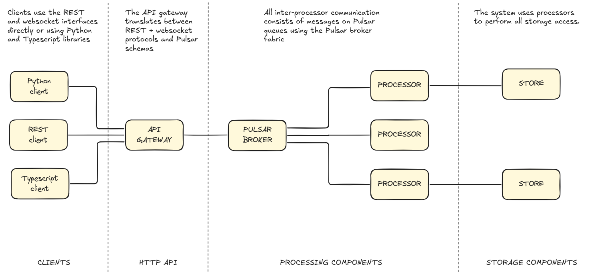

# Introduction to building with TrustGraph


<ul style="margin: 0; padding-left: 20px;">
<li>A basic understanding of TrustGraph</li>
<li>A basic understanding of development terminology tools</li>
</ul>




## Architecture

TrustGraph provides multiple integration points for building applications.

The TrustGraph system is open and complete API-centric.  All TrustGraph
functionality is built on open APIs, and you can use those APIs to build
applications.

### Client interfaces

Choose from Python, REST, or TypeScript clients to interact with TrustGraph. All clients connect through the API gateway using REST and WebSocket protocols.

### API gateway

The gateway translates between HTTP protocols and Pulsar messaging,
handling protocol conversion and message routing.  The HTTP API supports
REST and websocket interfaces.  Most functionality is available in both
HTTP request and websocket form.  The websocket interface supports
greater concurrent use as well as real-time / streaming responses.

### Processing components

Processors communicate via Pulsar message queues using the Pulsar broker fabric. This messaging architecture enables scalable, asynchronous processing workflows.

### Storage

All data persistence uses dedicated storage processors that interface with the storage layer.

## Development tasks

### Command-line automation

Use TrustGraph CLI tools to build simple scripts and automation workflows.
This allows some simple functionality to be used in scripts.  For anything
more complex, the Python library offers more integration options.

Command-line tools mostly interact with the API gateway.

→ See [Getting started with TrustGraph command-line tools](cli-tools)

### Client integration

The Python library provides complete coverage of TrustGraph functionality.

Integrate TrustGraph into Python applications using the Python library for
document processing, graph queries, and custom workflows.

The command-line utilities largely work by interacting with the API gateway,
and are written in Python, so provide some good working examples for
how to use the Python library.

→ See [Building with the Python API](python-api)

### Web applications

Build browser-based interfaces using the TypeScript libraries with
React or other frameworks.

→ See [Introduction to the TypeScript libraries](typescript-libraries)

→ See [Building a simple application with React and TypeScript](react-app)

### Custom processing

Add new processing components to extend TrustGraph's capabilities with
custom transformations, extractors, or analyzers.  Processors are programs
which integrate with Pulsar and use all common processing patterns.

New processors can form part of TrustGraph's dataflow and integrate with
existing processing.

→ See [Adding your own processing](custom-processing)

