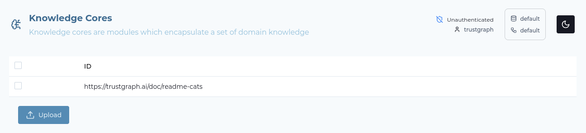
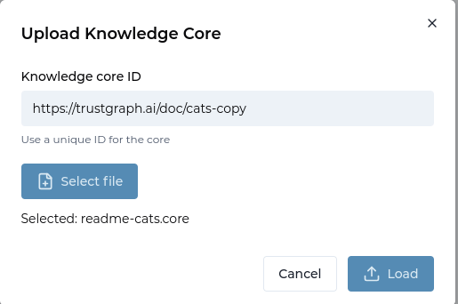
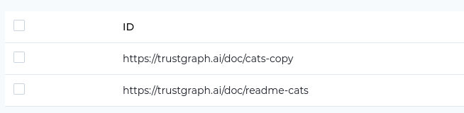

# Working with Context Cores Using CLI


<ul style="margin: 0; padding-left: 20px;">
<li>TrustGraph instance running</li>
<li>Familiarity with knowledge cores concepts</li>
</ul>




This guide covers the same knowledge core workflow as the [Working with Context Cores guide](../context-cores/), but using command-line tools instead of the Workbench.

**New to knowledge cores?** Read the [Working with Context Cores guide](../context-cores/) first to understand what cores are and their lifecycle (offline → online → loaded).

This guide demonstrates:
- Creating flows with core extraction enabled
- Downloading cores via CLI
- Uploading cores to other instances
- Loading cores into retrieval stores

## Step-by-Step Guide

### Step 1: Load Your Document

Download and load the example document:
```
wget -O README.cats https://raw.githubusercontent.com/trustgraph-ai/example-data/refs/heads/main/cats/README.cats
```

And use a command-line utility to load the document into the TrustGraph
library:

```
tg-add-library-document \
  --name "README.cats" \
  --description "Brief description of cats" \
  --tags cats,animals \
  --id https://trustgraph.ai/doc/readme-cats \
  --kind text/plain \
  README.cats
```

You can then see the document in the library:

```
$ tg-show-library-documents
+-------+---------------------------------------+
| id    | https://trustgraph.ai/doc/readme-cats |
| time  | 2026-01-15 19:50:49                   |
| title | README.cats                           |
| kind  | text/plain                            |
| note  | Brief description of cats             |
| tags  | cats, animals                         |
+-------+---------------------------------------+
```

#### Workbench

- Download [the document](https://raw.githubusercontent.com/trustgraph-ai/example-data/refs/heads/main/tracking/operation-phantom-cargo.md)
- Go the 'Library' page
- Click 'Upload documents'
- Set the title: README.cats
- Set the Comments to: Brief description of cats
- Set keywords: cats, animals
- Select 'Text' for the upload operation
- Click 'Select text files'
- Add the document you just downloaded
- Click Submit


### Step 2: Create a Collection

A collection is used to organise a set of related documents or data sources
into a single unit.  Retrieval operations operate across a single collection.

We'll create an 'intelligence' collection:

#### Command-line

```
tg-set-collection -n Cats -d 'Cat information' cats
```

#### Workbench

- Go to the 'Library' page
- Select the 'Collections' tab
- Click 'Create Collection'
- Set the ID: cats
- Set the name: Cats
- Set the description to: Cat information
- Click 'Submit'

### Step 3: Create the Flow

A flow describes the collection of processing operations.  We're going
to create a single flow for Graph RAG processing.

To create context cores, you need to be running a flow which contains the
**kg-store** processor.  The system ships two flow blueprints that
contain core creation: `everything` and `document-rag+graph-rag+kgcore`.
The system starts up with a single flow `default` based on the `everything`
blueprint, so that flow is able to do core building.

We'll create a `core-building` flow.

#### Command-line

This command allows you to add parameters for LLM model, temperature etc.
but we're just going to use the defaults:

```
tg-start-flow -n document-rag+graph-rag+kgcore -i core-building -d "Core building"
```

#### Workbench

Let's take a detour via the **Flow blueprints** page.  Go to the
**Settings** page, and make sure **Flow blueprints** is selected on the
feature list.

Select **Flow blueprints** on the sidebar, and you'll see the
blueprints table.  Blueprints provide processing patterns.


The two flows `everything` and `document-rag+graph-rag+kgcore` have
core creation in the description.

To launch a flow:
- Go to the 'Flows' page
- Click 'Create'
- Select the flow blueprint 'GraphRAG + DocumentRAG + knowledge core creation'
- Set the ID: core-building
- Set the description: Core building
- Click 'Create'

### Step 4: Submit the Document for Processing

This pushes the document into the flow input.

#### Command-line

This command submits the document for processing.  You need to specify
the flow ID (`core-building`) and the document ID which was used when the
document was added to the library in step 1.  The collection ID is
that which was used to create the collection.
Processing objects need an ID, and you can make up any string:

```
tg-start-library-processing \
    --flow-id core-building \
    --document-id https://trustgraph.ai/doc/readme-cats \
    --collection cats \
    --processing-id urn:processing-03
```

#### Workbench

There is a selection widget top right of the screen with an database icon
top left.


Click that to open the collection/flow selector, and select the
Cats collection, and core-building, both of which you created earlier.

You are ready to submit the document:

- Go to the 'Library' page
- Select the README.cats document so that the tick box is selected
- Click 'Submit' at the bottom of the page
- Change the Processing flow to **Core building**
- Click Submit

### Step 5: Monitoring

If you want to see the document loading, you can go to Grafana at
[`http://localhost:3000`](http://localhost:3000).  The default
login user is admin, password admin.  Grafana is configured with a single
dashboard.  Some useful things to monitor are:

The pub/sub backlog.  You can monitor the size of queues in Pulsar.
GraphRAG knowledge extraction causes a queue of chunks for processing in
knowledge extraction and you can see this in the backlog:


There is also a knowledge extraction backlog graph which helps to see
knowledge extraction if other queues are being exercised:


To gauge LLM effectiveness, there is a heatmap which shows LLM latency.
Here we can see that LLM response times for my LLM processing are in the
6 second window.


Another LLM effectiveness graph, the Token graph shows token throughput
over time, the Y-axis shows tokens/s rate.


Finally, another useful chart shows the rate limit events per second.
These are commonly seen in the text-completion process which interfaces
with the LLM.  Rate limit events are normal for a knowledge extraction
backlog.  This might particularly be helpful for you to determine whether
you need to provision more LLM bandwidth or dedicated hosting.


The document we loaded is small, and will process very quickly, so you
should only see a 'blip' on the backlog showing that chunks were loaded
and cleared quickly.

It can take many minutes or hours to process large documents or large document
sets using GraphRAG extraction.

### Step 6: Check something is loaded

We'll check that the vector store has something loaded.

#### Workbench

- Select Vector search
- The search box enter 'cats'
- Click 'Send'

This executes a search in the vector store for graph entities which are listed
along with the graph node description and the vector similarity score.
The exact view may vary depending on the LLM model you are using and the
entities discovered by it.  If you get some results it shows that
loading has started.  If not, you'll need to work out why nothing loaded.

### Step 7: View the Knowledge Core

Now let's verify the context core has been created by viewing it in the Knowledge Cores screen.

#### Workbench

First, ensure the Knowledge Cores screen is enabled in Settings:

- Go to the **Settings** page
- Look at the **Features** section
- Find **Knowledge Cores** in the feature list
- Make sure it is enabled (checked)

Once the feature is enabled, you'll see **Knowledge Cores** in the sidebar:

- Select **Knowledge Cores** from the sidebar
- You should see a table listing the cores that have been created
- Look for a core corresponding to your document (README.cats)
- The table shows core ID, creation time, size, and status



The core ID is derived from the document ID. If the core appears in the list, it means:
- The flow successfully processed the document
- The kg-store processor created the core
- The core is now available for download or loading

**Note:** knowledge cores are listed as soon as they start building.  You
should check Grafana to determine when processing of a document has
completed.

#### Command-line

You can also list cores using the CLI:

```bash
tg-show-kg-cores
```

This displays all available cores with their metadata:

```
https://trustgraph.ai/doc/readme-cats
```

### Step 8: Download the Knowledge Core

Once processing is complete, you can download the core as a file for storage or sharing.

#### Workbench

To download a core from the Workbench:

- Make sure you are on the **Knowledge Cores** page
- Find the core in the table (i.e. the README.cats core)
- Select the core in the table by clicking the row
- Click the download button/icon for that core at the bottom of the screen
- The core will download as a file (typically with `.core` extension)
- Save the file to your local system


The downloaded file contains:
- All knowledge graph edges and relationships
- Graph schema information
- Graph embeddings
- Metadata about the core

This file can be shared with others, stored in version control, or uploaded
to different TrustGraph instances.

#### Command-line

To download a core using the CLI, you need the core ID from the previous step:

```bash
tg-get-kg-core \
  --id https://trustgraph.ai/doc/readme-cats \
  --output readme-cats.core
```

It will report some record counts.  These are batch counts - these are
counts of record batches, so don't be too concerned if the numbers appear
small.

```
Got: 2 triple, 1 GE messages.
```

This saves the core to the specified file. You can verify the download:

```bash
ls -lh readme-cats.core
```

The file contains the complete knowledge core in msgpack format.  This can
be dumped out in JSON format.  The file format is somewhat internal to
TrustGraph so don't be too concerned if it doesn't make sense.

```
tg-dump-msgpack -i readme-cats.core
```

### Step 9: Upload the Knowledge Core

Now that you have a core file, you can upload it to make it available in the knowledge management service. Once uploaded, the core is not "online" for retrieval but available to be loaded into retrieval stores.

#### Workbench

To upload a core file using the Workbench:

- Go to the **Knowledge Cores** page
- Click the **Upload** button
- Enter a unique ID for the core, enter `https://trustgraph.ai/doc/cats-copy`
- Select the core file you previously downloaded (i.e. `readme-cats.core`)
- The core will be uploaded to the knowledge management service
- Once complete, the core appears in the Knowledge Cores table

You should now have two identical copies of the core.



After uploading, the core is stored in the system but not yet available for querying. You'll need to load it (Step 10) to make it available for GraphRAG queries.



#### Command-line

To upload a core using the CLI:

```bash
tg-put-kg-core \
  --id https://trustgraph.ai/doc/readme-cats \
  --input readme-cats.core
```

The command will report progress as it uploads:

```
Put: 2 triple, 1 GE messages.
```

Verify the core was uploaded by listing all cores:

```bash
tg-show-kg-cores
```

You should see your uploaded core in the list:

```
https://trustgraph.ai/doc/readme-cats
https://trustgraph.ai/doc/cats-copy
```

**Note:** Uploading a core makes it available in the knowledge
management service, but doesn't automatically load it into retrieval
stores. The core is "online" but not yet queryable.

### Step 10: Load the Knowledge Core for Retrieval

The final step is to load the core into retrieval stores, making it available for GraphRAG queries. To do this, you need to create a collection and load the core into it.

#### Workbench

First, create a new empty collection:

- Go to the **Library** page
- Select the **Collections** tab
- Click **Create Collection**
- Set the ID: `cats-copy`
- Set the name: `Cats Copy`
- Set the description: `Loaded from knowledge core`
- Click **Submit**

Now select the collection:

- Use the collection/flow selector (top right with database icon)
- Select the **cats-copy** collection

Confirm that the collection returns no results:

- Select Vector Search
- The search box enter 'cats'
- Click 'Send'
- You should see no results

Load the core:

- Go to the **Knowledge Cores** page
- Find the core you uploaded (e.g., `https://trustgraph.ai/doc/cats-copy`)
- Select the core by clicking the row
- Click the **Load** button at the bottom of the screen
- Select the **Core building** flow and press Load.
- The core will be loaded into the retrieval stores

The load may take time.


Once loaded, the knowledge from the core is now available for GraphRAG queries in the `cats-copy` collection.

#### Command-line

Create a new collection:

```bash
tg-set-collection \
  -n "Cats Copy" \
  -d "Loaded from knowledge core" \
  cats-copy
```

Load the core into the collection:

```bash
tg-load-kg-core \
  --id https://trustgraph.ai/doc/cats-copy \
  --collection cats-copy
```

The command will report progress as it loads the core:

```
Loading core into retrieval stores...
Loaded: 2 triple batches, 1 GE batches.
```

Verify the core is loaded by performing a GraphRAG query:

```bash
tg-invoke-graph-rag \
  -q "What do you know about cats?" \
  -C cats-copy
```

You should receive a response based on the knowledge extracted from the README.cats document.

**Note:** The core is now "loaded" - the knowledge is available in retrieval stores and can be queried using GraphRAG operations.

### API Integration

All knowledge core operations demonstrated in this guide are available through the Knowledge Management API.  For complete API documentation, see the [REST API Reference](../../reference/apis/rest.html).

**Related CLI commands:**
- [`tg-show-kg-cores`](../../reference/cli/tg-show-kg-cores) - List all knowledge cores
- [`tg-get-kg-core`](../../reference/cli/tg-get-kg-core) - Download a knowledge core
- [`tg-put-kg-core`](../../reference/cli/tg-put-kg-core) - Upload a knowledge core
- [`tg-load-kg-core`](../../reference/cli/tg-load-kg-core) - Load a core into retrieval stores


