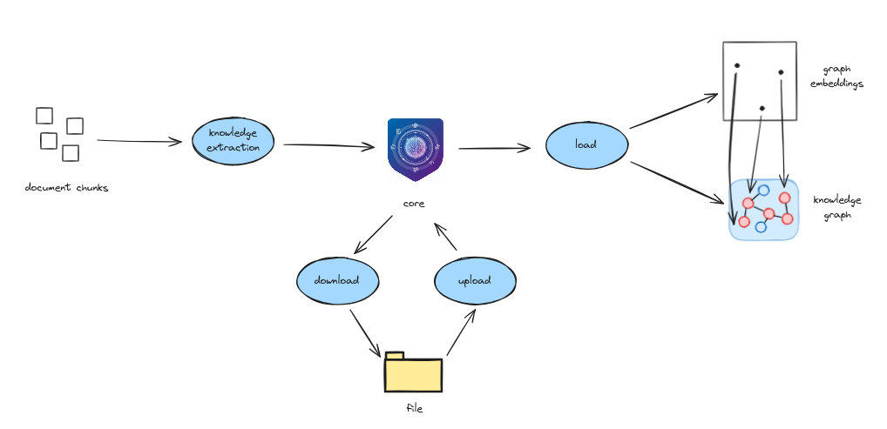
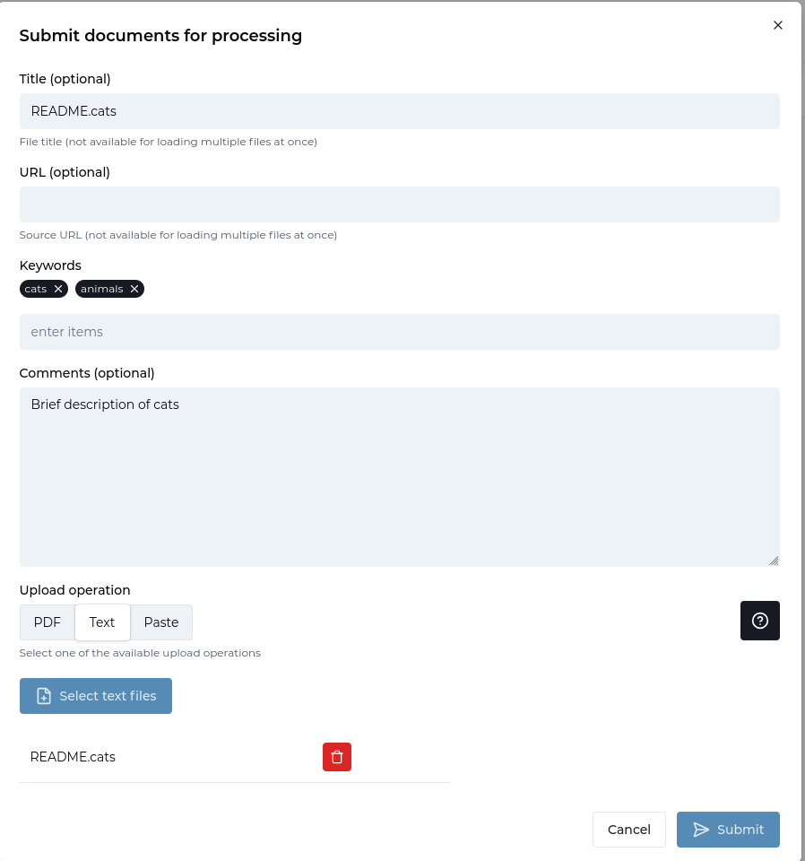
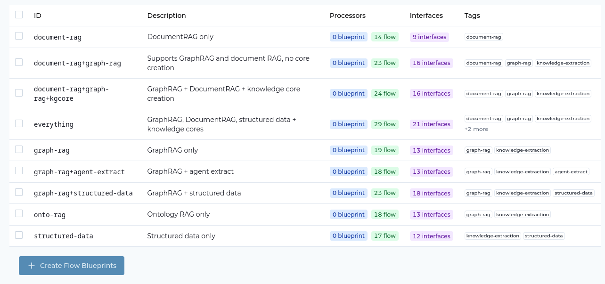
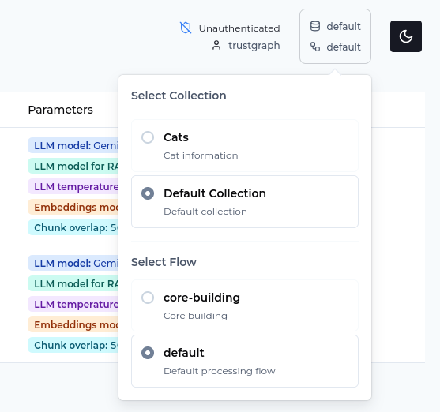
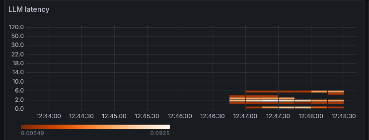
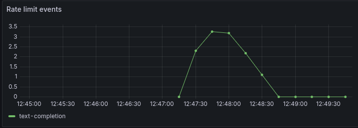

# Introduction to Context Cores


<ul style="margin: 0; padding-left: 20px;">
<li>TrustGraph instance running</li>
<li>Basic understanding of knowledge graphs and RAG concepts</li>
</ul>




## What are Cores?

Context cores (also called knowledge cores) are a way of packaging the output of knowledge extraction.  They provide focused, domain-specific context for model operations. Each knowledge core contains:

- **Knowledge graph edges describing the relationships between entities**
- **Knowledge graph schema information describing the nature of entities**
- **Graph embeddings mapping graph entities to semantic vector space**



Think of knowledge cores as self-contained "knowledge packages" that can be loaded, switched, and managed independently.

## How are they used

Here's how cores are used:
- **Creation**: In TrustGraph, when you run a flow with core
  extraction enabled, the information which goes into stores for
  retrieval algorithms is also maintained as a context core in the
  knowledge-management service.  There is one context core per
  document processed.
- **Download**: Once the processing has finished, the core can be downloaded
  using the Workbench, CLI or APIs.  The core exists as a file which can be
  stored or disk or shared with people.
- **Upload**: The core file can be presented to a TrustGraph to be reload
  to be loaded back into the knowledge-management service.  At this point
  the information held in the core is online, but not retrievable.
- **Load**: Loading a knowledge core transfers the information to stores,
  in a form which is retrievable i.e. you can ask questions using GraphRAG.

You can think of cores as having 3 states:
- **Offline**: The information exists in a core file
- **Online**: Loaded into the knowledge management core store
- **Loaded**: Loaded into retrieval stores, ready for GraphRAG and agent
  knowledge tasks.

## Why Use Context Cores?

Knowledge cores help you:

- **Organize knowledge by domain** - Keep medical knowledge separate from legal knowledge, for example
- **Improve RAG accuracy** - Queries use only relevant ontologies and context
- **Switch contexts easily** - Load different knowledge cores for different use cases
- **Share knowledge packages** - Export and import complete knowledge domains
- **Control sharing** - knowledge cores can be handled differently depending on their sensitivity


## Step-by-Step Guide

### Step 1: Load Your Document

We're going to start by using a fictional bit of cat text, we only need a
small amount of data to get going.  Fetch the text by visiting this URL:

[https://raw.githubusercontent.com/trustgraph-ai/example-data/refs/heads/main/cats/README.cats](https://raw.githubusercontent.com/trustgraph-ai/example-data/refs/heads/main/cats/README.cats)

You can load the document either through the command-line, or using the
Workbench

#### Command-line

You can download the document:
```
wget -O README.cats https://raw.githubusercontent.com/trustgraph-ai/example-data/refs/heads/main/cats/README.cats
```

And use a command-line utility to load the document into the TrustGraph
library:

```
tg-add-library-document \
  --name "README.cats" \
  --description "Brief description of cats" \
  --tags cats,animals \
  --id https://trustgraph.ai/doc/readme-cats \
  --kind text/plain \
  README.cats
```

You can then see the document in the library:

```
$ tg-show-library-documents
+-------+---------------------------------------+
| id    | https://trustgraph.ai/doc/readme-cats |
| time  | 2026-01-15 19:50:49                   |
| title | README.cats                           |
| kind  | text/plain                            |
| note  | Brief description of cats             |
| tags  | cats, animals                         |
+-------+---------------------------------------+
```

#### Workbench

- Download [the document](https://raw.githubusercontent.com/trustgraph-ai/example-data/refs/heads/main/tracking/operation-phantom-cargo.md)
- Go the 'Library' page
- Click 'Upload documents'
- Set the title: README.cats
- Set the Comments to: Brief description of cats
- Set keywords: cats, animals
- Select 'Text' for the upload operation
- Click 'Select text files'
- Add the document you just downloaded
- Click Submit



### Step 2: Create a Collection

A collection is used to organise a set of related documents or data sources
into a single unit.  Retrieval operations operate across a single collection.

We'll create an 'intelligence' collection:

#### Command-line

```
tg-set-collection -n Cats -d 'Cat information' cats
```

#### Workbench

- Go to the 'Library' page
- Select the 'Collections' tab
- Click 'Create Collection'
- Set the ID: cats
- Set the name: Cats
- Set the description to: Cat information
- Click 'Submit'

### Step 3: Create the Flow

A flow describes the collection of processing operations.  We're going
to create a single flow for Graph RAG processing.

To create context cores, you need to be running a flow which contains the
**kg-store** processor.  The system ships two flow blueprints that
contain core creation: `everything` and `document-rag+graph-rag+kgcore`.
The system starts up with a single flow `default` based on the `everything`
blueprint, so that flow is able to do core building.

We'll create a `core-building` flow.

#### Command-line

This command allows you to add parameters for LLM model, temperature etc.
but we're just going to use the defaults:

```
tg-start-flow -n document-rag+graph-rag+kgcore -i core-building -d "Core building"
```

#### Workbench

Let's take a detour via the **Flow blueprints** page.  Go to the
**Settings** page, and make sure **Flow blueprints** is selected on the
feature list.

Select **Flow blueprints** on the sidebar, and you'll see the
blueprints table.  Blueprints provide processing patterns.



The two flows `everything` and `document-rag+graph-rag+kgcore` have
core creation in the description.

To launch a flow:
- Go to the 'Flows' page
- Click 'Create'
- Select the flow blueprint 'GraphRAG + DocumentRAG + knowledge core creation'
- Set the ID: core-building
- Set the description: Core building
- Click 'Create'

### Step 4: Submit the Document for Processing

This pushes the document into the flow input.

#### Command-line

This command submits the document for processing.  You need to specify
the flow ID (`core-building`) and the document ID which was used when the
document was added to the library in step 1.  The collection ID is
that which was used to create the collection.
Processing objects need an ID, and you can make up any string:

```
tg-start-library-processing \
    --flow-id core-building \
    --document-id https://trustgraph.ai/doc/readme-cats \
    --collection cats \
    --processing-id urn:processing-03
```

#### Workbench

There is a selection widget top right of the screen with an database icon
top left.



Click that to open the collection/flow selector, and select the
Cats collection, and core-building, both of which you created earlier.

You are ready to submit the document:

- Go to the 'Library' page
- Select the README.cats document so that the tick box is selected
- Click 'Submit' at the bottom of the page
- Change the Processing flow to **Core building**
- Click Submit

### Step 5: Monitoring

If you want to see the document loading, you can go to Grafana at
[`http://localhost:3000`](http://localhost:3000).  The default
login user is admin, password admin.  Grafana is configured with a single
dashboard.  Some useful things to monitor are:

The pub/sub backlog.  You can monitor the size of queues in Pulsar.
GraphRAG knowledge extraction causes a queue of chunks for processing in
knowledge extraction and you can see this in the backlog:


There is also a knowledge extraction backlog graph which helps to see
knowledge extraction if other queues are being exercised:


To gauge LLM effectiveness, there is a heatmap which shows LLM latency.
Here we can see that LLM response times for my LLM processing are in the
6 second window.



Another LLM effectiveness graph, the Token graph shows token throughput
over time, the Y-axis shows tokens/s rate.


Finally, another useful chart shows the rate limit events per second.
These are commonly seen in the text-completion process which interfaces
with the LLM.  Rate limit events are normal for a knowledge extraction
backlog.  This might particularly be helpful for you to determine whether
you need to provision more LLM bandwidth or dedicated hosting.



The document we loaded is small, and will process very quickly, so you
should only see a 'blip' on the backlog showing that chunks were loaded
and cleared quickly.

It can take many minutes or hours to process large documents or large document
sets using GraphRAG extraction.

### Step 6: Retrieval

Retrieval in Graph RAG consists of mapping the question to a set of candidate
graph entities, and then following graph edges to create a subgraph, which
is used as context with the LLM.

#### Command-line

```
tg-invoke-graph-rag \
    -f graph-rag -C intelligence \
    -q 'What intelligence resources were using during the PHANTOM CARGO operation?'
```

Which should return a result like:

```
The intelligence resources used during the PHANTOM CARGO operation were:
* SIGINT
* MASINT
* Electro-Optical HUMINT
* FININT
* AIS
* synthetic aperture radar (SAR)
* GPS coordinates
```

#### Workbench

- Ensure the correct collection and flow are selected in the selection widget
- Navigate to the 'Assistant' page
- Select 'Graph RAG' assistant
- Enter the question: What intelligence resources were using during the PHANTOM CARGO operation?
- Press 'Send' and wait for the answer

### Step 7: Explore the knowledge graph

The Workbench provides access to some more tools you can play with.

- Select Vector search
- The search box enter 'optical'
- Click 'Send'

This executes a search in the vector store for graph entities which are listed
along with the graph node description and the vector similarity score.
The exact view may vary depending on the LLM model you are using and the
entities discovered by it.


This is a list of graph nodes.  Clicking on an item moves to a node
exploration view, showing graph nodes related to the selected node.
Clicking on CSO-class optical reconnaissance satellite shows
relationships:


Each row is a graph edge, on the left-hand side is the subject of the
graph node, the middle term shows the predicate (relationship), and the
right-hand side is the object (end node) of the relationship.
On this view you can navigate from the graph node show to other nodes by
clicking on the details.  Clicking on the 'subject of' relationship
shows a long list of all 'subject of' relationships which is a common term.


The 'subject of' relationship links discovered entities to the document
from which they were taken.  The right-hand side entities represent the
PHANTOM CARGO document itself.  Clicking that shows relationships, including
a 'has type' showing that 'PHANTOM CARGO' is a 'digital document'.


Once you have an interesting node, you can click 'Graph view' to switch to
a 3D graph view.  This is navigable.  Clicking a node shows a panel on the
right-hand side allowing you to see node properties, along with controls
to navigate relationships.  This adds further nodes to the graph.


You can rotate the graph and navigate 3D space using the mouse /
pointer controls.

## GraphRAG vs. Other Approaches

| Aspect | Document RAG | Graph RAG | Ontology RAG |
|--------|--------------|-----------|--------------|
| **Retrieval** | Vector similarity | Graph relationships | Schema-based |
| **Context** | Isolated chunks | Connected entities | Connected objects, properties and types |
| **Best for** | Semantic search | Complex relationships | Complex relationships + precise types |
| **Setup** | Simple | Simple | Complex |
| **Speed** | Fast | Medium | Medium |

**Use multiple approaches**: The processing flow defines the extraction
and retrieval mechanisms, so you can use multiple approaches on the same
data.

## Next Steps

### Explore Other RAG Types

- **[Ontology RAG](../ontology-rag)** - Use structured schemas for extraction

### Advanced Features

- **[Structured Processing](../structured-processing/)** - Extract typed objects
- **[Agent Extraction](../agent-extraction)** - AI-powered extraction workflows
- **[Object Extraction](../object-extraction)** - Domain-specific extraction

### API Integration

- **[Graph RAG API](../../reference/apis/api-graph-rag)** - API reference
- **[CLI Reference](../../reference/cli/)** - Command-line tools
- **[Examples](../../examples/)** - Code samples

## Related Resources

- **[Core Concepts](../../getting-started/concepts)** - Understanding embeddings and chunks
- **[Vector Search](../../getting-started/concepts#vector-embeddings)** - How semantic search works
- **[Deployment](../../deployment/)** - Scaling for production
- **[Troubleshooting](../../deployment/troubleshooting)** - Common issues

