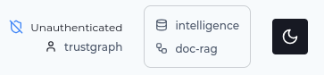
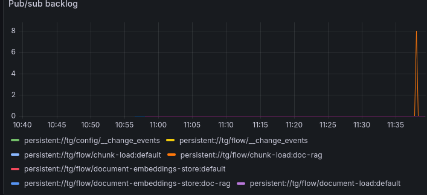

# Document RAG Guide

**Query documents using vector embeddings and semantic search**

Document RAG (also called "basic RAG", "naive RAG", or simply "RAG") is a
retrieval-augmented generation approach that uses vector embeddings to find
relevant document chunks and provides them as context to an LLM for generating
responses.

{: .note }
> Document RAG is the most basic information retrieval flow. It can prove
> useful for some limited cases, but you should consider
> [GraphRAG](graph-rag) or [Ontology RAG](ontology-rag) for real-world
> information retrieval use-cases.

## What is Document RAG?

The essential Document RAG ingest flow consists of:
1. **Chunking** documents into smaller pieces
2. **Embedding** each chunk as a vector
3. **Storing** vectors in a vector database along with the chunks
4. **Retrieving** similar chunks based on query embedding
5. **Generating** responses using retrieved context and an LLM

The pros and cons of this approach:
- ✅ *Pro*: Quicker ingest time compared to knowledge extraction flows
- ✅ *Pro*: No token consumption on document ingest
- ⚠️ *Con*: Sentence embeddings are imprecise and limited for retrieval
  where documents contain diverse concepts
- ⚠️ *Con*: Ineffective for resolving complex questions

### When to Use Document RAG

✅ **Use Document RAG when**:
- You need semantic search over documents
- Questions can be answered from isolated passages
- You want simple, fast implementation
- Document context is self-contained in paragraphs or chunks

⚠️ **Consider alternatives when**:
- You need to understand relationships between entities
  → Use [Graph RAG](graph-rag)
- You need structured schema-based extraction
  → Use [Ontology RAG](ontology-rag)
- Answers require connecting information across documents
  → Use [Graph RAG](graph-rag)

## Prerequisites

Before starting:
- ✅ TrustGraph deployed ([Quick Start](../getting-started/quickstart))
- ✅ Understanding of [Core Concepts](../getting-started/concepts)
- ✅ Documents ready to load

## Step-by-Step Guide

### Step 1: Load Your Document

TrustGraph supports multiple document formats:
- PDF files (`.pdf`)
- Text files (`.txt`)
- Markdown (`.md`)
- HTML (`.html`)

We're going to start by using a fictional maritime tracking report
which you can download at this URL:

[https://raw.githubusercontent.com/trustgraph-ai/example-data/refs/heads/main/tracking/operation-phantom-cargo.md](https://raw.githubusercontent.com/trustgraph-ai/example-data/refs/heads/main/tracking/operation-phantom-cargo.md).

You can load the document either through the command-line, or using the
Workbench

#### Command-line

You can download the document:
```
wget -O phantom-cargo.md https://raw.githubusercontent.com/trustgraph-ai/example-data/refs/heads/main/tracking/operation-phantom-cargo.md
```

And use a command-line utility to load the document into the TrustGraph
library:

```
tg-add-library-document \
  --name "PHANTOM CARGO" \
  --description "Intelligence report: Operation PHANTOM CARGO" \
  --tags 'maritime,intelligence,cargo,grey arms' \
  --id https://trustgraph.ai/doc/phantom-cargo \
  --kind text/plain \
  phantom-cargo.md
```

You can then see the document in the library:

```
$ tg-show-library-documents
+-------+----------------------------------------------+
| id    | https://trustgraph.ai/doc/phantom-cargo      |
| time  | 2025-11-22 11:05:05                          |
| title | PHANTOM CARGO                                |
| kind  | text/plain                                   |
| note  | Intelligence report: Operation PHANTOM CARGO |
| tags  | maritime, intelligence, cargo, grey arms     |
+-------+----------------------------------------------+
```

#### Workbench

- Download [the document](https://raw.githubusercontent.com/trustgraph-ai/example-data/refs/heads/main/tracking/operation-phantom-cargo.md)
- Go the 'Library' page
- Click 'Upload documents'
- Set the title: PHANTOM CARGO
- Set the Comments to: Intelligence report: Operation PHANTOM CARGO
- Set keywords: maritime, intelligence, cargo, grey arms
- Select 'Text' for the upload operation
- Click 'Select text files'
- Add the document you just downloaded
- Click Submit


### Step 2: Create a Collection

A collection is used to organise a set of related documents or data sources
into a single unit.  Retrieval operations operate across a single collection.

We'll create an 'intelligence' collection:

#### Command-line

```
tg-set-collection -n Intelligence -d 'Intelligence analysis' intelligence
```

#### Workbench

- Go to the 'Library' page
- Select the 'Collections' tab
- Click 'Create Collection'
- Set the ID: intelligence
- Set the name: Intelligence
- Set the description to: Intelligence analysis
- Click 'Submit'

### Step 3: Create the Flow

A flow describes the collection of processing operations.  We're going
to create a single flow for Document RAG processing.

We'll create a 'doc-rag' flow:

#### Command-line

This command allows you to add parameters for LLM model, temperature etc.
but we're just going to use the defaults:

```
tg-start-flow -n document-rag -i doc-rag -d "Document RAG"
```

#### Workbench

- Go to the 'Flows' page
- Click 'Create'
- Select the flow class 'Document RAG'
- Set the ID: doc-rag
- Set the description: Document RAG
- Click 'Create

### Step 4: Submit the Document for Processing

This pushes the document into the flow input.

#### Command-line

This command submits the document for processing.  You need to specify
the flow ID (`doc-rag`) and the document ID which was used when the
document was added to the library in step 1.  The collection ID is
that which was used to create the collection.
Processing objects need an ID, and you can make up any string:

```
tg-start-library-processing \
    --flow-id doc-rag \
    --document-id https://trustgraph.ai/doc/phantom-cargo \
    --collection intelligence \
    --processing-id urn:processing-01
```

#### Workbench

There is a selection widget top right of the screen with an database icon
top left.



Click that to open the collection/flow selector, and select the
Intelligence collection, and Document RAG, both of which you created earlier.


You are ready to submit the document:

- Go to the 'Library' page
- Select the PHANTOM CARGO document so that the tick box is selected
- Click 'Submit' at the bottom of the page
- Change the Processing flow to Document RAG
- Click Submit

### Step 5: Monitoring

If you want to see the document loading, you can go to Grafana at
[`http://localhost:3000`](http://localhost:3000).  The default
login user is admin, password admin.  Grafana is configured with a single
dashboard, which has a 'pub/sub backlog' graph.



The document we loaded is small, and will process very quickly, so you
should only see a 'blip' on the backlog showing that chunks were loaded
and cleared quickly.

### Step 6: Retrieval

Presently, there is no Document RAG support in the workbench.

#### Command-line

```
tg-invoke-document-rag \
    -f doc-rag -C intelligence \
    -q 'What is the PHANTOM CARGO report about?'
```

Which should return a result like:

```
The PHANTOM CARGO report is about an operation that detected unusual shipping
patterns involving a Dubai-based freight company, Meridian Logistics LLC. This
company was moving containerized "agricultural equipment" on irregular
schedules with inconsistent documentation between Limassol (Cyprus), Durban
(South Africa), and Batumi (Georgia). The operation aimed to uncover a
suspected arms trafficking network operating under the guise of legitimate
trade, circumventing sanctions.
```

Retrieval in Document RAG consists of selecting some chunks based on semantic
similarity to the question.  In this case, for a small report on a single
topic, which produces a very small number of chunks.  The retrieval process is
very likely to select all the chunks, and so the retrieval is going to be
effective.

An interesting experiment you might want to try is to try loading other
documents into the collection, and using more complex questions - you should
see Document RAG begin to become ineffective very quickly.

The question:
```
tg-invoke-document-rag -f doc-rag -C intelligence -q 'Which organisation operated agents which observed the warehouse?'
```
provides the answer:
```
An AISE officer operating under commercial cover in Cyprus was tasked to
establish visual observation of Meridian's warehouse facility.
```

But once more documents are loaded, the context gets overwhelmed with
irrelevant chunks:

```
The provided context does not specify which organization operated the agents
who observed the warehouse. It only mentions that an asset, a disgruntled
Meridian logistics coordinator in Cyprus, provided pre-encrypted shipping
schedules.
```

Document RAG is useful for small amounts of data
and quick demos but not useful for more complex scenarios.

## Document RAG vs. Other Approaches

| Aspect | Document RAG | Graph RAG | Ontology RAG |
|--------|--------------|-----------|--------------|
| **Retrieval** | Vector similarity | Graph relationships | Schema-based |
| **Context** | Isolated chunks | Connected entities | Connected objects, properties and types |
| **Best for** | Semantic search | Complex relationships | Complex relationships + precise types |
| **Setup** | Simple | Simple | Complex |
| **Speed** | Fast | Medium | Medium |

**Use multiple approaches**: The processing flow defines the extraction
and retrieval mechanisms, so you can use multiple approaches on the same
data.

## Next Steps

### Explore Other RAG Types

- **[Graph RAG](../graph-rag)** - Leverage knowledge graph relationships
- **[Ontology RAG](../ontology-rag)** - Use structured schemas for extraction

### Advanced Features

- **[Structured Processing](../structured-processing/)** - Extract typed objects
- **[Agent Extraction](../agent-extraction)** - AI-powered extraction workflows
- **[Object Extraction](../object-extraction)** - Domain-specific extraction

### API Integration

- **[Document RAG API](../../reference/apis/api-document-rag)** - API reference
- **[CLI Reference](../../reference/cli/)** - Command-line tools
- **[Examples](../../examples/)** - Code samples

## Related Resources

- **[Core Concepts](../../getting-started/concepts)** - Understanding embeddings and chunks
- **[Vector Search](../../getting-started/concepts#vector-embeddings)** - How semantic search works
- **[Deployment](../../deployment/)** - Scaling for production
- **[Troubleshooting](../../deployment/troubleshooting)** - Common issues
