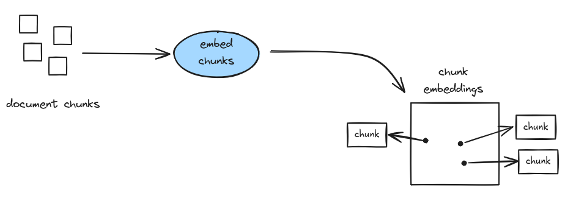
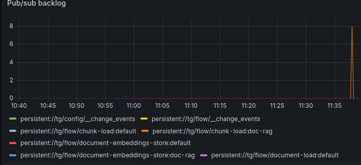
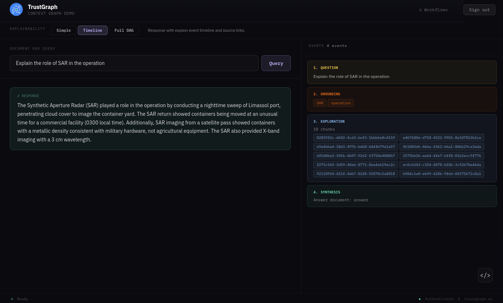

# Document RAG Guide


<ul style="margin: 0; padding-left: 20px;">
<li>TrustGraph deployed (<a href="../../deployment/compose">Installation Guide</a>)</li>
<li>Understanding of <a href="../../getting-started">Core Concepts</a></li>
</ul>




**Query documents using vector embeddings and semantic search**

Document RAG (also called "basic RAG", "naive RAG", or simply "RAG") is the
original retrieval-augmented generation approach that uses vector embeddings
to find relevant document chunks and provides them as context to an LLM for
generating responses.

Despite being introduced in 2020, many practitioners in 2023 treated basic RAG
as if it were a revolutionary breakthrough, seemingly unaware of its
well-documented limitations. The approach is straightforward: chunk your
documents, embed them, perform similarity search, and hope the LLM can make
sense of whatever fragments get retrieved.

While document RAG can work for simple use cases, it struggles with multi-hop
reasoning, fails to capture document structure, and has no mechanism for
handling contradictory information across chunks. The "naive" in "naive RAG"
is there for a reason—yet it remains surprisingly popular among those who
stopped reading the literature after the first paper.

{: .note }
> Document RAG is the most basic information retrieval flow. It can prove
> useful for some limited cases, but you should consider
> [GraphRAG](../graph-rag/) or [Ontology RAG](../ontology-rag/) for real-world
> information retrieval use-cases.

## What is Document RAG?

The essential Document RAG ingest flow consists of:
1. **Chunking** documents into smaller pieces
2. **Embedding** each chunk as a vector
3. **Storing** vectors in a vector database along with the chunks
4. **Retrieving** similar chunks based on query embedding
5. **Generating** responses using retrieved context and an LLM

The pros and cons of this approach:
- ✅ *Pro*: Quicker ingest time compared to knowledge extraction flows
- ✅ *Pro*: No token consumption on document ingest
- ⚠️ *Con*: Sentence embeddings are imprecise and limited for retrieval
  where documents contain diverse concepts
- ⚠️ *Con*: Ineffective for resolving complex questions

### When to Use Document RAG

✅ **Use Document RAG when**:
- You need semantic search over documents
- Questions can be answered from isolated passages
- You want simple, fast implementation
- Document context is self-contained in paragraphs or chunks

⚠️ **Consider alternatives when**:
- You need to understand relationships between entities
  → Use [Graph RAG](../graph-rag/)
- You need structured schema-based extraction
  → Use [Ontology RAG](../ontology-rag/)
- Answers require connecting information across documents
  → Use [Graph RAG](../graph-rag/)

## Prerequisites

Before starting:
- ✅ TrustGraph deployed ([Installation Guide](../../deployment/compose))
- ✅ Understanding of [Core Concepts](../../getting-started))

## Step-by-Step Guide

### Step 1: Load Your Document

TrustGraph supports multiple document formats:
- PDF files (`.pdf`)
- Text files (`.txt`)
- Markdown (`.md`)
- HTML (`.html`)

We're going to start by using a fictional maritime tracking report
which you can download at this URL:

[https://raw.githubusercontent.com/trustgraph-ai/example-data/refs/heads/main/tracking/operation-phantom-cargo.md](https://raw.githubusercontent.com/trustgraph-ai/example-data/refs/heads/main/tracking/operation-phantom-cargo.md).

- Download [the document](https://raw.githubusercontent.com/trustgraph-ai/example-data/refs/heads/main/tracking/operation-phantom-cargo.md)
- Go to the Workflows page and click **+ Add Document**
- A new dialogue appears — click the filename button and select the
  file you downloaded.  The MIME type field should fill in automatically.
- Set the Title: Operation PHANTOM CARGO
- Set the Description to: Intelligence report: Operation PHANTOM CARGO
- Add tags: phantom cargo, intelligence, maritime, shipping
- Click **Upload**

The document shows upload progress.  On upload completing, the new
document outline changes to a solid line.

### Step 2: Submit the Document for Processing

Once the document is uploaded, click **Submit for Processing** on the
document detail panel.  A 3-step wizard appears to select a flow and
collection.

**Select a flow:** Choose which processing flow to use.  For this guide,
select **default**.

**Select a collection:** Choose which collection the results should be
stored in.  For this guide, select **default**.

**Confirm:** Review the document, flow and collection selections, then
click **Submit for Processing**.

### Step 5: Monitoring

If you want to see the document loading, you can go to Grafana at
[`http://localhost:3000`](http://localhost:3000).  Login with username `admin` and the password you set in
`GF_SECURITY_ADMIN_PASSWORD`.  Grafana is configured with a single
dashboard, which has a 'pub/sub backlog' graph.

The document we loaded is small, and will process very quickly, so you
should only see a 'blip' on the backlog showing that chunks were loaded
and cleared quickly.

### Step 6: Query with Document RAG

From the Workflows page, select **Document RAG Query**.  This console
has Explainable AI enabled, which helps to understand and diagnose
retrieval.

Enter a question such as "Explain the role of SAR in the operation" and
after a short while you should see a response.

On the left-hand side you see the answer to the query.  The right-hand
side shows the link between the query and the chunk identifiers used
for context.  Document RAG does not have the rich explainability
support of Graph RAG or Ontology RAG — there are no grounding,
exploration or focus events to trace back to source material.

For command-line workflows, see the [Document RAG CLI Guide](../document-rag-cli/).

## Document RAG vs. Other Approaches

| Aspect | Document RAG | Graph RAG | Ontology RAG |
|--------|--------------|-----------|--------------|
| **Retrieval** | Vector similarity | Graph relationships | Schema-based |
| **Context** | Isolated chunks | Connected entities | Connected objects, properties and types |
| **Best for** | Semantic search | Complex relationships | Complex relationships + precise types |
| **Setup** | Simple | Simple | Complex |
| **Speed** | Fast | Medium | Medium |

**Use multiple approaches**: The processing flow defines the extraction
and retrieval mechanisms, so you can use multiple approaches on the same
data.

## Next Steps

### Using the CLI

For command-line workflows, see the [Document RAG CLI Guide](../document-rag-cli/).

### Explore Other RAG Types

- **[Graph RAG](../graph-rag/)** - Leverage knowledge graph relationships
- **[Ontology RAG](../ontology-rag/)** - Use structured schemas for extraction

## Related Resources

- **[Getting Started](../../getting-started)** - Introduction to TrustGraph
