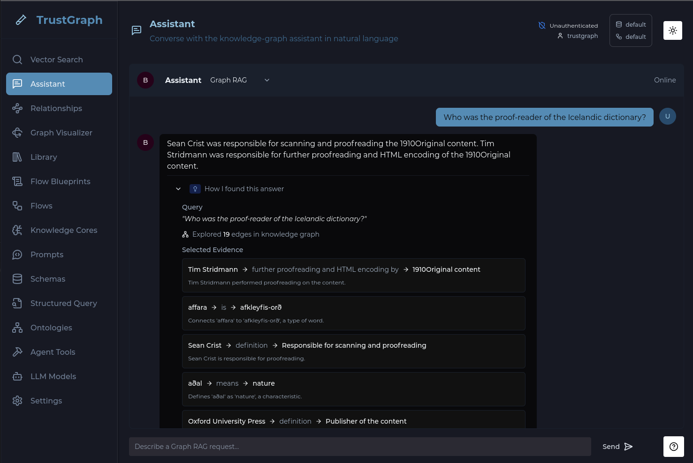

# Explainability Guide


<ul style="margin: 0; padding-left: 20px;">
<li>TrustGraph deployed (<a href="../getting-started/quickstart">Quick Start</a>)</li>
<li>Understanding of <a href="../getting-started/concepts">Core Concepts</a>)</li>
<li>A document already loaded and processed with Graph RAG (see <a href="../graph-rag">Graph RAG guide</a>)</li>
</ul>




Explainability in TrustGraph is always on.  Every query records a full
reasoning trace in the context graph automatically.  It's down to the
application to decide what to show the user and how to interpret the
explainability data.  The Workbench provides a built-in view, but any
application built on TrustGraph can query the same data.

## Step 1: Run a Query

In the Workbench, navigate to the **Assistant** page.  Make sure
**Graph RAG** is selected as the retrieval strategy.

Enter a question and submit the query.  The answer will stream back,
and TrustGraph records the full reasoning trace.

## Step 2: View the Reasoning Trace

Once the answer appears, expand the **How I found this answer** section
to see the explainability trace inline.

The trace shows key stages of the reasoning pipeline:

- **Query** — the original question
- **Exploration** — how many edges were traversed in the knowledge graph
- **Selected Evidence** — the edges chosen as most relevant, shown as
  subject → predicate → object triples, each with the LLM's reasoning
  for why it was selected

All explainability traces are persistent.  The
[Explainability using CLI](../explainability-cli/) guide shows how to
list and review past explainability sessions using command-line tools.

## Next Steps

- **[Explainability using CLI](../explainability-cli/)** — the same
  workflow using command-line tools, with more control over output
  formats
- **[Explainability overview](../../overview/explainability)** — deeper
  understanding of the architecture
