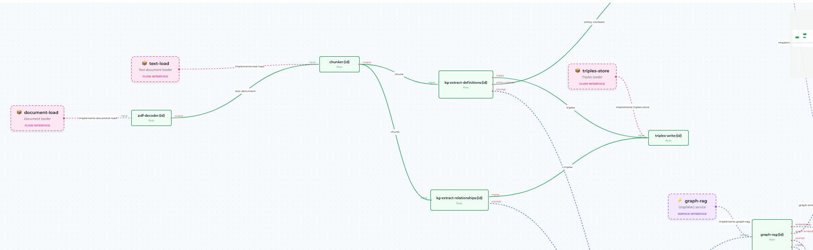
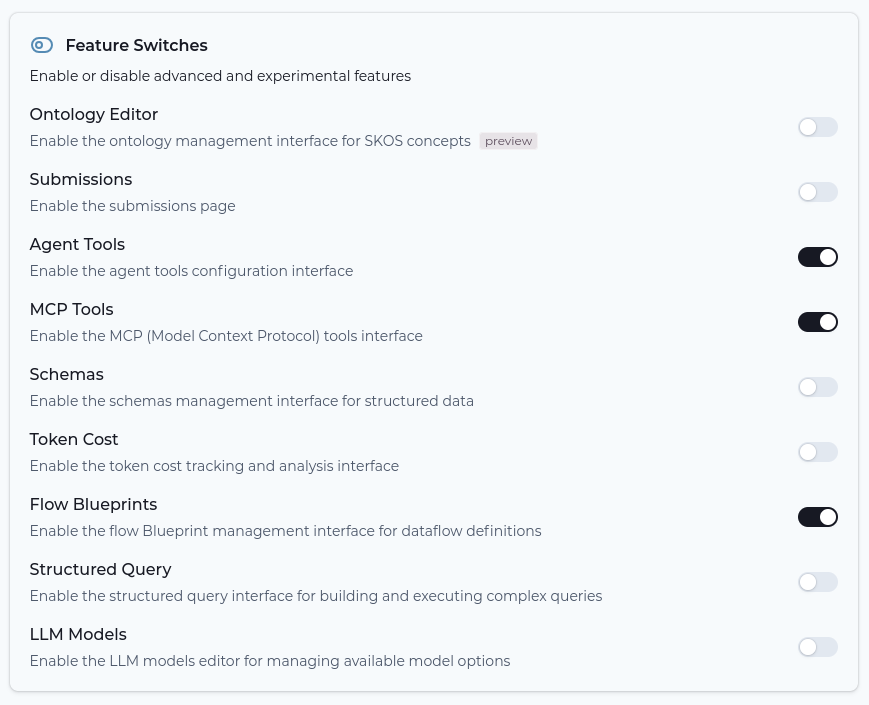
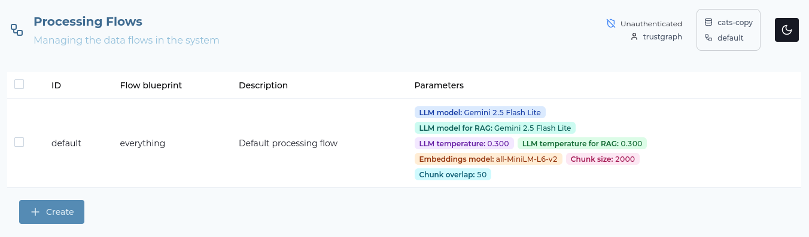
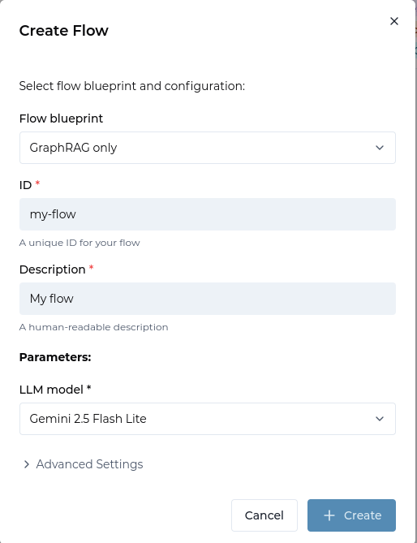
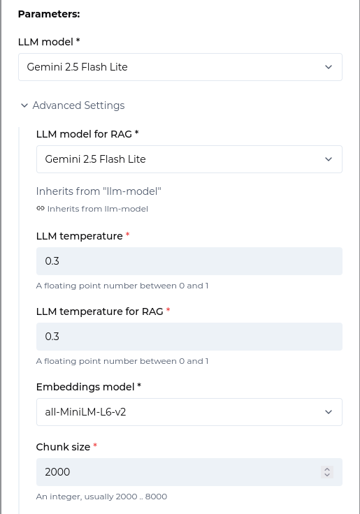
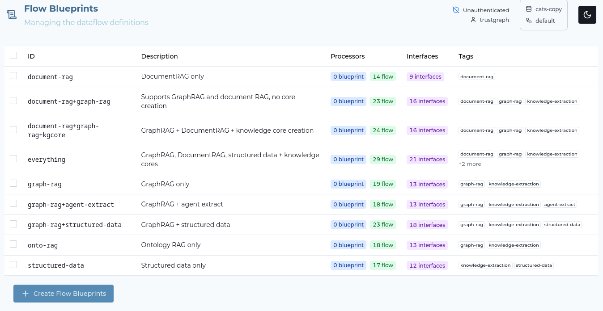

# Introduction to Flows


<ul style="margin: 0; padding-left: 20px;">
<li>TrustGraph instance running</li>
<li>Basic understanding of knowledge processing concepts</li>
</ul>




## Why Use Flows?

In the world of analytics and processing people come across many different
use-cases which are broadly solved by the same set of capabilities.  The
trick is to make those capabilities work flexibly together.

Have you ever come across a tool, and thought to yourself, "This is almost
perfect for my problem, if only I could change XYZ"?  That's what flows do,
allow for the TrustGraph capabilities to be plumbed together in different
ways, with different configuration settings, and also allow for new
capabilities to be introduced by extending the system.

## What are Flows?

Flows are configurable processing pipelines in TrustGraph that
orchestrate how data moves through various processing stages. A flow
defines:

- **Processing steps** - The sequence of operations to perform on data
- **Data transformations** - How data is extracted, enriched, and structured
- **Integration points** - How different services and models work together
- **Output destinations** - Where processed results are stored
- **Configuration paremeters** - e.g. AI models and model temperatures

Think of flows as assembly lines for knowledge - raw data enters one end,
moves through various processing stations, and emerges as structured
knowledge.

Flows help you:

- **Automate knowledge extraction** - Process documents and data without
  manual intervention
- **Standardize processing** - Ensure consistent handling across all inputs
- **Scale operations** - Handle large volumes of data efficiently

- **Customize pipelines** - Adapt processing for different data types and use
  cases

## What are Flow Blueprints?

When house builders build houses, they can use a blueprint.  The blueprint
explains how to build a house.  The builders can use the blueprint to
create multiple house which follow the same pattern.  The blueprint can
include options to vary the pattern for different customers.  Perhaps
a particular buyer will want different windows or wall dressing to other
buyers.

TrustGraph has **flow blueprints** which are used to launch flows.  The
same blueprint can be used to make multiple flows. Flow blueprints have
configuration parameters so, e.g. the same flow can be launched with
different AI models or model settings.

## Step-by-Step Guide

### Step 1: Enable Flow Blueprint View

First, ensure the the Flow Blueprints feature is enabled in Settings.
This is a view we'll be visiting in the guided tour.

- Go to the **Settings** page
- Look at the **Features** section
- Find **Flows** in the feature list
- Make sure it is enabled (checked)
- Also enable **Flow Blueprints** if you want to explore blueprints

Once enabled, you'll see **Flows** in the sidebar navigation.

### Step 2: View Existing Flows

Navigate to the Flows page to see your current flows:

- Select **Flows** from the sidebar
- You'll see a table listing all flows
- TrustGraph starts with a **default** flow based on the "everything" blueprint
- The table shows flow ID, description, and blueprint name

The default flow includes all processing capabilities: chunking, embeddings, Document RAG, Graph RAG, and knowledge core creation.

### Step 3: Create a New Flow

Let's create a specialized flow for a specific use case:

- Click the **Create** button at the bottom of the Flows page
- A dialogue appears asking you to select a flow blueprint
- Choose a blueprint that matches your use case:
  - **Document RAG** - For simple vector similarity search
  - **Graph RAG Only** - For knowledge graph extraction
  - **Ontology RAG Only** - For schema-based extraction
  - **GraphRAG + DocumentRAG + knowledge core creation** - For comprehensive processing
  - **Everything** - All capabilities enabled

- Set a unique **ID** for your flow (e.g., "graph-rag")
- Set a **Description** (e.g., "Graph RAG processing")
- Click **Create**

### Step 4: Configure Advanced Settings (Optional)

If you need to customise more detail of the flow behavior, you can
configure advanced settings:

- After selecting a blueprint, you may see additional configuration options
- These can include:
  - **LLM model selection** - Choose which AI model to use
  - **Temperature settings** - Control generation randomness
  - **Chunking parameters** - Adjust chunk sizes and overlap
  - **Graph traversal depth** - Control relationship exploration
  - **Embedding model** - Select the embedding provider

Most flows work well with default settings, but advanced configuration allows fine-tuning for specific requirements.

### Step 5: Verify the New Flow

After creation, your new flow appears in the flows table:

- The new flow is listed alongside existing flows
- You can see its ID, description, and blueprint
- The flow is now ready to process documents

To use this flow, select it in the collection/flow selector (top right with database icon) before submitting documents for processing.

### Step 6: Explore Flow Blueprints

To understand what blueprints are available:

- Enable **Flow Blueprints** in Settings if not already enabled
- Select **Flow Blueprints** from the sidebar
- You'll see a table of all available blueprints
- Each blueprint shows:
  - **Name** - The blueprint identifier
  - **Description** - What processing capabilities it includes
  - **Version** - The blueprint version

Blueprints are templates that define the processing pipeline. When you create
a flow from a blueprint, you're instantiating that template with specific
configuration settings.

Flow blueprints can be viewed by selecting them in the table and clicking
**View**.  The flow blueprints are fairly complicated.

### Using the CLI

For command-line workflows, see the [Managing Flows CLI Guide](../flows-cli/).

## Next Steps

Now that you understand flows, you can:

- [Process documents with Graph RAG](../graph-rag/)
- [Build custom processing pipelines](../../reference/extending)
- [Monitor flow performance](../monitoring/)

