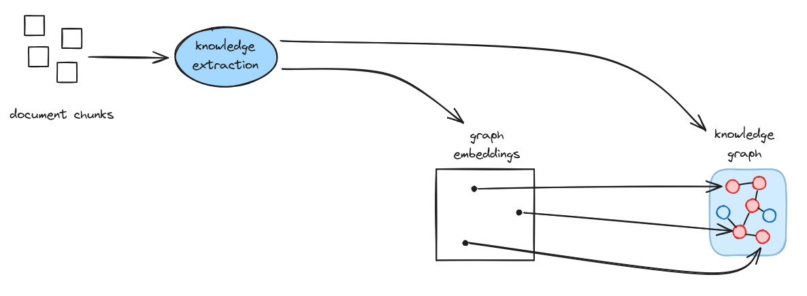
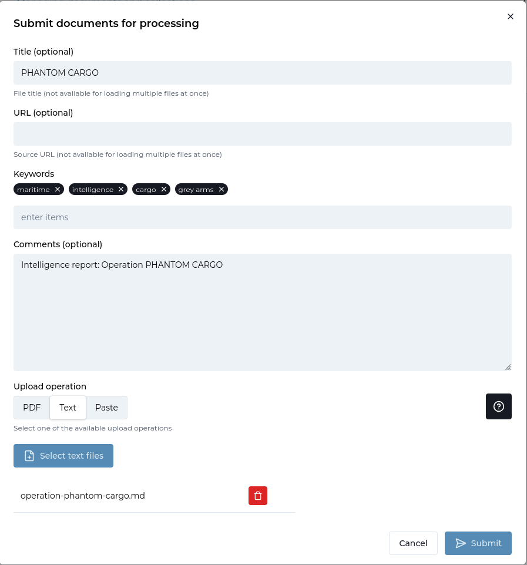
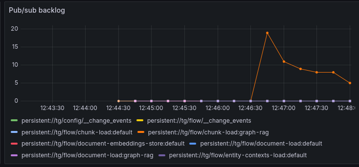
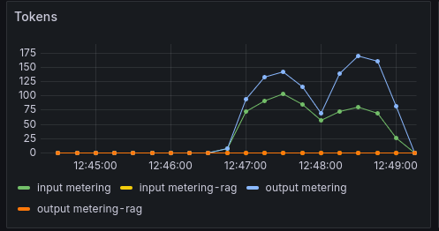

# Graph RAG Guide


<ul style="margin: 0; padding-left: 20px;">
<li>TrustGraph deployed (<a href="../getting-started/quickstart">Quick Start</a>)</li>
<li>Understanding of <a href="../getting-started/concepts">Core Concepts</a></li>
</ul>




**Query documents using graph embeddings and knowledge graph relationships**

GraphRAG is a technique which uses automated extraction of relationships
from unstructured text, which is stored in a knowledge graph.

GraphRAG is a very effective technique for retrieval on complex diverse
information, with complex structures.  Graph RAG uses vector embeddings
to go from questions to knowledge graph nodes, but then uses graph node
relationships to discover related information.

In TrustGraph, Graph RAG refers to information extraction without an
ontology or schema.  Ontology-free knowledge extraction automatically
discovers relationships in unstructured text.  In contrast, Ontology RAG
uses an ontology.

## What is Graph RAG?

The essential Graph RAG ingest flow consists of:
1. **Chunking** documents into smaller pieces
2. **Knowledge Extraction** to discover entities and relationships
3. **Embedding** each entity as a vector and storing these in a vector store
4. **Storing** entity relationships in a knowledge graph
5. **Retrieving** using semantic similarity to discover knowledge graph entry points
6. **Traversing** the knowledge graph to find related information
7. **Generating** responses using the knowledge subgraph as context to an LLM

The pros and cons of this approach:
- ✅ *Pro*: Much more precise retrieval
- ✅ *Pro*: Effective when faced with complex relationships or diverse data
- ✅ *Pro*: Scales to handle much larger document sets
- ✅ *Pro*: No need for an ontology/schema as relationships are discovered automatically
- ⚠️ *Con*: Knowledge extract has a cost at document ingest time
- ⚠️ *Con*: Token costs required to ingest documents

## When to Use Graph RAG

✅ **Use Graph RAG when**:
- Questions require understanding relationships
- Answers need context from multiple documents
- You need to connect disparate information
- Reducing hallucinations is critical
- Questions involve "how are X and Y related?"

⚠️ **Consider alternatives when**:
- Simple keyword search on small data is sufficient → Use [Document RAG](document-rag)
- Need structured typed data → Use [Ontology RAG](ontology-rag)

## Prerequisites

Before starting:
- ✅ TrustGraph deployed ([Quick Start](../getting-started/quickstart))
- ✅ Understanding of [Core Concepts](../getting-started/concepts)

## Step-by-Step Guide

### Step 1: Load Your Document

TrustGraph supports multiple document formats:
- PDF files (`.pdf`)
- Text files (`.txt`)
- Markdown (`.md`)
- HTML (`.html`)

We're going to start by using a fictional maritime tracking report
which you can download at this URL:

[https://raw.githubusercontent.com/trustgraph-ai/example-data/refs/heads/main/tracking/operation-phantom-cargo.md](https://raw.githubusercontent.com/trustgraph-ai/example-data/refs/heads/main/tracking/operation-phantom-cargo.md).

- Download [the document](https://raw.githubusercontent.com/trustgraph-ai/example-data/refs/heads/main/tracking/operation-phantom-cargo.md)
- Go the 'Library' page
- Click 'Upload documents'
- Set the title: PHANTOM CARGO
- Set the Comments to: Intelligence report: Operation PHANTOM CARGO
- Set keywords: maritime, intelligence, cargo, grey arms
- Select 'Text' for the upload operation
- Click 'Select text files'
- Add the document you just downloaded
- Click Submit

### Step 2: Create a Collection

A collection is used to organise a set of related documents or data sources
into a single unit.  Retrieval operations operate across a single collection.

We'll create an 'intelligence' collection:

- Go to the 'Library' page
- Select the 'Collections' tab
- Click 'Create Collection'
- Set the ID: intelligence
- Set the name: Intelligence
- Set the description to: Intelligence analysis
- Click 'Submit'

### Step 3: Create the Flow

A flow describes the collection of processing operations.  We're going
to create a single flow for Graph RAG processing.

We'll create a 'graph-rag' flow:

- Go to the 'Flows' page
- Click 'Create'
- Select the flow blueprint 'Graph RAG'
- Set the ID: graph-rag
- Set the description: Graph RAG
- Click 'Create'

### Step 4: Submit the Document for Processing

This pushes the document into the flow input.

There is a selection widget top right of the screen with an database icon
top left.

Click that to open the collection/flow selector, and select the
Intelligence collection, and Graph RAG, both of which you created earlier.

You are ready to submit the document:

- Go to the 'Library' page
- Select the PHANTOM CARGO document so that the tick box is selected
- Click 'Submit' at the bottom of the page
- Change the Processing flow to GraphRAG
- Click Submit

### Step 5: Monitoring

If you want to see the document loading, you can go to Grafana at
[`http://localhost:3000`](http://localhost:3000).  The default
login user is admin, password admin.  Grafana is configured with a single
dashboard.  Some useful things to monitor are:

The pub/sub backlog.  You can monitor the size of queues in Pulsar.
GraphRAG knowledge extraction causes a queue of chunks for processing in
knowledge extraction and you can see this in the backlog:

There is also a knowledge extraction backlog graph which helps to see
knowledge extraction if other queues are being exercised:

To gauge LLM effectiveness, there is a heatmap which shows LLM latency.
Here we can see that LLM response times for my LLM processing are in the
6 second window.

Another LLM effectiveness graph, the Token graph shows token throughput
over time, the Y-axis shows tokens/s rate.

Finally, another useful chart shows the rate limit events per second.
These are commonly seen in the text-completion process which interfaces
with the LLM.  Rate limit events are normal for a knowledge extraction
backlog.  This might particularly be helpful for you to determine whether
you need to provision more LLM bandwidth or dedicated hosting.

The document we loaded is small, and will process very quickly, so you
should only see a 'blip' on the backlog showing that chunks were loaded
and cleared quickly.

It can take many minutes or hours to process large documents or large document
sets using GraphRAG extraction.

### Step 6: Retrieval

Retrieval in Graph RAG consists of mapping the question to a set of candidate
graph entities, and then following graph edges to create a subgraph, which
is used as context with the LLM.

- Ensure the correct collection and flow are selected in the selection widget
- Navigate to the 'Assistant' page
- Select 'Graph RAG' assistant
- Enter the question: What intelligence resources were using during the PHANTOM CARGO operation?
- Press 'Send' and wait for the answer

### Step 7: Explore the knowledge graph

The Workbench provides access to some more tools you can play with.

- Select Vector search
- The search box enter 'optical'
- Click 'Send'

This executes a search in the vector store for graph entities which are listed
along with the graph node description and the vector similarity score.
The exact view may vary depending on the LLM model you are using and the
entities discovered by it.

This is a list of graph nodes.  Clicking on an item moves to a node
exploration view, showing graph nodes related to the selected node.
Clicking on CSO-class optical reconnaissance satellite shows
relationships:

Each row is a graph edge, on the left-hand side is the subject of the
graph node, the middle term shows the predicate (relationship), and the
right-hand side is the object (end node) of the relationship.
On this view you can navigate from the graph node show to other nodes by
clicking on the details.  Clicking on the 'subject of' relationship
shows a long list of all 'subject of' relationships which is a common term.

The 'subject of' relationship links discovered entities to the document
from which they were taken.  The right-hand side entities represent the
PHANTOM CARGO document itself.  Clicking that shows relationships, including
a 'has type' showing that 'PHANTOM CARGO' is a 'digital document'.

Once you have an interesting node, you can click 'Graph view' to switch to
a 3D graph view.  This is navigable.  Clicking a node shows a panel on the
right-hand side allowing you to see node properties, along with controls
to navigate relationships.  This adds further nodes to the graph.

You can rotate the graph and navigate 3D space using the mouse /
pointer controls.

## GraphRAG vs. Other Approaches

| Aspect | Document RAG | Graph RAG | Ontology RAG |
|--------|--------------|-----------|--------------|
| **Retrieval** | Vector similarity | Graph relationships | Schema-based |
| **Context** | Isolated chunks | Connected entities | Connected objects, properties and types |
| **Best for** | Semantic search | Complex relationships | Complex relationships + precise types |
| **Setup** | Simple | Simple | Complex |
| **Speed** | Fast | Medium | Medium |

**Use multiple approaches**: The processing flow defines the extraction
and retrieval mechanisms, so you can use multiple approaches on the same
data.

## Next Steps

### Explore Other RAG Types

- **[Ontology RAG](../ontology-rag)** - Use structured schemas for extraction

### Advanced Features

- **[Structured Processing](../structured-processing/)** - Extract typed objects
- **[Agent Extraction](../agent-extraction)** - AI-powered extraction workflows
- **[Object Extraction](../object-extraction)** - Domain-specific extraction

### Using the CLI

For command-line workflows, see the [Graph RAG CLI Guide](../graph-rag-cli/).

## Related Resources

- **[Core Concepts](../../getting-started/concepts)** - Understanding embeddings and chunks
- **[Vector Search](../../getting-started/concepts#vector-embeddings)** - How semantic search works
- **[Deployment](../../deployment/)** - Scaling for production
- **[Troubleshooting](../../deployment/troubleshooting)** - Common issues
