# Graph RAG Guide


<ul style="margin: 0; padding-left: 20px;">
<li>TrustGraph deployed (<a href="../../deployment/compose">Installation Guide</a>)</li>
<li>Understanding of <a href="../../getting-started">Core Concepts</a></li>
</ul>




**Query documents using graph embeddings and knowledge graph relationships**

GraphRAG is a technique which uses automated extraction of relationships
from unstructured text, which is stored in a knowledge graph.

GraphRAG is a very effective technique for retrieval on complex diverse
information, with complex structures.  Graph RAG uses vector embeddings
to go from questions to knowledge graph nodes, but then uses graph node
relationships to discover related information.

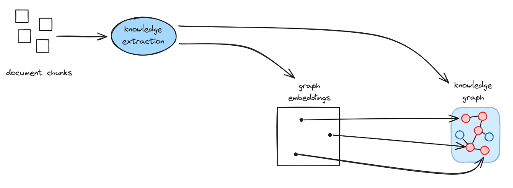

In TrustGraph, Graph RAG refers to information extraction without an
ontology or schema.  Ontology-free knowledge extraction automatically
discovers relationships in unstructured text.  In contrast, Ontology RAG
uses an ontology.

## What is Graph RAG?

The essential Graph RAG ingest flow consists of:
1. **Chunking** documents into smaller pieces
2. **Knowledge Extraction** to discover entities and relationships
3. **Embedding** each entity as a vector and storing these in a vector store
4. **Storing** entity relationships in a knowledge graph
5. **Retrieving** using semantic similarity to discover knowledge graph entry points
6. **Traversing** the knowledge graph to find related information
7. **Generating** responses using the knowledge subgraph as context to an LLM

The pros and cons of this approach:
- ✅ *Pro*: Much more precise retrieval
- ✅ *Pro*: Effective when faced with complex relationships or diverse data
- ✅ *Pro*: Scales to handle much larger document sets
- ✅ *Pro*: No need for an ontology/schema as relationships are discovered automatically
- ⚠️ *Con*: Knowledge extract has a cost at document ingest time
- ⚠️ *Con*: Token costs required to ingest documents

## When to Use Graph RAG

✅ **Use Graph RAG when**:
- Questions require understanding relationships
- Answers need context from multiple documents
- You need to connect disparate information
- Reducing hallucinations is critical
- Questions involve "how are X and Y related?"

⚠️ **Consider alternatives when**:
- Simple keyword search on small data is sufficient → Use [Document RAG](../document-rag/)
- Need structured typed data → Use [Ontology RAG](../ontology-rag/)

## Prerequisites

Before starting:
- ✅ TrustGraph deployed ([Installation Guide](../../deployment/compose))
- ✅ Understanding of [Core Concepts](../../getting-started)

## Step-by-Step Guide

### Step 1: Load Your Document

TrustGraph supports multiple document formats:
- PDF files (`.pdf`)
- Text files (`.txt`)
- Markdown (`.md`)
- HTML (`.html`)

We're going to start by using a fictional maritime tracking report
which you can download at this URL:

[https://raw.githubusercontent.com/trustgraph-ai/example-data/refs/heads/main/tracking/operation-phantom-cargo.md](https://raw.githubusercontent.com/trustgraph-ai/example-data/refs/heads/main/tracking/operation-phantom-cargo.md).

- Download [the document](https://raw.githubusercontent.com/trustgraph-ai/example-data/refs/heads/main/tracking/operation-phantom-cargo.md)
- Go to the Workflows page and click **+ Add Document**
- A new dialogue appears — click the filename button and select the
  file you downloaded.  The MIME type field should fill in automatically.
- Set the Title: Operation PHANTOM CARGO
- Set the Description to: Intelligence report: Operation PHANTOM CARGO
- Add tags: phantom cargo, intelligence, maritime, shipping
- Click **Upload**

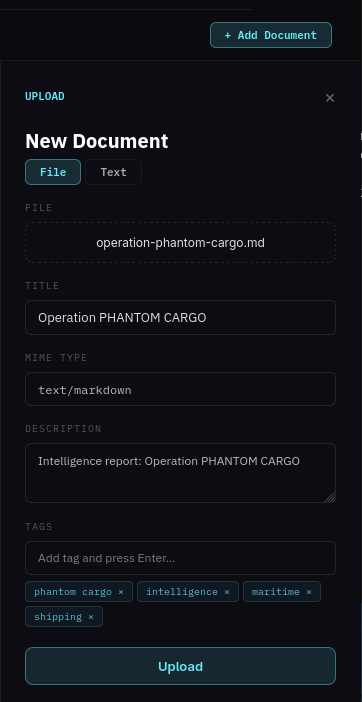

The document shows upload progress.  On upload completing, the new
document outline changes to a solid line.

### Step 2: Submit the Document for Processing

Once the document is uploaded, click **Submit for Processing** on the
document detail panel.  A 3-step wizard appears to select a flow and
collection.

**Select a flow:** Choose which processing flow to use.  You can select
an existing flow or start a new one.  For this guide, select **default**.

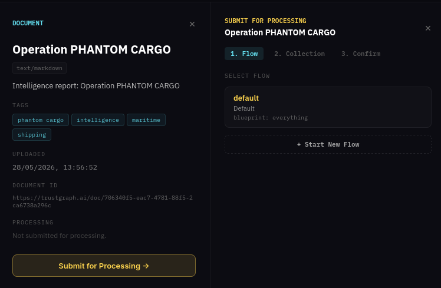

**Select a collection:** Choose which collection the results should be
stored in.  You can select an existing collection or create a new one.
For this guide, select **default**.

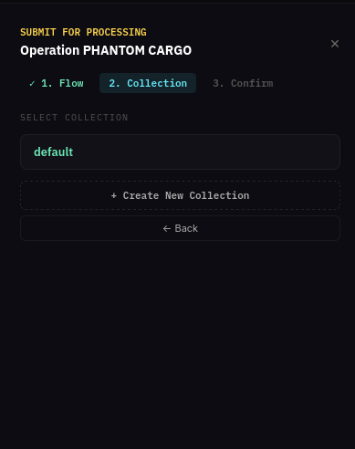

**Confirm:** Review the document, flow and collection selections, then
click **Submit for Processing**.

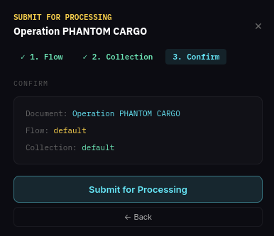

The main page reconfigures to show the document with its processing
pipelines — documents on the left, flows in the middle, and storage
destinations on the right.

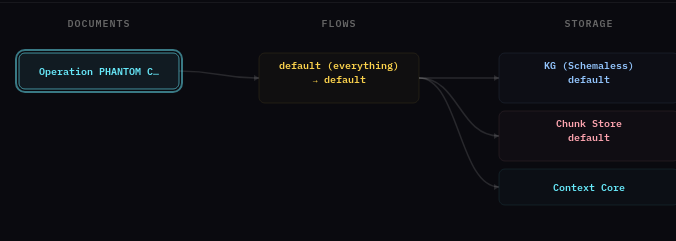

### Step 5: Monitoring

If you want to see the document loading, you can go to Grafana at
[`http://localhost:3000`](http://localhost:3000).  Login with username `admin` and the password you set in
`GF_SECURITY_ADMIN_PASSWORD`.  Grafana is configured with a single
dashboard.  Some useful things to monitor are:

The pub/sub backlog.  You can monitor the size of queues in Pulsar.
GraphRAG knowledge extraction causes a queue of chunks for processing in
knowledge extraction and you can see this in the backlog:

There is also a knowledge extraction backlog graph which helps to see
knowledge extraction if other queues are being exercised:

To gauge LLM effectiveness, there is a heatmap which shows LLM latency.
Here we can see that LLM response times for my LLM processing are in the
6 second window.

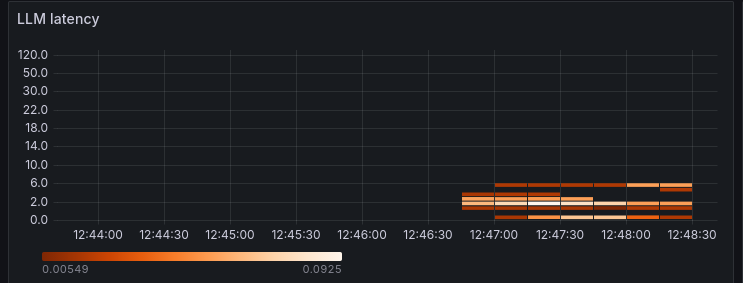

Another LLM effectiveness graph, the Token graph shows token throughput
over time, the Y-axis shows tokens/s rate.

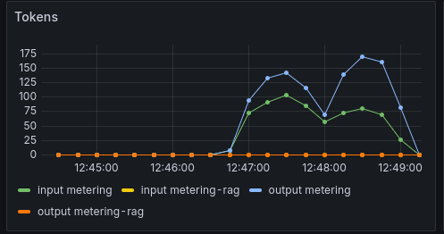

Finally, another useful chart shows the rate limit events per second.
These are commonly seen in the text-completion process which interfaces
with the LLM.  Rate limit events are normal for a knowledge extraction
backlog.  This might particularly be helpful for you to determine whether
you need to provision more LLM bandwidth or dedicated hosting.

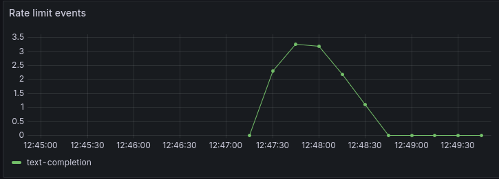

The document we loaded is small, and will process very quickly, so you
should only see a 'blip' on the backlog showing that chunks were loaded
and cleared quickly.

It can take many minutes or hours to process large documents or large document
sets using GraphRAG extraction.

### Step 6: Query with Graph RAG

From the Workflows page, select **Graph RAG Query**.  This console has
full Explainable AI enabled, which helps to understand and diagnose
retrieval.

Enter the question: What intelligence resources were using during the
PHANTOM CARGO operation?  After a short while you should see a response.

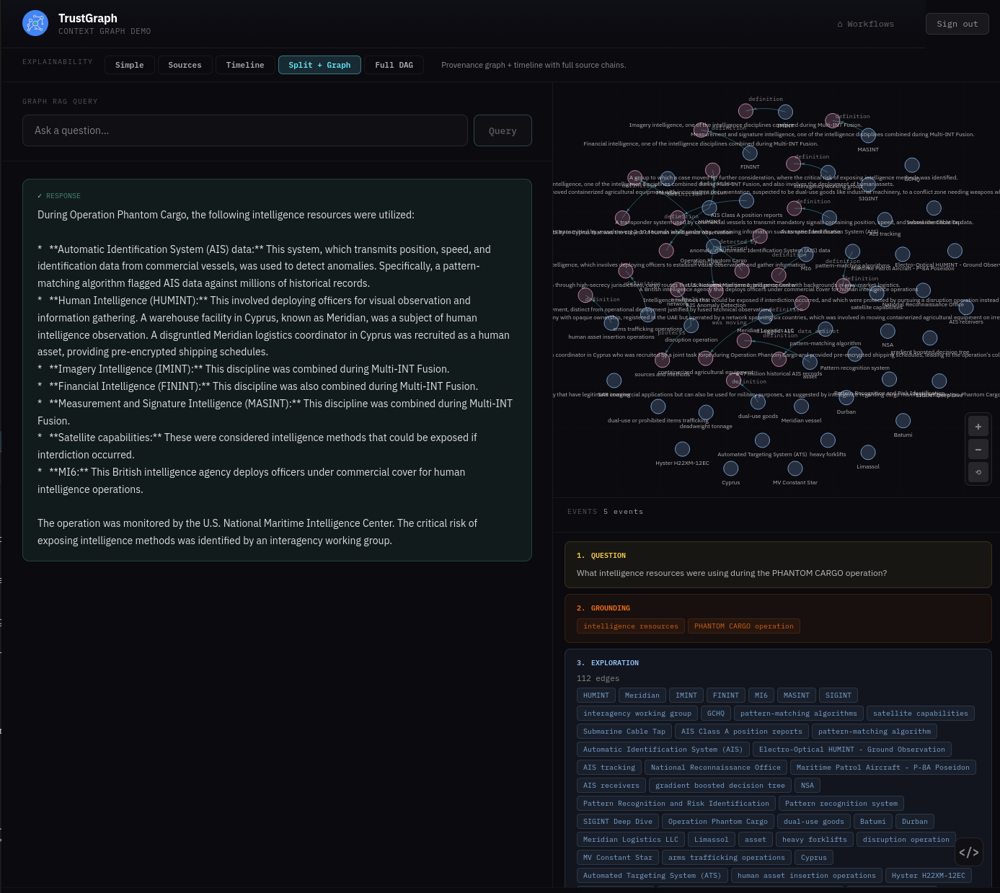

On the left-hand side you see the answer to the query.  The bottom right
part of the screen shows the various explainability events, starting from
the question:

- **Grounding** — where retrieval selects key concepts for discovery
- **Exploration** — where graph nodes are selected for analytics
- **Focus** — where the system decides on a core set of graph edges to
  resolve the question
- **Synthesis** — where this is processed to provide an answer

The **Focus** event may be of particular interest as you can trace graph
edges all the way back to the source documents.  For example, the graph
edge *(pattern-matching algorithm → flagged AIS data against → 847
million historical AIS records)* has a link to source below which, when
followed, shows the original source text.

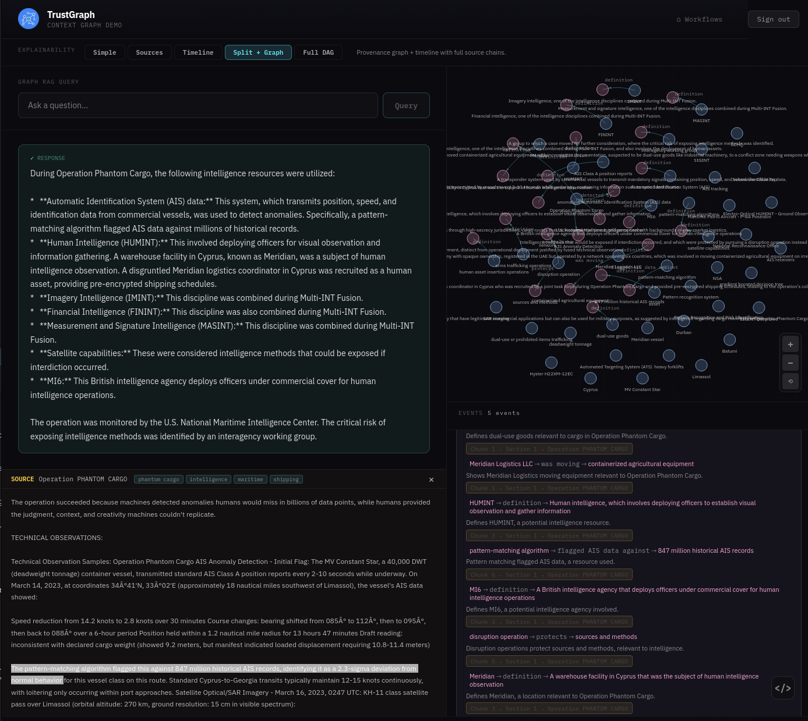

### Step 7: Explore the knowledge graph

From the Workflows page, select **Graph Explorer**.  This shows what's
in the knowledge graph with tools for viewing and searching.

The graph can be easier to see in 3D — click the **3D** button above
the graph view.

If you click a node, it will be highlighted along with its related
edges.  A side panel also appears showing node properties and
highlighted links that allow you to navigate to related nodes.

On the top left is a **Search** button which opens a search dialog.
You can enter text for a similarity search against nodes in the graph.
Matching nodes are listed and can be selected, which adds them to the
graph along with their neighbours.

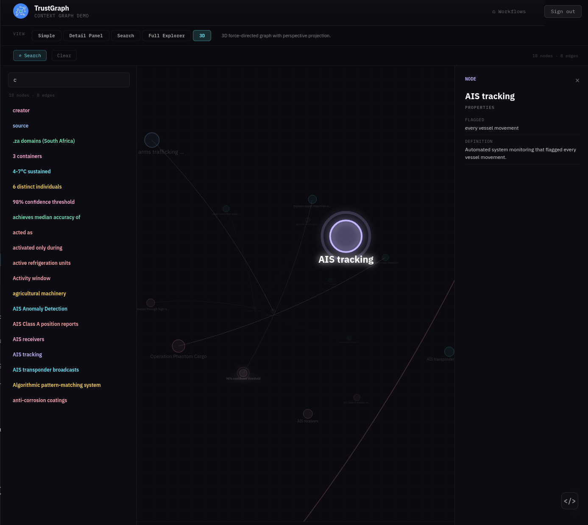

There is also a **Clear** button which resets the graph back to an
empty state.

## GraphRAG vs. Other Approaches

| Aspect | Document RAG | Graph RAG | Ontology RAG |
|--------|--------------|-----------|--------------|
| **Retrieval** | Vector similarity | Graph relationships | Schema-based |
| **Context** | Isolated chunks | Connected entities | Connected objects, properties and types |
| **Best for** | Semantic search | Complex relationships | Complex relationships + precise types |
| **Setup** | Simple | Simple | Complex |
| **Speed** | Fast | Medium | Medium |

**Use multiple approaches**: The processing flow defines the extraction
and retrieval mechanisms, so you can use multiple approaches on the same
data.

## Next Steps

### Explore Other RAG Types

- **[Ontology RAG](../ontology-rag/)** - Use structured schemas for extraction

### Advanced Features

- **[Structured Processing](../structured-processing/)** - Extract typed objects
- **[Agent Extraction](../agent-extraction)** - AI-powered extraction workflows
- **[Object Extraction](../object-extraction)** - Domain-specific extraction

### Using the CLI

For command-line workflows, see the [Graph RAG CLI Guide](../graph-rag-cli/).

## Related Resources

- **[Getting Started](../../getting-started)** - Introduction to TrustGraph
- **[Deployment](../../deployment/)** - Scaling for production
- **[Monitoring](../monitoring/)** - Monitoring and diagnostics
