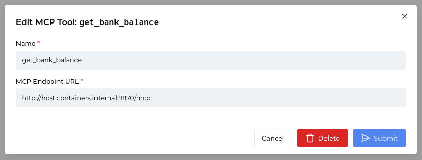
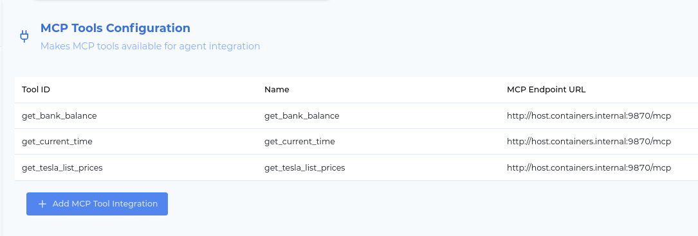
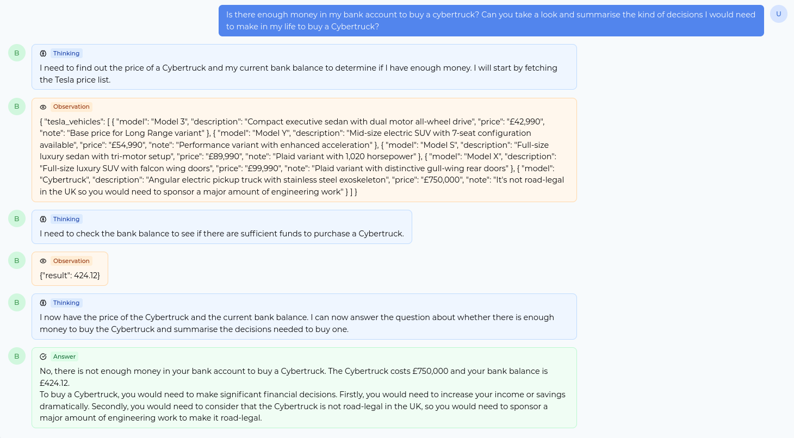

# MCP Integration

Learn how to integrate Model Context Protocol (MCP) servers with TrustGraph to extend your agent workflows with custom tools and capabilities.

This is a feature which began release in TrustGraph 1.1.

## Overview

The Model Context Protocol (MCP) is an open standard that enables seamless integration between AI systems and external tools. TrustGraph supports MCP, allowing you to connect custom tools and services that your agents can use during their workflows.

This guide walks through setting up a simple MCP server and integrating it with TrustGraph's agent framework.

The capability has been released to allow early adopters to get started
with the technology.  MCP is an emerging topic, and a number of areas such
as production deployment and authentication may not be ready for production
use.  Follow the TrustGraph roadmap as we track this emerging and amazing
technology.

## What You'll Learn

- How to create a basic MCP server with custom tools
- How to configure TrustGraph to use MCP services
- How to enable agents to use MCP tools in their workflows
- Best practices for MCP integration

## Prerequisites

Before starting this guide, ensure you have:

- A running TrustGraph instance (see [Installation Guide](../../getting-started/installation))
- Python 3.8 or later with a working development environment
- Basic familiarity with Python programming
- The TrustGraph CLI tools installed (`pip install trustgraph-cli`)

## Quickstart Scenario

In this guide, we'll create an MCP server with three example tools:

1. **`get_current_time`** - Returns the current system time
2. **`get_tesla_list_prices`** - Provides Tesla vehicle pricing information (test data)
3. **`get_bank_balance`** - Returns a user's bank balance (hard-coded for demo)

We'll then configure TrustGraph to use these tools and demonstrate how an agent can leverage them to answer complex questions.

## Step 1: Set Up TrustGraph

If you haven't already, deploy TrustGraph using one of the methods described in the [Installation Guide](../../getting-started/installation).

For this tutorial, we recommend loading a small sample document to enable knowledge-based queries alongside MCP tools:

```bash
tg-load-sample-documents
```

Select a small document like "Beyond State Surveillance" for quick loading.

## Step 2: Create the MCP Server

Create a new file called `server.py` with the following code:

```python
import dataclasses
import datetime

# server.py
from mcp.server.fastmcp import FastMCP

# Create an MCP server
mcp = FastMCP("Demo", host="0.0.0.0", port=9870)

@dataclasses.dataclass
class CurrentTime:
    time: str

@mcp.tool()
def get_current_time() -> CurrentTime:
    """Return the current time"""
    return {
        "time": datetime.datetime.now().isoformat()
    }

@mcp.tool()
def get_tesla_list_prices() -> dict:
    """Return Tesla list prices"""
    return {
      "tesla_vehicles": [
        {
          "model": "Model 3",
          "description": "Compact executive sedan with dual motor all-wheel drive",
          "price": "£42,990",
          "note": "Base price for Long Range variant"
        },
        {
          "model": "Model Y",
          "description": "Mid-size electric SUV with 7-seat configuration available",
          "price": "£54,990",
          "note": "Performance variant with enhanced acceleration"
        },
        {
          "model": "Model S",
          "description": "Full-size luxury sedan with tri-motor setup",
          "price": "£89,990",
          "note": "Plaid variant with 1,020 horsepower"
        },
        {
          "model": "Model X",
          "description": "Full-size luxury SUV with falcon wing doors",
          "price": "£99,990",
          "note": "Plaid variant with distinctive gull-wing rear doors"
        },
        {
          "model": "Cybertruck",
          "description": "Angular electric pickup truck with stainless steel exoskeleton",
          "price": "£750,000",
          "note": "It's not road-legal in the UK so you would need to sponsor a major amount of engineering work"
        }
      ]
    }

@mcp.tool()
def get_bank_balance() -> float:
    """Return the value in my current account in UK pounds"""
    return 424.12

mcp.run(transport="streamable-http")
```

### Install Dependencies

Install the MCP library:

```bash
pip install mcp
```

### Start the MCP Server

Run the server:

```bash
python3 server.py
```

You should see output similar to:

```
INFO:     Started server process [457135]
INFO:     Waiting for application startup.
[07/15/25 13:52:21] INFO     StreamableHTTP session manager started         streamable_http_manager.py:111
INFO:     Application startup complete.
INFO:     Uvicorn running on http://0.0.0.0:9870 (Press CTRL+C to quit)
```

This confirms the server is running on port 9870.

## Step 3: Configure MCP Tools in TrustGraph

### Access the Web Interface

Navigate to the TrustGraph web interface at [http://localhost:8888/](http://localhost:8888/).

### Add MCP Tool Integrations

1. Go to the **MCP Tools** configuration page
2. For each of the three tools, click **"Add MCP Tool Integration"** and configure:

   - **Tool 1**: `get_tesla_list_prices`
   - **Tool 2**: `get_current_time`
   - **Tool 3**: `get_bank_balance`

3. For each tool, set the MCP server address:
   - **Linux with Podman**: `http://host.containers.internal:9870/mcp`
   - **Docker**: `http://host.docker.internal:9870/mcp`

<a href="mcp-tool-config.png">
  
</a>

> **Note**: Since TrustGraph runs in containers while your MCP server runs on the host machine, you need to use the special hostname that allows containers to access the host.

The finished MCP tool list should appear as below:

<a href="mcp-tool-list.png">
  
</a>

### Alternative: Configure via CLI

For automation or scripting, you can also configure MCP tools using the CLI:

```bash
# Configure the three MCP tools
tg-set-mcp-tool --id get_current_time \
  --tool-url "http://host.containers.internal:9870/mcp"

tg-set-mcp-tool --id get_tesla_list_prices \
  --tool-url "http://host.containers.internal:9870/mcp"

tg-set-mcp-tool --id get_bank_balance \
  --tool-url "http://host.containers.internal:9870/mcp"
```

### Verify MCP Integration

First, verify that your MCP tools are properly configured:

```bash
# List all configured MCP tools
tg-show-mcp-tools
```

This should show your three configured MCP tools with their URLs and settings.

Test that TrustGraph can communicate with your MCP server:

```bash
tg-invoke-mcp-tool -n get_current_time
```

Expected output:

```json
{
    "time": "2025-07-15T13:57:54.925316"
}
```

Test the other tools:

```bash
tg-invoke-mcp-tool -n get_tesla_list_prices
tg-invoke-mcp-tool -n get_bank_balance
```

If any tool isn't working, you can check the configuration and remove/reconfigure it:

```bash
# Remove a tool if needed
tg-delete-mcp-tool --id get_current_time

# Reconfigure it
tg-set-mcp-tool --id get_current_time \
  --tool-url "http://host.containers.internal:9870/mcp"
```

## Step 4: Configure Agent Tools

Now we'll make these MCP tools available to TrustGraph agents. You can configure them via the web interface or CLI.

### Option A: Configure via Web Interface

In the web interface, navigate to **"Agent Tools"**. You can delete the sample tools and add your MCP tools.

Add the following tool configurations:

1. **get_current_time**
   - Type: `MCP Tool`
   - Tool ID: `get_current_time`
   - Name: `get_current_time`
   - Description: `Fetches the current time as an ISO format string`
   - Arguments: (leave empty)

2. **get_bank_balance**
   - Type: `MCP Tool`
   - Tool ID: `get_bank_balance`
   - Name: `get_bank_balance`
   - Description: `Fetches the user's bank balance, the value returned is in GBP sterling`
   - Arguments: (leave empty)

3. **get_tesla_list_prices**
   - Type: `MCP Tool`
   - Tool ID: `get_tesla_list_prices`
   - Name: `get_tesla_list_prices`
   - Description: `Fetches the current Tesla vehicle price list. This contains information such as model, current price, and notes that are relevant`
   - Arguments: (leave empty)

### Option B: Configure via CLI

Use the CLI to configure agent tools that reference your MCP tools:

```bash
# Configure agent tool for current time
tg-set-tool --id get_current_time \
  --name get_current_time \
  --type mcp-tool --mcp-tool get_current_time \
  --description "Fetches the current time as an ISO format string"

# Configure agent tool for bank balance
tg-set-tool --id get_bank_balance \
  --name get_bank_balance \
  --type mcp-tool --mcp-tool get_bank_balance \
  --description "Fetches the bank balance, the value returned is in GBP sterling"

# Configure agent tool for Tesla prices
tg-set-tool --id get_tesla_list_prices \
  --name get_tesla_list_prices \
  --type mcp-tool --mcp-tool get_tesla_list_prices \
  --description "Fetches the current Tesla vehicle price list. This contains information such as model, current price, and notes that are relevant"
```

### Optional: Add Knowledge Query Tool

If you loaded sample documents earlier, you can also add a knowledge query tool:

**Via Web Interface:**
- **Surveillance and Intelligence**
  - Type: `Knowledge query`
  - Tool ID: `surveillance-and-intelligence`
  - Name: `search_surveillance_intelligence_kb`
  - Description: `This tool has information about the topics of state surveillance and intelligence gathering. The question should be a natural language question.`

**Via CLI:**
```bash
tg-set-tool --id surveillance-and-intelligence \
  --name "search_surveillance_intelligence_kb" \
  --type knowledge-query --collection default \
  --description "This tool has information about the topics of state surveillance and intelligence gathering. The question should be a natural language question." \
  --argument query:string:"Natural language question about surveillance and intelligence"
```

### Verify Agent Tool Configuration

Check that your agent tools are properly configured:

```bash
# List all configured agent tools
tg-show-tools
```

This should show your MCP-based agent tools along with any knowledge query tools you configured.

## Step 5: Test the Integration

### Command Line Testing

Run an agent query that uses multiple MCP tools:

```bash
tg-invoke-agent -v -q 'Is there enough money in my bank account to buy a
cybertruck? Can you take a look and summarise the kind of decisions I would
need to make in my life to buy a Cybertruck?'
```

Expected output shows the agent:
1. Fetching Tesla prices to find the Cybertruck cost
2. Checking the bank balance
3. Comparing values and providing recommendations

### Web Interface Testing

1. Go to the **GraphRAG** tab
2. Select **'Agent'** mode
3. Enter the same question

<a href="agent-chat.png">
  
</a>

## How This Works

When you submit a question to the TrustGraph agent:

1. **Query Analysis**: The agent analyzes your question to determine what information it needs
2. **Tool Selection**: It identifies which MCP tools can provide the required data
3. **Tool Invocation**: The agent calls the MCP tools through TrustGraph's MCP integration layer
4. **Data Integration**: Results from multiple tools are combined and analyzed
5. **Response Generation**: The agent formulates a comprehensive answer based on all gathered information

The MCP protocol handles:
- **Tool Discovery**: TrustGraph automatically discovers available tools from the MCP server
- **Type Safety**: Input and output types are validated
- **Error Handling**: Failed tool calls are gracefully handled
- **Async Communication**: Tools can be called in parallel for efficiency

## Advanced Usage Examples

### Combining MCP Tools with Knowledge Queries

Try this query that combines MCP data with document knowledge:

```bash
tg-invoke-agent -v -q 'Given the current surveillance capabilities described
in the documents, and considering my bank balance, what privacy protection
measures could I afford if I wanted to protect myself from state
surveillance while saving for a Tesla?'
```

This demonstrates how agents can:
- Query knowledge graphs for context
- Use MCP tools for real-time data
- Synthesize information from multiple sources

### Creating More Complex MCP Tools

You can extend the MCP server with tools that:
- Query external APIs
- Access databases
- Perform calculations
- Integrate with other services

Example of a more complex tool:

```python
@mcp.tool()
def calculate_savings_timeline(target_amount: float, monthly_savings: float) -> dict:
    """Calculate how long it will take to save for a target amount"""
    months_needed = int(target_amount / monthly_savings)
    years = months_needed // 12
    remaining_months = months_needed % 12
    
    return {
        "total_months": months_needed,
        "years": years,
        "additional_months": remaining_months,
        "target_amount": target_amount,
        "monthly_savings": monthly_savings
    }
```

## CLI-Based Workflow Examples

### Complete MCP Setup Script

Create a script to automate the entire MCP setup process:

```bash
#!/bin/bash
# setup-mcp-tools.sh

echo "Setting up MCP tools for TrustGraph..."

# Configure MCP tools (the underlying MCP service references)
echo "Configuring MCP tool endpoints..."
tg-set-mcp-tool --id get_current_time \
  --tool-url "http://host.containers.internal:9870/mcp"

tg-set-mcp-tool --id get_tesla_list_prices \
  --tool-url "http://host.containers.internal:9870/mcp"

tg-set-mcp-tool --id get_bank_balance \
  --tool-url "http://host.containers.internal:9870/mcp"

# Verify MCP tools are configured
echo "Verifying MCP tool configuration..."
tg-show-mcp-tools

# Configure agent tools (the tools agents can use)
echo "Configuring agent tools..."
tg-set-tool --id get_current_time --name "Get the current time" \
  --type mcp-tool --mcp-tool get_current_time \
  --description "Fetches the current time as an ISO format string"

tg-set-tool --id get_bank_balance --name "Get the user's current bank balance" \
  --type mcp-tool --mcp-tool get_bank_balance \
  --description "Fetches the bank balance, the value returned is in GBP sterling"

tg-set-tool --id get_tesla_list_prices --name "Get tesla list prices" \
  --type mcp-tool --mcp-tool get_tesla_list_prices \
  --description "Fetches the current Tesla vehicle price list"

# Verify agent tools are configured
echo "Verifying agent tool configuration..."
tg-show-tools

# Test MCP connectivity
echo "Testing MCP tool connectivity..."
tg-invoke-mcp-tool -n get_current_time
tg-invoke-mcp-tool -n get_bank_balance

echo "MCP setup complete!"
```

### Environment-Specific Configuration

Configure different MCP endpoints for different environments:

```bash
#!/bin/bash
# configure-mcp-environment.sh

ENVIRONMENT=${1:-development}

case $ENVIRONMENT in
  development)
    MCP_BASE_URL="http://host.containers.internal:9870/mcp"
    ;;
  staging)
    MCP_BASE_URL="http://staging-mcp.internal:9870/mcp"
    ;;
  production)
    MCP_BASE_URL="https://mcp.production.com/mcp"
    ;;
  *)
    echo "Unknown environment: $ENVIRONMENT"
    exit 1
    ;;
esac

echo "Configuring MCP tools for $ENVIRONMENT environment..."

tg-set-mcp-tool --id get_current_time --tool-url "$MCP_BASE_URL"
tg-set-mcp-tool --id get_tesla_list_prices --tool-url "$MCP_BASE_URL"
tg-set-mcp-tool --id get_bank_balance --tool-url "$MCP_BASE_URL"

echo "Configuration complete for $ENVIRONMENT environment"
```

### MCP Tool Health Check Script

Monitor MCP tool health and availability:

```bash
#!/bin/bash
# mcp-health-check.sh

echo "=== MCP Tools Health Check ==="

# Check MCP tool configurations
echo "Checking MCP tool configurations..."
if tg-show-mcp-tools > /dev/null 2>&1; then
    echo "✓ MCP tools configured"
    tool_count=$(tg-show-mcp-tools | grep -c "id.*|")
    echo "  Found $tool_count MCP tools"
else
    echo "✗ No MCP tools configured"
    exit 1
fi

# Test each MCP tool
echo "Testing MCP tool connectivity..."
mcp_tools=("get_current_time" "get_tesla_list_prices" "get_bank_balance")

for tool in "${mcp_tools[@]}"; do
    if tg-invoke-mcp-tool -n "$tool" > /dev/null 2>&1; then
        echo "✓ $tool - responding"
    else
        echo "✗ $tool - not responding"
    fi
done

# Check agent tool configurations
echo "Checking agent tool configurations..."
agent_tool_count=$(tg-show-tools | grep -c "mcp-tool")
echo "  Found $agent_tool_count MCP-based agent tools"

echo "Health check complete"
```

## Best Practices

### MCP Server Development

1. **Error Handling**: Always handle exceptions gracefully in your tools
2. **Documentation**: Provide clear descriptions for tools and parameters
3. **Type Hints**: Use proper type annotations for better integration
4. **Logging**: Implement logging for debugging and monitoring
5. **Security**: Validate inputs and sanitize outputs

### CLI-Based Configuration Management

1. **Automation Scripts**: Use scripts to automate MCP setup and configuration
2. **Environment Management**: Maintain separate configurations for different environments
3. **Version Control**: Keep your configuration scripts in version control
4. **Testing**: Test MCP tools individually before integrating with agents
5. **Documentation**: Document your MCP tool configurations and their purposes

### Integration Configuration

1. **Network Security**: Use proper firewall rules for MCP server ports
2. **Authentication**: Consider adding authentication for production deployments
3. **Performance**: Monitor tool execution times and optimize as needed
4. **Versioning**: Version your MCP tools to manage updates
5. **Health Monitoring**: Implement regular health checks for MCP services

### Tool Design

1. **Single Responsibility**: Each tool should do one thing well
2. **Idempotency**: Tools should produce consistent results for the same inputs
3. **Descriptive Names**: Use clear, action-oriented tool names
4. **Comprehensive Descriptions**: Help agents understand when to use each tool
5. **Configuration Separation**: Keep MCP tool configurations separate from agent tool configurations

## Troubleshooting

### Common Issues

**MCP Server Not Accessible**
- Verify the server is running on the correct port
- Check firewall settings
- Ensure you're using the correct host address for container access

**Tool Invocation Fails**
- Check MCP server logs for errors
- Verify tool configuration in TrustGraph matches the MCP server
- Test tools individually using `tg-invoke-mcp-tool`

**Agent Doesn't Use MCP Tools**
- Ensure tools are properly configured in Agent Tools
- Check tool descriptions are clear and relevant
- Verify the agent has access to the configured tools

### Debug Commands

```bash
# List configured MCP tools (the underlying MCP tool configurations)
tg-show-mcp-tools

# List configured agent tools (tools available to agents)
tg-show-tools

# Test individual MCP tool directly
tg-invoke-mcp-tool -n <tool_name> -P '{"param": "value"}'

# Check specific MCP tool configuration
tg-show-mcp-tools | grep -A 5 <tool_name>

# Check agent configuration
tg-show-config | grep -A 10 agent

# Remove and reconfigure MCP tools if needed
tg-delete-mcp-tool --id <tool_name>
tg-set-mcp-tool --id <tool_name> --tool-url "http://host.containers.internal:9870/mcp"

# Remove and reconfigure agent tools if needed
tg-delete-tool --id <tool_name>
tg-set-tool --id <tool_name> --name "Tool Name" --type mcp-tool --mcp-tool <tool_name> --description "Tool description"
```

## Next Steps

- Explore creating custom MCP tools for your specific use cases
- Learn about [securing MCP deployments](../security/)
- Integrate with external APIs and services
- Build complex agent workflows using multiple tools

## Further Reading

### MCP and Tool CLI Documentation

- [`tg-set-mcp-tool`](../../reference/cli/tg-set-mcp-tool) - Configure MCP tools
- [`tg-show-mcp-tools`](../../reference/cli/tg-show-mcp-tools) - List MCP tool configurations
- [`tg-delete-mcp-tool`](../../reference/cli/tg-delete-mcp-tool) - Remove MCP tool configurations
- [`tg-invoke-mcp-tool`](../../reference/cli/tg-invoke-mcp-tool) - Test and execute MCP tools
- [`tg-set-tool`](../../reference/cli/tg-set-tool) - Configure agent tools
- [`tg-show-tools`](../../reference/cli/tg-show-tools) - List agent tool configurations
- [`tg-delete-tool`](../../reference/cli/tg-delete-tool) - Remove agent tool configurations

### Additional Resources

- [MCP Protocol Specification](https://github.com/anthropics/mcp)
- [TrustGraph Agent Documentation](../../reference/apis/api-agent)
- [TrustGraph CLI Reference](../../reference/cli/)
- [Advanced Agent Workflows](../../advanced/custom-algorithms)
