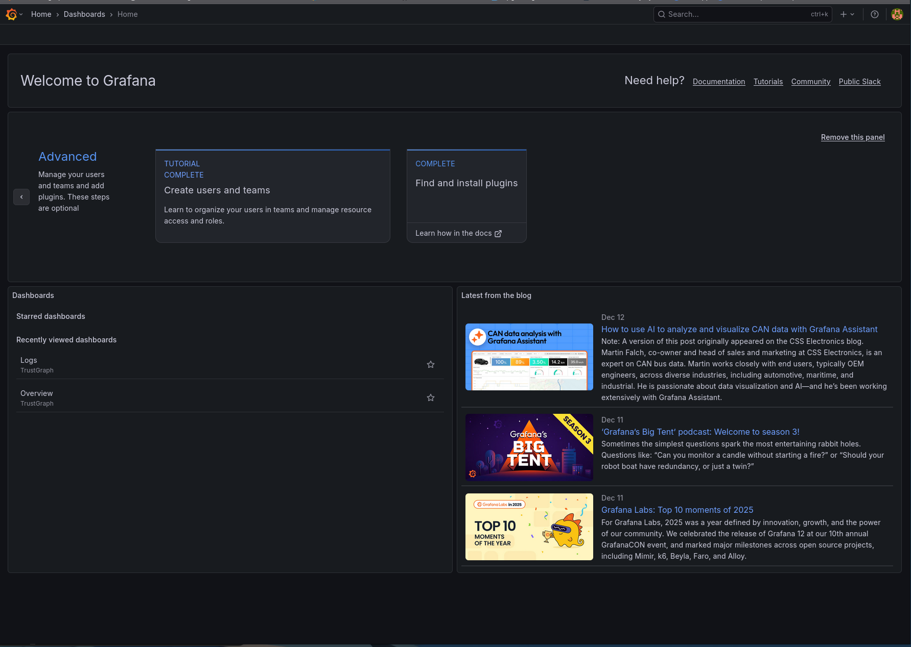
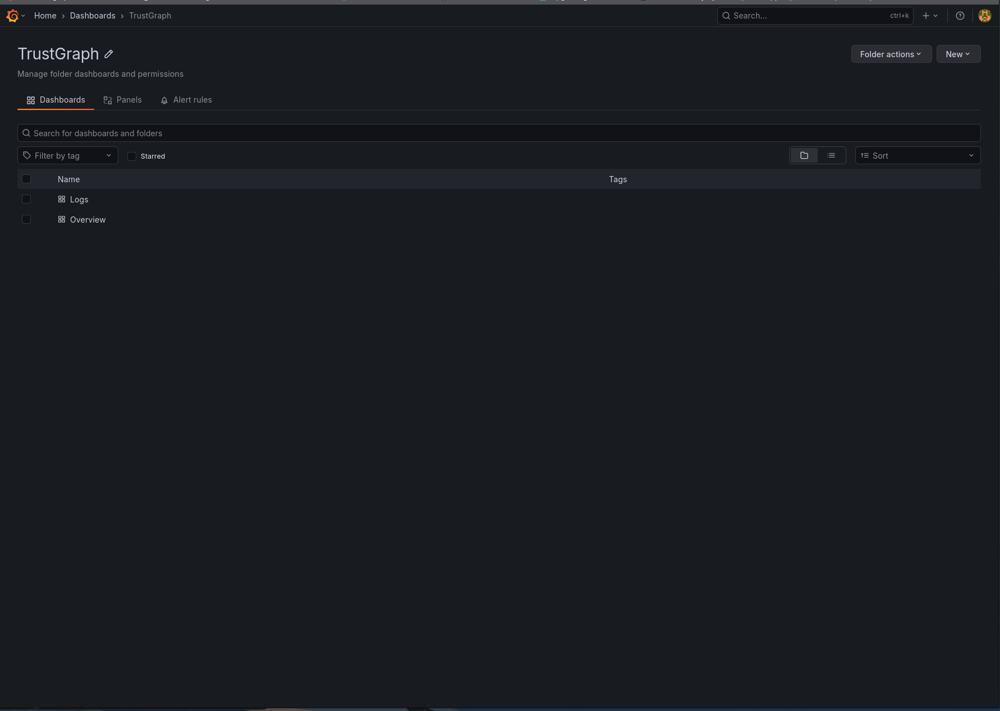
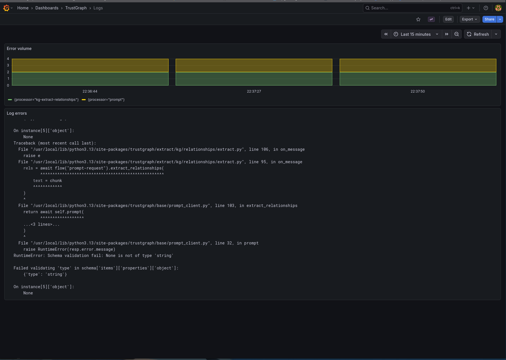
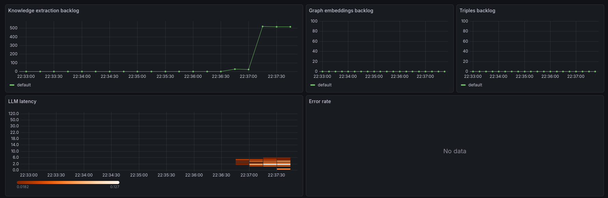
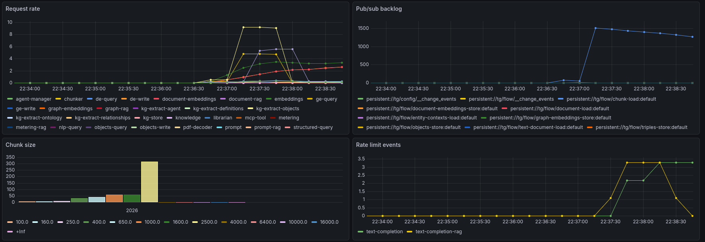

# Monitoring


<ul style="margin: 0; padding-left: 20px;">
<li>A running TrustGraph deployment</li>
<li>Access to Grafana (port 3000)</li>
<li>Access to Prometheus (port 9090)</li>
</ul>




## Observability Stack

TrustGraph deployments include a complete observability stack for monitoring system health and performance.

**Components:**

- **Prometheus** - Time-series metrics database that collects and stores metrics from all TrustGraph services
- **Grafana** - Visualization platform providing dashboards for metrics and logs
- **Loki** - Log aggregation system that collects logs from TrustGraph components

**What's monitored:**

TrustGraph components expose metrics and logs automatically. The monitoring stack currently captures:
- All TrustGraph processing components (flows, queues, processors)
- API gateway request/response metrics
- Pulsar message queue statistics
- System resource usage

**Note:** Infrastructure components (Cassandra, Pulsar, etc.) are not yet integrated into the monitoring stack but may be added in future releases.

## Accessing Grafana

Grafana provides the primary interface for viewing metrics and logs.

Access Grafana at `http://localhost:3000` (or your deployment hostname).

Default credentials:
- Username: `admin`
- Password: `admin`



The home screen shows:
- Recent dashboards
- Starred dashboards
- Navigation to logs and metrics

## Available Dashboards

Grafana includes pre-configured dashboards for monitoring TrustGraph:



**TrustGraph Dashboard** - Main monitoring dashboard showing:
- Flow processing rates
- Queue depths and throughput
- API request metrics
- System resource usage
- Processing latency

**Custom Dashboards** - Create additional dashboards for:
- Specific flow instances
- Document processing metrics
- LLM usage and costs
- Custom business metrics

## Viewing Logs

Loki collects logs from all TrustGraph components, providing centralized log access.



**Log sources:**
- Processing flows (document-load, graph-rag, etc.)
- API gateway requests
- Initialization services
- Error messages and stack traces

**Query logs:**
- Use the Explore interface in Grafana
- Filter by component, log level, or time range
- Search log content for debugging

**Current limitation:** Only TrustGraph components send logs to Loki. Infrastructure components (Cassandra, Pulsar) log to their own systems.

## TrustGraph Dashboard

The main TrustGraph dashboard provides comprehensive system monitoring:



**Top section shows:**
- Knowledge backlog - backlog on knowledge extraction queues
- Graph and tripple load backlog
- Latency through LLM as a heatmap
- Error rates



**Middle section displays:**
- Request rates per queue
- Pub/sub queue backlogs
- Chunk size counts histogram
- Indicator of the number of rate-limit events


**Bottom section includes:**
- Resource utilization (CPU, memory)
- List of models in use + token counts
- Token usage
- Token cost (based on token const configuration)

## Using Prometheus

Prometheus provides direct access to raw metrics data for custom queries and analysis.

Access Prometheus at `http://localhost:9090`.


**Use Prometheus to:**
- Execute custom PromQL queries
- Explore available metrics
- Test alert expressions
- Analyze time-series data
- Debug metric collection

**Example queries:**

```promql
# Total messages processed per minute
rate(trustgraph_messages_processed_total[1m])

# Queue depth for a specific flow
trustgraph_queue_depth{flow="default"}

# API request latency (95th percentile)
histogram_quantile(0.95, rate(trustgraph_api_duration_seconds_bucket[5m]))
```

## Monitoring Best Practices

**Regular checks:**
- Monitor queue depths - growing queues indicate processing bottlenecks
- Track error rates - spikes suggest configuration or resource issues
- Watch processing latency - increasing latency means slower responses
- Review logs for errors - catch issues before they impact users

**Set up alerts for:**
- Queue depth exceeding thresholds
- Error rates above acceptable levels
- Processing failures
- Resource exhaustion (CPU, memory, disk)

**Performance tuning:**
- Use metrics to identify slow processors
- Balance flow processing resources
- Optimize queue configurations
- Scale components based on load patterns

## Troubleshooting with Metrics

**Queue backlog growing:**
- Check processor resource limits
- Verify flow configuration
- Look for processing errors in logs
- Consider scaling processors

**High error rates:**
- Filter logs by error level
- Identify failing components
- Check resource availability
- Review recent configuration changes

**Slow API responses:**
- Check API gateway metrics
- Review queue processing times
- Verify LLM response latency
- Examine database query performance

**Resource exhaustion:**
- Monitor CPU and memory usage
- Identify resource-hungry components
- Adjust container limits
- Scale horizontally if needed

## Next Steps

- Configure alert rules in Prometheus
- Create custom Grafana dashboards for your workflows
- Export metrics to external monitoring systems
- Set up long-term metric retention
- Integrate infrastructure component metrics
