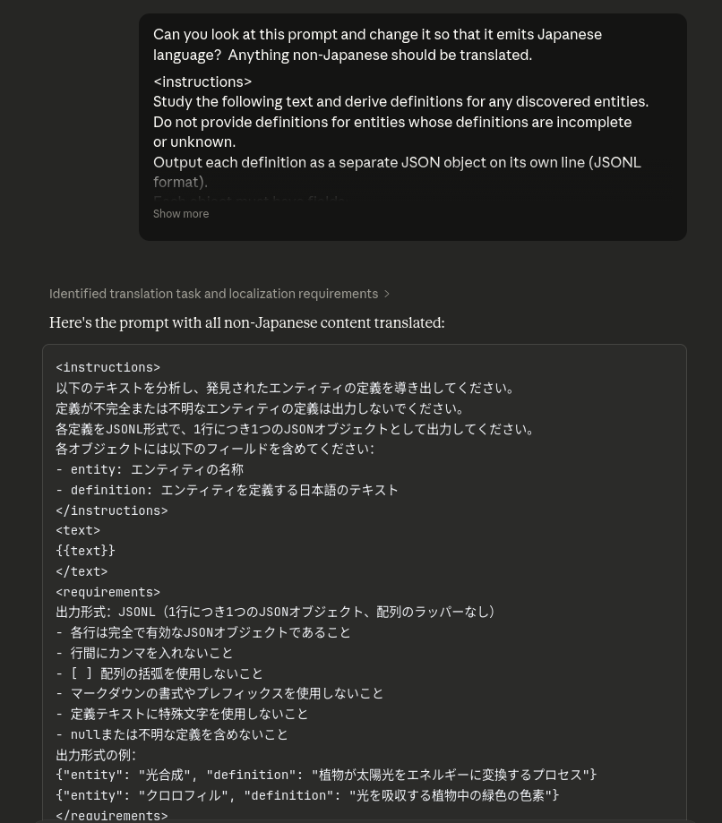
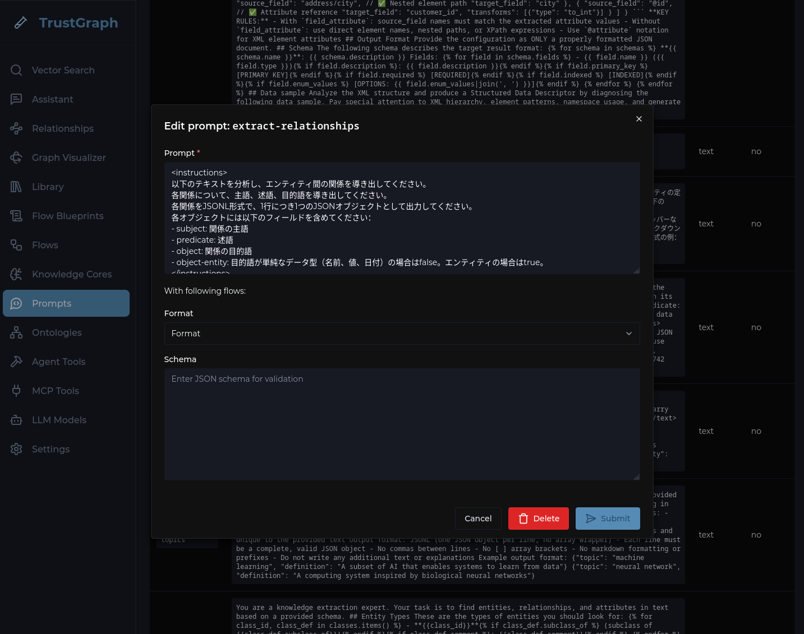
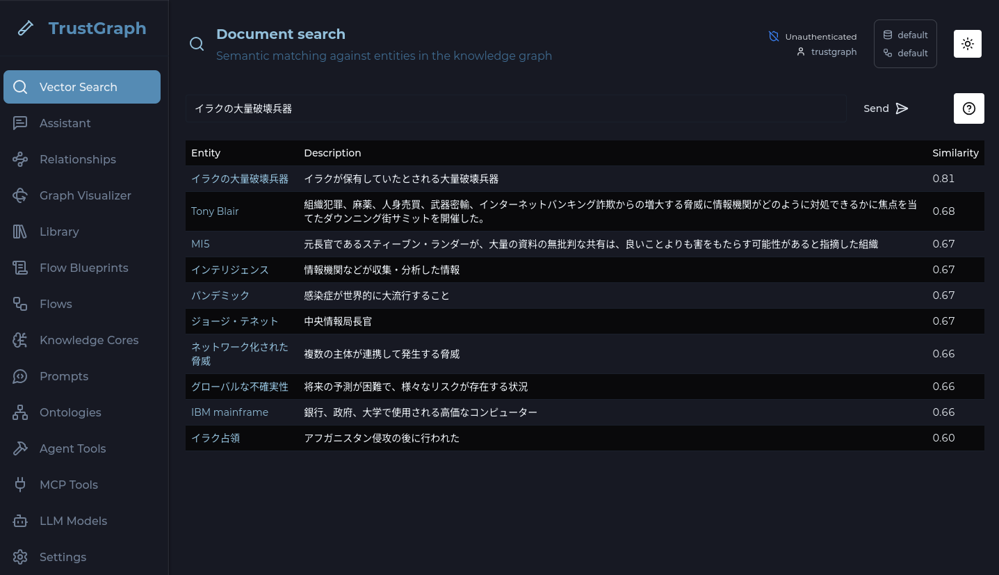
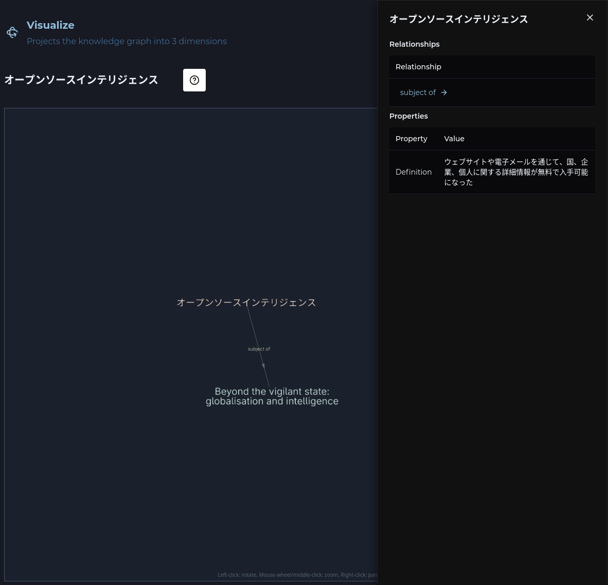
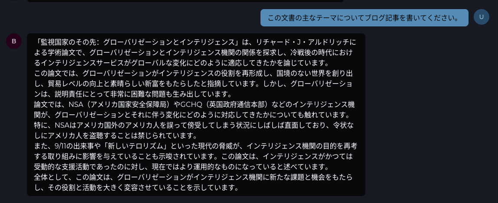

# Working with non-English languages


<ul style="margin: 0; padding-left: 20px;">
<li>TrustGraph deployed (<a href="../getting-started/quickstart">Quick Start</a>)</li>
<li>Understanding of <a href="../getting-started/concepts">Core Concepts</a></li>
<li>An LLM with proficiency in your target language</li>
</ul>




TrustGraph uses an LLM to extract knowledge and build context graphs from your
documents. To work in a non-English language, you simply need a model that is
proficient in your preferred language. Most modern LLMs support multiple
languages, so building a context graph in French, German, Japanese or any
other widely-used language is straightforward.

## Step-by-Step Guide

### Step 1: Verify your model supports the target language

Before processing documents, confirm that your chosen LLM has strong
capabilities in your target language.

For simpler workflows where your source documents are already in the target
language, the model only needs to understand and generate text in that
language. For more complex scenarios—such as ingesting documents in multiple
languages or translating content into a single target language—you'll need a
model with strong multilingual and translation capabilities.

Models with good multilingual support include:
- **Claude** (Anthropic) - Strong performance across many languages
- **Gemini** (Google) - Extensive multilingual training
- **Llama 3** (Meta) - Good support for major world languages
- **Mistral** - Strong European language support
- **Qwen** (Alibaba) - Particularly strong for Chinese and Asian languages

Check your model's documentation for specific language capabilities and
limitations.

### Step 2: Locate the graph extraction prompts

The prompts used during knowledge extraction control the language of the
output graph. To modify them:

- Open the Workbench
- Navigate to the **Prompts** page

Find these two prompts which are used to build context graphs:
- **extract-definitions** - Extracts entity definitions from text
- **extract-relationships** - Extracts relationships between entities

### Step 3: Modify the prompts for your target language

We've found that adding instructions to output in a specific language works
well. The easiest approach is to use an AI chatbot to help edit the prompts:

1. Click on a prompt (e.g. **extract-definitions**) to open the editor
2. Copy the prompt text
3. Paste it into your preferred AI chatbot with a request like:

   > Can you look at this prompt and change it so that it emits Japanese
   > language? Anything non-Japanese should be translated.

4. Copy the modified prompt back into the prompt editor
5. Click **Save**
6. Repeat for the **extract-relationships** prompt

This approach ensures that all extracted entities, definitions, and
relationships are in your target language, even if the source documents
contain mixed-language content.

Now when you load a document through a graph-building process, the graph
will be built in your preferred language.

