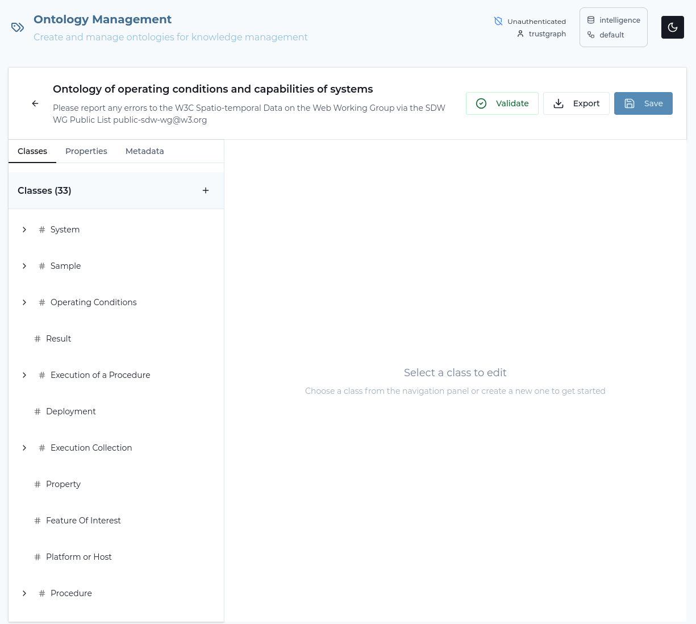
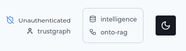
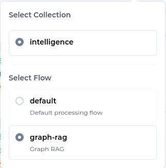
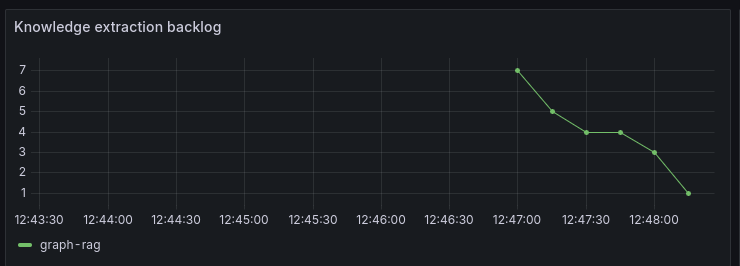
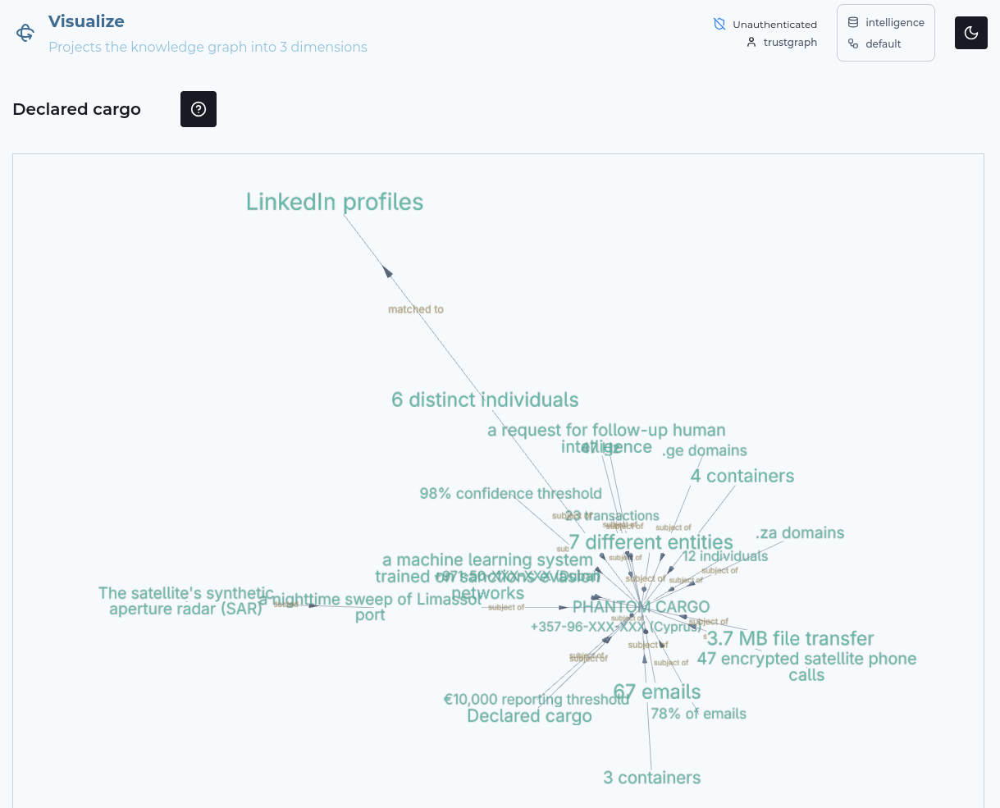

# Ontology RAG Guide

**Extract knowledge using language definition**
**Query documents using graph embeddings and knowledge graph relationships**

Ontology RAG is a technique which uses automated extraction of relationships
from unstructured text, which is stored in a knowledge graph.
It is similar to [GraphRAG](../graph-rag).

Ontology RAG uses an ontology, which is a form of schema, defining the
semantic meaning of language concepts.


In TrustGraph, Ontology RAG refers to information extraction using an
ontology.  TrustGraph supports importing OWL ontologies which can then be
used to import objects and properties from unstructured text.

## What is Ontology RAG?

The essential Graph RAG ingest flow consists of:
1. **Chunking** documents into smaller pieces
2. **Ontology loading** an OWL ontology is loaded into an in-memory store
3. **Knowledge Extraction** using the ontologies to discover entities and relationships
4. **Embedding** each entity as a vector and storing these in a vector store
5. **Storing** entity relationships in a knowledge graph
6. **Retrieving** using semantic similarity to discover knowledge graph entry points
7. **Traversing** the knowledge graph to find related information
8. **Generating** responses using the knowledge subgraph as context to an LLM

The pros and cons of this approach:
- ✅ *Pro*: Very precise retrieval
- ✅ *Pro*: Conformant knowledge graphs - knowledge graph structures are defined by the ontologies
- ✅ *Pro*: Effective when faced with complex relationships or diverse data
- ✅ *Pro*: Scales to handle much larger document sets and complex ontologies
- ⚠️ *Con*: Knowledge extract has a cost at document ingest time
- ⚠️ *Con*: Token costs required to ingest documents
- ⚠️ *Con*: Ontology creation can be a complex process

## When to Use Ontology RAG

✅ **Use Ontology RAG when**:
- Ontologies already exist for your information space
- Answers need context from multiple documents
- You need to connect disparate information
- Complex custom knowledge problems require precision of retrieval
- Working with specialist knowledge such as cybersecurity or intelligence

⚠️ **Consider alternatives when**:
- Simple keyword search on small data is sufficient → Use [Document RAG](../document-rag)
- Ontology defintion will be too complex → Use [GraphRAG](../graph-rag)

## Prerequisites

Before starting:
- ✅ TrustGraph deployed ([Quick Start](../getting-started/quickstart))
- ✅ Understanding of [Core Concepts](../getting-started/concepts)

## Step-by-Step Guide

### Step 1: Load Your Document

TrustGraph supports multiple document formats:
- PDF files (`.pdf`)
- Text files (`.txt`)
- Markdown (`.md`)
- HTML (`.html`)

We're going to start by using a fictional maritime tracking report
which you can download at this URL:

[https://raw.githubusercontent.com/trustgraph-ai/example-data/refs/heads/main/tracking/operation-phantom-cargo.md](https://raw.githubusercontent.com/trustgraph-ai/example-data/refs/heads/main/tracking/operation-phantom-cargo.md).

You can load the document either through the command-line, or using the
Workbench

#### Command-line

You can download the document:
```
wget -O phantom-cargo.md https://raw.githubusercontent.com/trustgraph-ai/example-data/refs/heads/main/tracking/operation-phantom-cargo.md
```

And use a command-line utility to load the document into the TrustGraph
library:

```
tg-add-library-document \
  --name "PHANTOM CARGO" \
  --description "Intelligence report: Operation PHANTOM CARGO" \
  --tags 'maritime,intelligence,cargo,grey arms' \
  --id https://trustgraph.ai/doc/phantom-cargo \
  --kind text/plain \
  phantom-cargo.md
```

You can then see the document in the library:

```
$ tg-show-library-documents
+-------+----------------------------------------------+
| id    | https://trustgraph.ai/doc/phantom-cargo      |
| time  | 2025-11-22 11:05:05                          |
| title | PHANTOM CARGO                                |
| kind  | text/plain                                   |
| note  | Intelligence report: Operation PHANTOM CARGO |
| tags  | maritime, intelligence, cargo, grey arms     |
+-------+----------------------------------------------+
```

#### Workbench

- Download [the document](https://raw.githubusercontent.com/trustgraph-ai/example-data/refs/heads/main/tracking/operation-phantom-cargo.md)
- Go the 'Library' page
- Click 'Upload documents'
- Set the title: PHANTOM CARGO
- Set the Comments to: Intelligence report: Operation PHANTOM CARGO
- Set keywords: maritime, intelligence, cargo, grey arms
- Select 'Text' for the upload operation
- Click 'Select text files'
- Add the document you just downloaded
- Click Submit


### Step 2: Load the Ontology

The ontology we're going to use is the SSN with SOSA extensions.  This is a
standard ontology family defined by the W3C.

SOSA (Sensor, Observation, Sample, and Actuator) and SSN (Semantic Sensor
Network) are standardized vocabularies for describing sensors, observations,
and measurements on the web. They're maintained by the W3C (World Wide Web
Consortium).

Think of them as a shared language that lets different systems talk about
sensor data in a consistent way.

#### The Relationship Between Them

SOSA is the lightweight core — it defines the essential concepts you need to describe observations and sensors. SSN builds on top of SOSA, adding more detailed concepts for complex scenarios.

You can use SOSA alone for simple cases, or bring in SSN when you need more expressive power.

#### Core Concepts in SOSA

The main classes you'll work with are:

- *Sensor* - A device or agent that observes something (a thermometer, a
  satellite, even a human observer).
- *Observation* - The act of measuring or estimating a property. An
  observation links together what was observed, how it was observed, and what
  the result was.
- *ObservableProperty* - The quality being measured (temperature, humidity,
  speed).
- *FeatureOfInterest* - The real-world thing you're interested in (a room,
  a lake, a patient).
- *Result* - The output value of an observation.
- *Actuator* and *Actuation* - The counterparts for doing something rather
  than observing (turning on a heater, opening a valve).
- *Sample* - A representative portion of a larger feature (a water sample
  from a lake).

#### A Simple Example

Imagine a weather station measuring air temperature:
- *FeatureOfInterest*: The atmosphere at a specific location
- *ObservableProperty*: Air temperature
- *Sensor*: A digital thermometer
- *Observation*: The act of taking a reading at 2pm on Tuesday
- *Result*: 22.5 degrees Celsius

#### How TrustGraph uses ontologies

TrustGraph stores ontologies as an internal JSON format which is not
standard but closely follows the OWL Ontology structure.

You can create an ontology using the Workbench Ontology editor.  This is
able to import a standard OWL ontology.  Once loaded, you can use the
configuration API or CLI tools to save and load the ontology in its
imported format.

#### Command-line

Download the ontology in internal JSON format at the following URL:

[https://raw.githubusercontent.com/trustgraph-ai/example-data/refs/heads/main/tracking/ssn-ontology.json](https://raw.githubusercontent.com/trustgraph-ai/example-data/refs/heads/main/tracking/ssn-ontology.json)

e.g.

```
wget -O ssn-ontology.json https://raw.githubusercontent.com/trustgraph-ai/example-data/refs/heads/main/tracking/ssn-ontology.json
```

and then install to TrustGraph:

```
cat ssn-ontology.json | tg-put-config-item --type ontology --key ssn --stdin
```

#### Workbench

Download the ontology in standard Turtle format at the following URL:

[https://raw.githubusercontent.com/trustgraph-ai/example-data/refs/heads/main/tracking/ssn-ontology.ttl](https://raw.githubusercontent.com/trustgraph-ai/example-data/refs/heads/main/tracking/ssn-ontology.ttl)

Then load the ontology:

- On the workbench, go to the settings page, and in the Feature Switches
  section, ensure 'Ontology Editor' is enabled
- Go to the Ontologies page
- Click 'Import Ontology'
- Click the 'Select File' section, and select the ontology you just
  downloaded
- At the bottom of the dialog click 'Import'

At this point you should be looking at a structured view of the ontology.
You can explore the structure of the ontology in this editor.  The ontology
contains classes, properties and datatypes.



### Step 3: Create a Collection

A collection is used to organise a set of related documents or data sources
into a single unit.  Retrieval operations operate across a single collection.

We'll create an 'intelligence' collection:

#### Command-line

```
tg-set-collection -n Intelligence -d 'Intelligence analysis' intelligence
```

#### Workbench

- Go to the 'Library' page
- Select the 'Collections' tab
- Click 'Create Collection'
- Set the ID: intelligence
- Set the name: Intelligence
- Set the description to: Intelligence analysis
- Click 'Submit'

### Step 4: Create the Flow

A flow describes the collection of processing operations.  We're going
to create a single flow for Ontology RAG processing.

We'll create a 'onto-rag' flow:

#### Command-line

This command allows you to add parameters for LLM model, temperature etc.
but we're just going to use the defaults:

```
tg-start-flow -n onto-rag -i onto-rag -d "Ontology RAG"
```

#### Workbench

- Go to the 'Flows' page
- Click 'Create'
- Select the flow class 'Ontology RAG Only'
- Set the ID: onto-rag
- Set the description: Ontology RAG
- Click 'Create'

### Step 5: Submit the Document for Processing

This pushes the document into the flow input.

#### Command-line

This command submits the document for processing.  You need to specify
the flow ID (`onto-rag`) and the document ID which was used when the
document was added to the library in step 1.  The collection ID is
that which was used to create the collection.
Processing objects need an ID, and you can make up any string:

```
tg-start-library-processing \
    --flow-id onto-rag \
    --document-id https://trustgraph.ai/doc/phantom-cargo \
    --collection intelligence \
    --processing-id urn:processing-03
```

#### Workbench

There is a selection widget top right of the screen with an database icon
top left.



Click that to open the collection/flow selector, and select the
Intelligence collection, and Graph RAG, both of which you created earlier.



You are ready to submit the document:

- Go to the 'Library' page
- Select the PHANTOM CARGO document so that the tick box is selected
- Click 'Submit' at the bottom of the page
- Change the Processing flow to Ontology RAG
- Click Submit

From hereon, everything is very similar to GraphRAG.

### Step 6: Monitoring

If you want to see the document loading, you can go to Grafana at
[`http://localhost:3000`](http://localhost:3000).  The default
login user is admin, password admin.  Grafana is configured with a single
dashboard.  Some useful things to monitor are:

The pub/sub backlog.  You can monitor the size of queues in Pulsar.
Knowledge extraction causes a queue of chunks for processing in
knowledge extraction and you can see this in the backlog:


There is also a knowledge extraction backlog graph which helps to see
knowledge extraction if other queues are being exercised:



To gauge LLM effectiveness, there is a heatmap which shows LLM latency.
Here we can see that LLM response times for my LLM processing are in the
6 second window.


Another LLM effectiveness graph, the Token graph shows token throughput
over time, the Y-axis shows tokens/s rate.


Finally, another useful chart shows the rate limit events per second.
These are commonly seen in the text-completion process which interfaces
with the LLM.  Rate limit events are normal for a knowledge extraction
backlog.  This might particularly be helpful for you to determine whether
you need to provision more LLM bandwidth or dedicated hosting.


The document we loaded is small, and will process very quickly, so you
should only see a 'blip' on the backlog showing that chunks were loaded
and cleared quickly.

It can take many minutes or hours to process large documents or large document
sets using Ontology RAG extraction.

### Step 7: Retrieval

Retrieval in Graph RAG consists of mapping the question to a set of candidate
graph entities, and then following graph edges to create a subgraph, which
is used as context with the LLM.

#### Command-line

]$ tg-invoke-graph-rag     -f onto-rag -C intelligence --max-path-length 5 -q 'Write a report about the intelligence gained from optical satellite sensors'
Based on the provided knowledge statements, here's a report about intelligence gained from optical satellite sensors:

Optical satellite sensors are utilized for various intelligence gathering purposes. For instance, "satellite systems photography" is an "Observation" made by "satellite systems" and can be deployed for "port facilities photography" and "port facility surveillance." The "Maxar WorldView-3 commercial satellite tasking (0.31m resolution)" is an example of an optical sensor that has been used to observe "Satellite imagery of Durban Port." This imagery can observe features like "durban-port" and has a specific valid time.

Furthermore, "CSO-class optical reconnaissance satellite" is classified as a "Sensor or Observer," indicating its role in intelligence collection. "IMINT" (Imagery Intelligence) is also categorized as a "Sensor or Observer," which is often derived from optical satellite imagery.

The intelligence gained from these optical sensors can be related to various aspects, such as observing "port facilities" and conducting "port facility surveillance."


```
tg-invoke-graph-rag \
    -f onto-rag -C intelligence \
    -q 'What intelligence resources were using during the PHANTOM CARGO operation?'
```

Which should return a result like:

```
The intelligence resources used during the PHANTOM CARGO operation were:
* SIGINT
* MASINT
* Electro-Optical HUMINT
* FININT
* AIS
* synthetic aperture radar (SAR)
* GPS coordinates
```

#### Workbench

- Ensure the correct collection and flow are selected in the selection widget
- Navigate to the 'Assistant' page
- Select 'Graph RAG' assistant
- Enter the question: What intelligence resources were using during the PHANTOM CARGO operation?
- Press 'Send' and wait for the answer

### Step 8: Explore the knowledge graph

The Workbench provides access to some more tools you can play with.

- Select Vector search
- The search box enter 'optical'
- Click 'Send'

This executes a search in the vector store for graph entities which are listed
along with the graph node description and the vector similarity score.
The exact view may vary depending on the LLM model you are using and the
entities discovered by it.


This is a list of graph nodes.  Clicking on an item moves to a node
exploration view, showing graph nodes related to the selected node.
Clicking on CSO-class optical reconnaissance satellite shows
relationships:


Each row is a graph edge, on the left-hand side is the subject of the
graph node, the middle term shows the predicate (relationship), and the
right-hand side is the object (end node) of the relationship.
On this view you can navigate from the graph node show to other nodes by
clicking on the details.  Clicking on the 'subject of' relationship
shows a long list of all 'subject of' relationships which is a common term.


The 'subject of' relationship links discovered entities to the document
from which they were taken.  The right-hand side entities represent the
PHANTOM CARGO document itself.  Clicking that shows relationships, including
a 'has type' showing that 'PHANTOM CARGO' is a 'digital document'.


Once you have an interesting node, you can click 'Graph view' to switch to
a 3D graph view.  This is navigable.  Clicking a node shows a panel on the
right-hand side allowing you to see node properties, along with controls
to navigate relationships.  This adds further nodes to the graph.



You can rotate the graph and navigate 3D space using the mouse /
pointer controls.

## Further exploration

If you want to try a RAG approach but don't know where to start, an
interesting experiment is to compare GraphRAG and Ontology RAG to see which
works best for your use-case.

If you don't know anything about ontologies, you could try using Claude
to generate an ontology.  Feed in some text, tell the assistant the
important use-cases and ask for an OWL ontology presented in Turtle
format.


## Conclusion

The advantage of Ontology RAG is that it guides the knowledge extraction
to extract knowledge in a particularly precise manner.  For complex use-cases
this means that the knowledge going into retrieval contexts is packed with
the right information to answer the question.  This is a major advantage
for complex information analysis use-cases.


## Ontology RAG vs. Other Approaches

| Aspect | Document RAG | Graph RAG | Ontology RAG |
|--------|--------------|-----------|--------------|
| **Retrieval** | Vector similarity | Graph relationships | Schema-based |
| **Context** | Isolated chunks | Connected entities | Connected objects, properties and types |
| **Best for** | Semantic search | Complex relationships | Complex relationships + precise types |
| **Setup** | Simple | Simple | Complex |
| **Speed** | Fast | Medium | Medium |

**Use multiple approaches**: The processing flow defines the extraction
and retrieval mechanisms, so you can use multiple approaches on the same
data.

## Next Steps

### Explore Other RAG Types

- **[GraphRAG](../graph-rag)** - Schema-free automated knowledge extraction

### Advanced Features

- **[Structured Processing](../structured-processing/)** - Extract typed objects
- **[Agent Extraction](../agent-extraction)** - AI-powered extraction workflows
- **[Object Extraction](../object-extraction)** - Domain-specific extraction

### API Integration

- **[Graph RAG API](../../reference/apis/api-graph-rag)** - API reference
- **[CLI Reference](../../reference/cli/)** - Command-line tools
- **[Examples](../../examples/)** - Code samples

## Related Resources

- **[Core Concepts](../../getting-started/concepts)** - Understanding embeddings and chunks
- **[Vector Search](../../getting-started/concepts#vector-embeddings)** - How semantic search works
- **[Deployment](../../deployment/)** - Scaling for production
- **[Troubleshooting](../../deployment/troubleshooting)** - Common issues
