# Ontology RAG Guide


<ul style="margin: 0; padding-left: 20px;">
<li>TrustGraph deployed (<a href="../../deployment/compose">Installation Guide</a>)</li>
<li>Understanding of <a href="../../getting-started">Core Concepts</a></li>
<li>Familiarity with ontologies and schemas</li>
</ul>




**Extract knowledge using language definition**

Ontology RAG is a technique which uses automated extraction of relationships
from unstructured text, which is stored in a knowledge graph.
It is similar to [GraphRAG](../graph-rag/).

Ontology RAG uses an ontology, which is a form of schema, defining the
semantic meaning of language concepts.

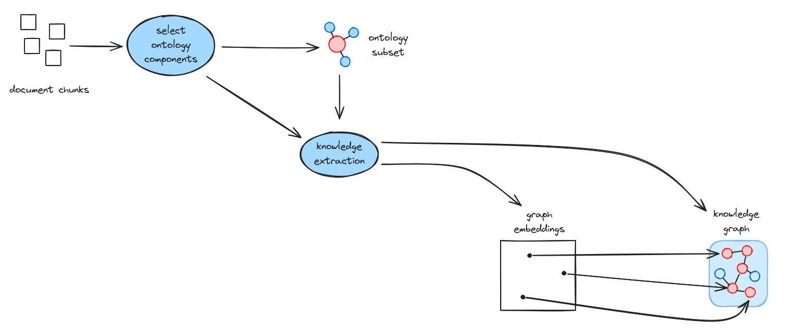

In TrustGraph, Ontology RAG refers to information extraction using an
ontology.  TrustGraph supports importing OWL ontologies which can then be
used to import objects and properties from unstructured text.

## What is Ontology RAG?

The essential Graph RAG ingest flow consists of:
1. **Chunking** documents into smaller pieces
2. **Ontology loading** an OWL ontology is loaded into an in-memory store
3. **Knowledge Extraction** using the ontologies to discover entities and relationships
4. **Embedding** each entity as a vector and storing these in a vector store
5. **Storing** entity relationships in a knowledge graph
6. **Retrieving** using semantic similarity to discover knowledge graph entry points
7. **Traversing** the knowledge graph to find related information
8. **Generating** responses using the knowledge subgraph as context to an LLM

The pros and cons of this approach:
- ✅ *Pro*: Very precise retrieval
- ✅ *Pro*: Conformant knowledge graphs - knowledge graph structures are defined by the ontologies
- ✅ *Pro*: Effective when faced with complex relationships or diverse data
- ✅ *Pro*: Scales to handle much larger document sets and complex ontologies
- ⚠️ *Con*: Knowledge extract has a cost at document ingest time
- ⚠️ *Con*: Token costs required to ingest documents
- ⚠️ *Con*: Ontology creation can be a complex process

## When to Use Ontology RAG

✅ **Use Ontology RAG when**:
- Ontologies already exist for your information space
- Answers need context from multiple documents
- You need to connect disparate information
- Complex custom knowledge problems require precision of retrieval
- Working with specialist knowledge such as cybersecurity or intelligence

⚠️ **Consider alternatives when**:
- Simple keyword search on small data is sufficient → Use [Document RAG](../document-rag/)
- Ontology defintion will be too complex → Use [GraphRAG](../graph-rag/)

## Prerequisites

Before starting:
- ✅ TrustGraph deployed ([Installation Guide](../../deployment/compose))
- ✅ Understanding of [Core Concepts](../../getting-started))

## Step-by-Step Guide

### Step 1: Load the Ontology

The ontology we're going to use is the SSN with SOSA extensions.  This is a
standard ontology family defined by the W3C.

SOSA (Sensor, Observation, Sample, and Actuator) and SSN (Semantic Sensor
Network) are standardized vocabularies for describing sensors, observations,
and measurements on the web. They're maintained by the W3C (World Wide Web
Consortium).

Think of them as a shared language that lets different systems talk about
sensor data in a consistent way.

#### The Relationship Between Them

SOSA is the lightweight core — it defines the essential concepts you need to describe observations and sensors. SSN builds on top of SOSA, adding more detailed concepts for complex scenarios.

You can use SOSA alone for simple cases, or bring in SSN when you need more expressive power.

#### Core Concepts in SOSA

The main classes you'll work with are:

- *Sensor* - A device or agent that observes something (a thermometer, a
  satellite, even a human observer).
- *Observation* - The act of measuring or estimating a property. An
  observation links together what was observed, how it was observed, and what
  the result was.
- *ObservableProperty* - The quality being measured (temperature, humidity,
  speed).
- *FeatureOfInterest* - The real-world thing you're interested in (a room,
  a lake, a patient).
- *Result* - The output value of an observation.
- *Actuator* and *Actuation* - The counterparts for doing something rather
  than observing (turning on a heater, opening a valve).
- *Sample* - A representative portion of a larger feature (a water sample
  from a lake).

#### A Simple Example

Imagine a weather station measuring air temperature:
- *FeatureOfInterest*: The atmosphere at a specific location
- *ObservableProperty*: Air temperature
- *Sensor*: A digital thermometer
- *Observation*: The act of taking a reading at 2pm on Tuesday
- *Result*: 22.5 degrees Celsius

#### How TrustGraph uses ontologies

TrustGraph stores ontologies as an internal JSON format which is not
standard but closely follows the OWL Ontology structure.

You can create an ontology using the Workbench Ontology editor.  This is
able to import a standard OWL ontology.

Download the ontology in standard Turtle format at the following URL:

[https://raw.githubusercontent.com/trustgraph-ai/example-data/refs/heads/main/tracking/ssn-ontology.ttl](https://raw.githubusercontent.com/trustgraph-ai/example-data/refs/heads/main/tracking/ssn-ontology.ttl)

Then load the ontology:

- On the Workflows page, select **Ontology Management**
- Click **Import OWL/Turtle...** at the bottom of the panel
- Select the ontology file you just downloaded

At this point you should be looking at a structured view of the ontology.
The ontology editor can be used to explore and add information to an
existing ontology.  The ontology contains classes, properties and
datatypes.

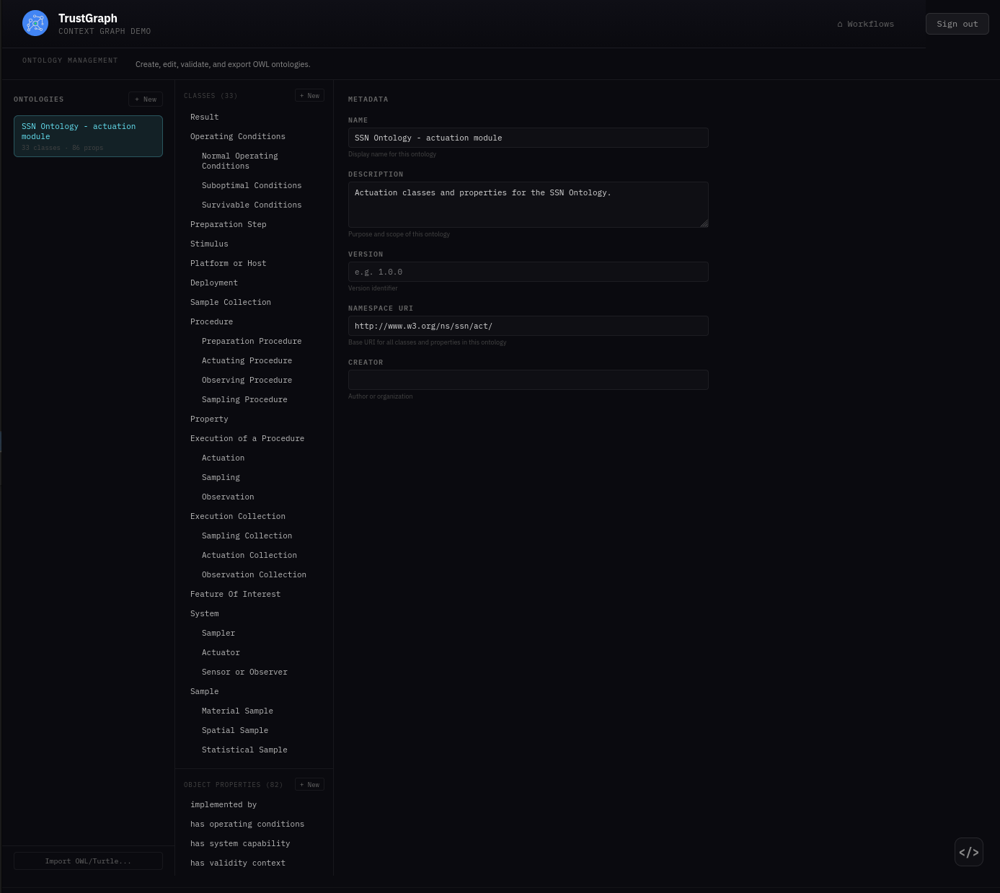

OWL (Web Ontology Language) ontologies are formal descriptions of
concepts and their relationships within a domain.  They define classes
(types of things), properties (relationships between things), and
constraints on how those relate.  A full treatment of OWL ontologies
is beyond the scope of this guide.

If you want to create your own ontologies, your favourite LLM (e.g.
Claude or Gemini) can help move from a discussion of the information
space to drafting OWL ontologies.  Make sure to capture them in Turtle
format, and tell the LLM to use `rdfs:label` and `rdf:description` on
all ontology elements — this is needed to power TrustGraph's ontology
extraction pipeline.

### Step 2: Load Your Document

TrustGraph supports multiple document formats:
- PDF files (`.pdf`)
- Text files (`.txt`)
- Markdown (`.md`)
- HTML (`.html`)

We're going to start by using a fictional maritime tracking report
which you can download at this URL:

[https://raw.githubusercontent.com/trustgraph-ai/example-data/refs/heads/main/tracking/operation-phantom-cargo.md](https://raw.githubusercontent.com/trustgraph-ai/example-data/refs/heads/main/tracking/operation-phantom-cargo.md).

- Download [the document](https://raw.githubusercontent.com/trustgraph-ai/example-data/refs/heads/main/tracking/operation-phantom-cargo.md)
- Go to the Workflows page and click **+ Add Document**
- A new dialogue appears — click the filename button and select the
  file you downloaded.  The MIME type field should fill in automatically.
- Set the Title: Operation PHANTOM CARGO
- Set the Description to: Intelligence report: Operation PHANTOM CARGO
- Add tags: phantom cargo, intelligence, maritime, shipping
- Click **Upload**

The document shows upload progress.  On upload completing, the new
document outline changes to a solid line.

### Step 3: Submit the Document for Processing

Once the document is uploaded, click **Submit for Processing** on the
document detail panel.  A 3-step wizard appears to select a flow and
collection.

**Select a flow:** For Ontology RAG we need to start a new flow.  The
wizard shows available flow blueprints:

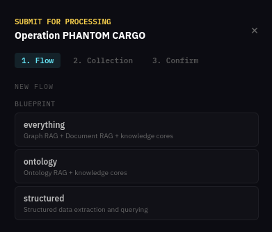

Select the **ontology** blueprint.  Set the Flow ID to `onto-rag` and
the Description to `Ontology RAG`.  You can also select the LLM model
to use and adjust advanced parameters.

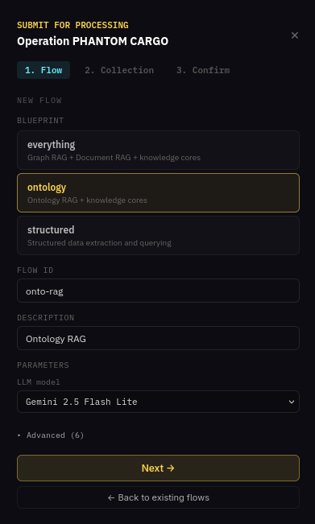

**Select a collection:** Choose which collection the results should be
stored in.  For this guide, select **default**.

**Confirm:** Review the document, flow and collection selections.  Note
that it shows the new flow will be created using the ontology blueprint.
Click **Submit for Processing**.

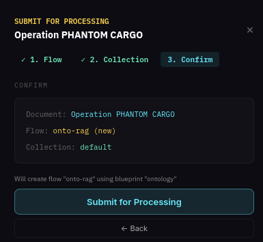

The main page reconfigures to show the document with its processing
pipelines.  Note that Ontology RAG produces a KG (Ontology) store and
a Context Core — unlike the default flow, there is no Chunk Store
because Ontology RAG does not run Document RAG processing.

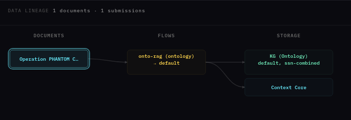

### Step 6: Monitoring

If you want to see the document loading, you can go to Grafana at
[`http://localhost:3000`](http://localhost:3000).  Login with username `admin` and the password you set in
`GF_SECURITY_ADMIN_PASSWORD`.  Grafana is configured with a single
dashboard.  Some useful things to monitor are:

The pub/sub backlog.  You can monitor the size of queues in Pulsar.
Knowledge extraction causes a queue of chunks for processing in
knowledge extraction and you can see this in the backlog:

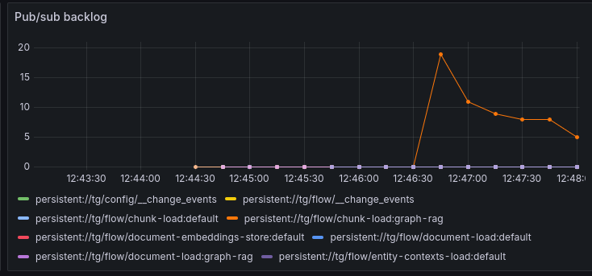

There is also a knowledge extraction backlog graph which helps to see
knowledge extraction if other queues are being exercised:

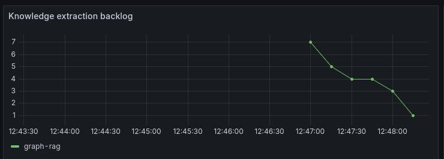

To gauge LLM effectiveness, there is a heatmap which shows LLM latency.
Here we can see that LLM response times for my LLM processing are in the
6 second window.

Another LLM effectiveness graph, the Token graph shows token throughput
over time, the Y-axis shows tokens/s rate.

Finally, another useful chart shows the rate limit events per second.
These are commonly seen in the text-completion process which interfaces
with the LLM.  Rate limit events are normal for a knowledge extraction
backlog.  This might particularly be helpful for you to determine whether
you need to provision more LLM bandwidth or dedicated hosting.

The document we loaded is small, and will process very quickly, so you
should only see a 'blip' on the backlog showing that chunks were loaded
and cleared quickly.

It can take many minutes or hours to process large documents or large document
sets using Ontology RAG extraction.

### Step 7: Context Graph

From the Workflows page, select **Context Graph**.  This is similar to
the Graph Explorer but takes advantage of the richer type information
in an ontology-based knowledge graph by clustering nodes around their
ontology types.  Because the graph has much more type information,
the Context Graph provides a powerful way to visualise and navigate the
structured knowledge.

Clicking a node highlights it and its related edges, and opens a detail
panel on the right showing node properties and navigation links.

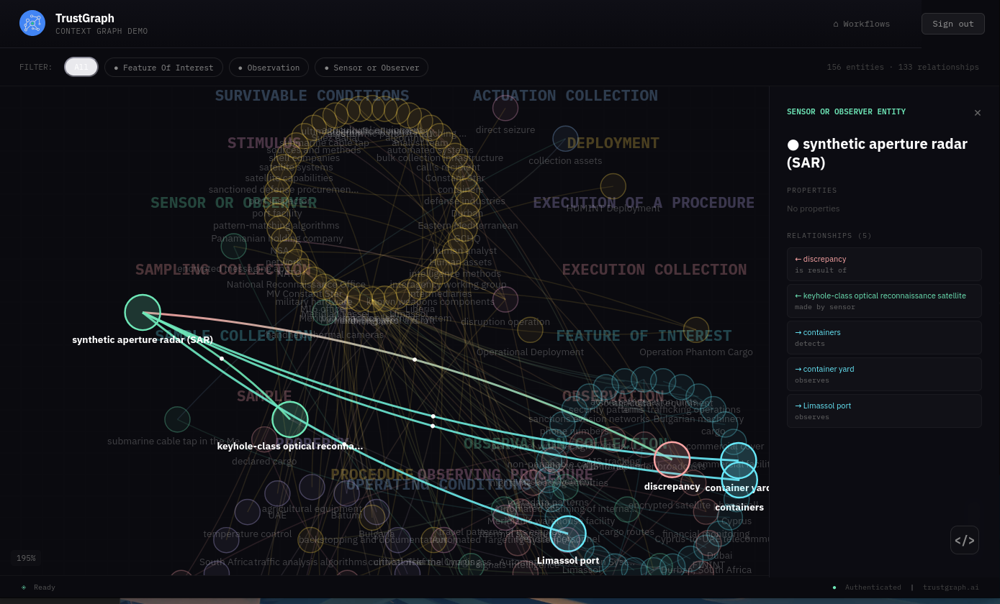

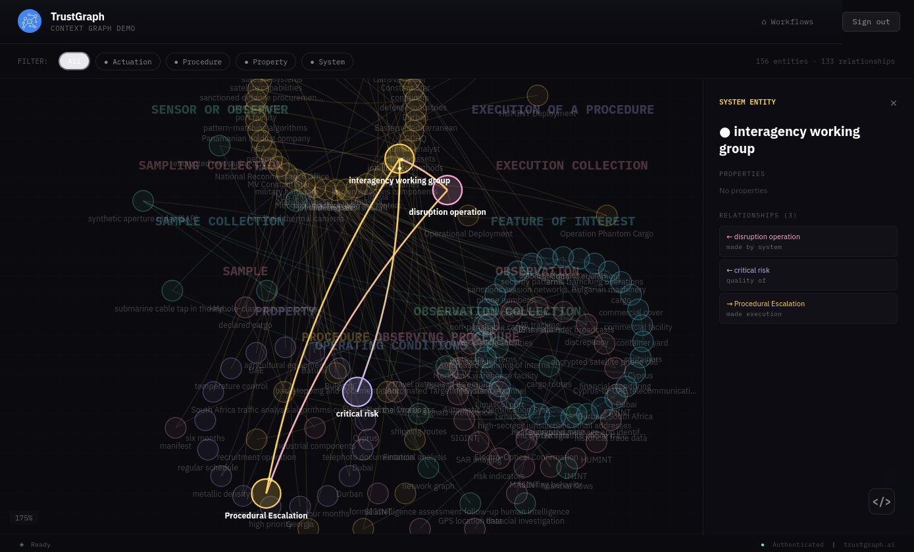

### Ontology Viewer

From the Workflows page, select **Ontology Viewer**.  This displays the
ontology types as cards with their extracted instances listed beneath
them.  This is another way to explore the ontology-based knowledge graph,
showing how extracted entities have been classified against the ontology
types.

Note that this view relies on ontology processing having completed —
it is not enough to have loaded an ontology.  Without ontology
processing there will be no instances to display.

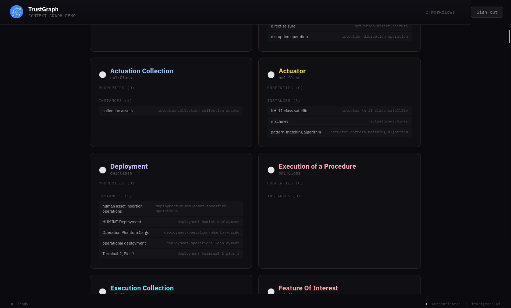

### Step 8: Query with Graph RAG

From the Workflows page, select **Graph RAG Query**.  This console has
full Explainable AI enabled, which helps to understand and diagnose
retrieval.

Enter the question: What intelligence resources were using during the
PHANTOM CARGO operation?  After a short while you should see a response.

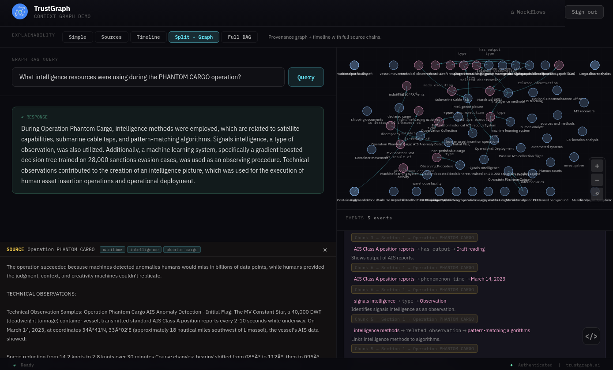

On the left-hand side you see the answer to the query.  The bottom right
part of the screen shows the various explainability events, starting from
the question:

- **Grounding** — where retrieval selects key concepts for discovery
- **Exploration** — where graph nodes are selected for analytics
- **Focus** — where the system decides on a core set of graph edges to
  resolve the question
- **Synthesis** — where this is processed to provide an answer

The **Focus** event may be of particular interest as you can trace graph
edges all the way back to the source documents.

### Step 9: Explore the knowledge graph

From the Workflows page, select **Graph Explorer**.  This shows what's
in the knowledge graph with tools for viewing and searching.

The graph can be easier to see in 3D — click the **3D** button above
the graph view.

If you click a node, it will be highlighted along with its related
edges.  A side panel also appears showing node properties and
highlighted links that allow you to navigate to related nodes.

On the top left is a **Search** button which opens a search dialog.
You can enter text for a similarity search against nodes in the graph.
Matching nodes are listed and can be selected, which adds them to the
graph along with their neighbours.

Ontology RAG provides a much richer set of connections in the graph
compared to schema-free Graph RAG, so expect to see more consistency
and more inter-connected paths in the knowledge graph explorer.

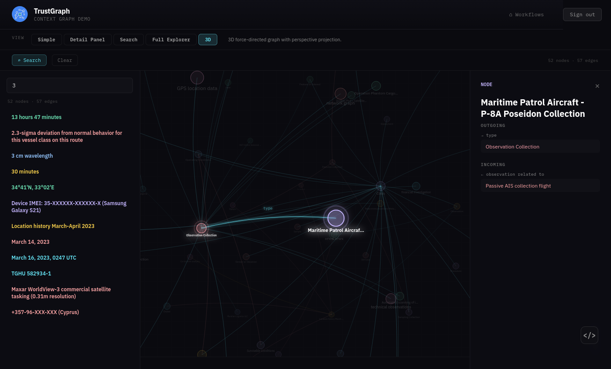

There is also a **Clear** button which resets the graph back to an
empty state.

## Further exploration

If you want to try a RAG approach but don't know where to start, an
interesting experiment is to compare GraphRAG and Ontology RAG to see which
works best for your use-case.

If you don't know anything about ontologies, you could try using Claude
to generate an ontology.  Feed in some text, tell the assistant the
important use-cases and ask for an OWL ontology presented in Turtle
format.

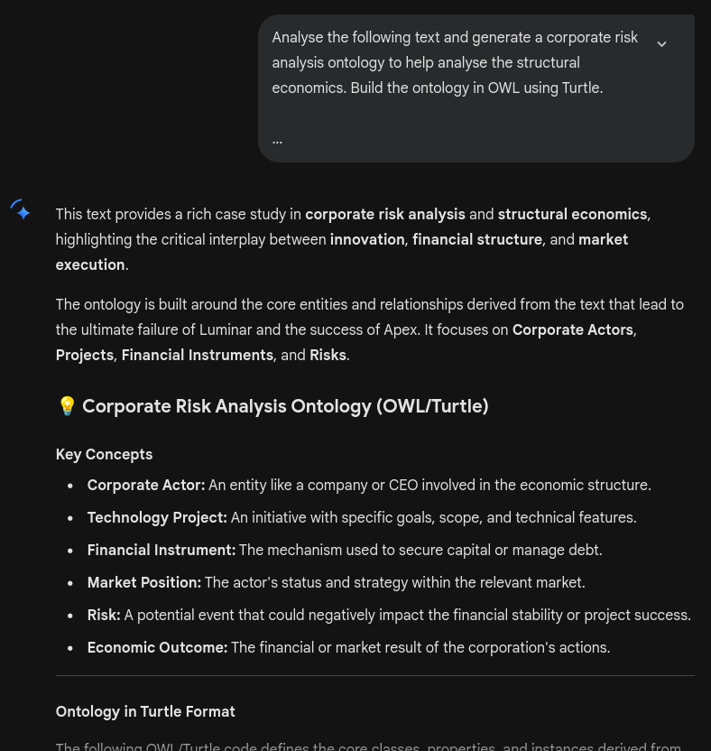

## Conclusion

The advantage of Ontology RAG is that it guides the knowledge extraction
to extract knowledge in a particularly precise manner.  For complex use-cases
this means that the knowledge going into retrieval contexts is packed with
the right information to answer the question.  This is a major advantage
for complex information analysis use-cases.

## Ontology RAG vs. Other Approaches

| Aspect | Document RAG | Graph RAG | Ontology RAG |
|--------|--------------|-----------|--------------|
| **Retrieval** | Vector similarity | Graph relationships | Schema-based |
| **Context** | Isolated chunks | Connected entities | Connected objects, properties and types |
| **Best for** | Semantic search | Complex relationships | Complex relationships + precise types |
| **Setup** | Simple | Simple | Complex |
| **Speed** | Fast | Medium | Medium |

**Use multiple approaches**: The processing flow defines the extraction
and retrieval mechanisms, so you can use multiple approaches on the same
data.

## Next Steps

### Explore Other RAG Types

- **[GraphRAG](../graph-rag/)** - Schema-free automated knowledge extraction

### Advanced Features

- **[Structured Processing](../structured-processing/)** - Extract typed objects
- **[Agent Extraction](../agent-extraction)** - AI-powered extraction workflows
- **[Object Extraction](../object-extraction)** - Domain-specific extraction

### Using the CLI

For command-line workflows, see the [Ontology RAG CLI Guide](../ontology-rag-cli/).

## Related Resources

- **[Graph RAG](../graph-rag/)** - Schema-free knowledge extraction
- **[Working with Context Cores](../context-cores/)** - Package and share knowledge
- **[Getting Started](../../getting-started)** - Introduction to TrustGraph
