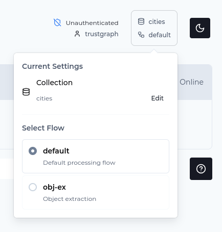

# Structured Data Load from a Document

In this guide a document containing tabular data will be loaded using the
schema defined in the [previous guide](schemas).

## Overview

This guide walks through using a previously defined schema in an extraction
flow.  In an object-extraction flow, the system uses LLM prompts to
located objects matching defined schemas, which are then loaded into the
object store.

## What You'll Learn

- How to load test documents into TrustGraph
- How to start an object extraction flow
- How to process documents through the extraction pipeline

## Prerequisites

Before starting this guide, ensure you have:

- A running TrustGraph instance version 1.3 or later (see [Installation Guide](../../getting-started/installation))
- Python 3.10 with the TrustGraph CLI tools installed (`pip install trustgraph-cli`)
- Sample documents or structured data files to process

## Step 1: Load Data into TrustGraph

You have two options for loading a document into TrustGraph:
1. **Using the workbench**: The librarian screen allows loading a PDF
  or text document.
2. **Command line**: Running the same operation using CLI

### Prepare Test Documents

For this example, we'll use a sample document containing city demographic data that matches our schema.

1. **Access the Sample Document**
   Open this Google Docs document containing city demographic data:
   [https://raw.githubusercontent.com/trustgraph-ai/example-data/main/cities/most-populous-cities.pdf](https://raw.githubusercontent.com/trustgraph-ai/example-data/main/cities/most-populous-cities.pdf)

2. **Save as PDF**
   - In Google Docs, click **File** → **Download** → **PDF Document (.pdf)**
   - Save the file as `cities_data.pdf` to your local machine

3. **Alternative: Create Your Own Test Document**
   If you prefer, you can create your own test document with city information. Make sure it includes:
   - City names and their countries
   - Population figures
   - Climate descriptions
   - Primary languages spoken
   - Local currencies

   Example content format:

   ```text
   Tokyo, Japan has a population of 37.4 million people. The climate
   is humid subtropical with hot summers and mild winters. The primary
   language is Japanese and the currency is the Japanese Yen.

   Delhi, India has a population of 32.9 million. The climate is
   semi-arid with extreme summers and cool winters. The primary
   language is Hindi and the currency is the Indian Rupee.

   Shanghai, China has a population of 28.5 million people. The
   climate is humid subtropical with hot, humid summers and cool, damp
   winters. The primary language is Mandarin Chinese and the currency
   is the Chinese Yuan.

   São Paulo, Brazil has a population of 22.8 million people. The
   climate is subtropical highland with warm, rainy summers and mild,
   dry winters. The primary language is Portuguese and the currency is
   the Brazilian Real.

   Dhaka, Bangladesh has a population of 22.4 million people. The
   climate is tropical monsoon with hot, humid summers and mild
   winters. The primary language is Bengali and the currency is the
   Bangladeshi Taka.
  ```

### Load Documents into TrustGraph using the Workbench

1. **Navigate to Library**
   In the TrustGraph workbench, click on **Library** in the navigation menu.

2. **Upload Documents**
   Click **Upload Documents** button.

3. **Configure Document Upload**
   - **Title**: Enter `30 Most Populous Cities`
   - **Document Type**: Select the `PDF` button
   - **Select Files**: Click **Select PDF files** and choose your `cities_data.pdf` file

4. **Submit Upload**
   Click **Submit** to load the document into the library.

### Using the Command Line

Load the document using the `tg-add-library-document` command:

```bash
tg-add-library-document cities_data.pdf \
  --name "30 Most Populous Cities" \
  --kind "application/pdf"
```

## Step 2: Start an Object Extraction Flow

Use the Workbench to create a new flow on the Flows page.

Select 'Create', give your flow an ID e.g. `object-extraction` and
select the `object-extract` flow class.  Give it a helpful description
e.g. `Object extraction`.

## Step 3: Launch Document Processing

When loading the document on the workbench, it can help to decide to store
the data in a particular collection for later.  Click the dialog
top right, and set the collection to `cities`.



On the Library page, select your document containing city information,
click 'Submit' at the bottom of the screen.

Select your new object extraction processing and submit the document.

You can track progress on the Grafana dashboard.  The sample document
provided should process quickly, say under 1 minute.  The processing
makes use of an LLM to perform extraction so there will be time needed
when processing large datasets.

After about 1 minute, the data should be available for querying.

## Next Steps

See the [next guide](query).

## Best Practices

### Document Preparation**

- Ensure documents contain clear, structured information
- Use consistent formatting and terminology
- Include relevant context around entities

## Further Reading

- [tg-add-library-document](../../reference/cli/tg-add-library-document) - Load documents into the library
- [TrustGraph CLI Reference](../../reference/cli/) - Complete CLI documentation

