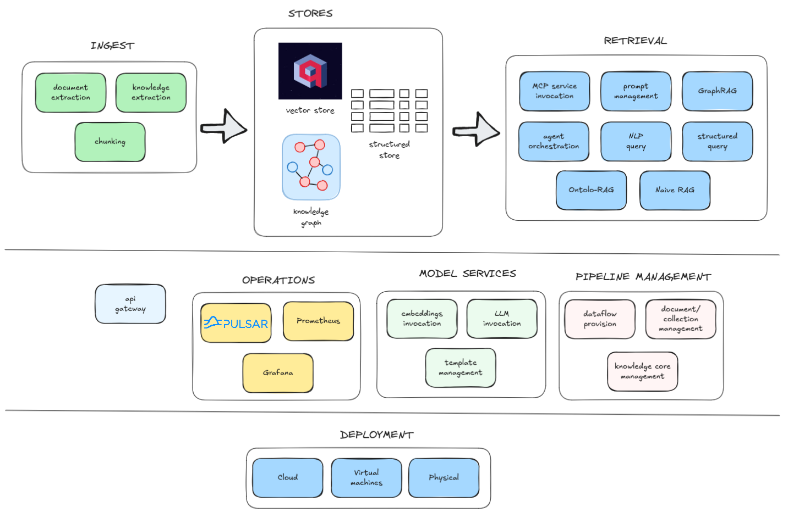

# Architecture

Learn about TrustGraph's system architecture and design principles for building intelligent AI agent platforms.

## In a nutshell

<div class="feature-section" markdown="0">
<div class="feature-list">
<div class="feature-item">
<span class="feature-item-icon">⚡</span>
<div class="feature-item-content">
<strong>Resilient, Scalable Dataflow</strong>
<span>Event-driven architecture with auto-recovery and independent scaling</span>
</div>
</div>
<div class="feature-item">
<span class="feature-item-icon">🏠</span>
<div class="feature-item-content">
<strong>Full Self-Hosting</strong>
<span>Deploy on your own infrastructure, no cloud dependency required</span>
</div>
</div>
<div class="feature-item">
<span class="feature-item-icon">🧠</span>
<div class="feature-item-content">
<strong>12+ LLM Providers</strong>
<span>No vendor lock-in (Anthropic, OpenAI, AWS Bedrock, Azure, Ollama, etc.)</span>
</div>
</div>
<div class="feature-item">
<span class="feature-item-icon">👥</span>
<div class="feature-item-content">
<strong>Multi-Tenancy</strong>
<span>Isolated data pipelines per user or collection</span>
</div>
</div>
<div class="feature-item">
<span class="feature-item-icon">🔓</span>
<div class="feature-item-content">
<strong>Fully Open</strong>
<span>Open source, open architecture, Apache 2 license</span>
</div>
</div>
<div class="feature-item">
<span class="feature-item-icon">📦</span>
<div class="feature-item-content">
<strong>Context Cores</strong>
<span>Isolated, versionable knowledge bases you can load/unload at runtime</span>
</div>
</div>
<div class="feature-item">
<span class="feature-item-icon">📊</span>
<div class="feature-item-content">
<strong>Production Observability</strong>
<span>Built-in Grafana & Loki for monitoring and logs</span>
</div>
</div>
<div class="feature-item">
<span class="feature-item-icon">🤖</span>
<div class="feature-item-content">
<strong>Agentic AI Runtime</strong>
<span>ReAct pattern with parallel workflows and MCP tool integration</span>
</div>
</div>
</div>
</div>

## System Overview

TrustGraph is a knowledge and agent substrate that sits alongside your existing data sources and LLM providers — not a monolithic application. It transforms your enterprise data into structured knowledge that agents can reason over, while you retain full control over where data lives and which models you use.

The architecture builds on proven patterns from the knowledge graph and semantic web ecosystem, making concepts familiar to teams with experience in enterprise knowledge management.

**At a glance**: Ingestion & Processing → Knowledge Storage → Agent Runtime → Integration Layer

### High-Level Architecture

<a href="arch-diagram.png">
  
</a>

TrustGraph follows a modular, microservices-based architecture built on an event-driven streaming backbone (Apache Pulsar). Components communicate asynchronously, enabling independent scaling and resilient operation.

### Infrastructure

- **Apache Pulsar** — The messaging backbone that underpins all system communication. Every service communicates through Pulsar, enabling decoupled scaling, message replay, and resilient operation
- **Cassandra** — Stores system metadata, processing state, and operational data
- **Garage** — S3-compatible object storage for source documents and artifacts
- **Grafana & Loki** — Monitoring dashboards and log aggregation for observability

### Knowledge Infrastructure

TrustGraph uses pluggable backends for knowledge storage:

- **Graph store** — Stores entities and relationships. Options: Cassandra, Neo4j, Memgraph, FalkorDB
- **Vector store** — Stores embeddings for semantic search. Options: Qdrant, Milvus
- **Structure store** — Stores structured data extracts. Options: Cassandra

### Service Architecture

TrustGraph consists of many independent **processors** — small, focused services that each perform a specific task (parsing documents, extracting entities, generating embeddings, etc.). Processors communicate exclusively through Pulsar, making the system loosely coupled and independently scalable.

- **Processors** — Individual services that subscribe to input queues, perform work, and publish to output queues
- **Flows** — Running dataflow pipelines that chain processors together to accomplish complex tasks
- **Flow blueprints** — Reusable templates that define which processors to invoke and how data moves between them

This architecture allows the system to run many configurable dataflows simultaneously, adapting processing pipelines to different use cases without code changes.

### Processing Chains in Action

The following examples show how processors chain together to perform tasks. Processors interact in two ways: **flow** interactions use fire-and-forget messaging where data moves from one processor to the next without waiting for acknowledgement — this powers processing chains. **Request/response** interactions place a request and wait for a response (which may be an error) — this is used when a result is needed before proceeding.

**Knowledge extraction from documents:**

```
pdf-decoder → chunker → kg-extract-relationships → triple-store
```

A PDF is decoded to text, split into chunks, entities and relationships are extracted by an LLM, and the resulting triples are written to the graph store.

**GraphRAG query:**

```
api-gateway → graph-rag → prompt → text-completion
```

A query arrives at the API gateway, GraphRAG retrieves relevant context from the knowledge graph, a prompt is constructed with the context, and the LLM generates a grounded response.

*Note: Both examples are simplified illustrations of single flows within more complex pipelines. The extraction example omits graph embeddings and other extraction processes. The GraphRAG example omits the knowledge graph traversal steps that occur between retrieval and prompt construction.*

### Platform

TrustGraph supports two deployment models:

- **Podman / Docker** — Deploy using `podman-compose` or `docker-compose` for development, evaluation, and smaller-scale production workloads
- **Kubernetes** — Deploy on managed Kubernetes services (GKE, AKS, EKS) or self-managed clusters (Scaleway, OVHcloud, on-premises) for production-scale deployments

See [Deployment](../deployment/) for platform-specific guides.

### Software Packaging

The core TrustGraph system is built into [Python packages](../reference/python-packages) published on PyPI. The build pipeline then packages these into [container images](../reference/containers) published to Docker Hub. Deployment engineers typically work with deployment packages that describe how the system is deployed, rather than interacting directly with Python packages or container images.

### Interacting with the System

The **api-gateway** processor bridges between external clients and the Pulsar messaging world. It exposes two interfaces:

- **REST API** — Standard HTTP requests for simple integrations
- **WebSocket API** — Multiplexes multiple requests over a single connection, better suited for async workloads and higher request concurrency

Both interfaces support approximately 95% of the same functionality.

Client libraries are available for building applications:

- **Python API** — Connects to either the REST or WebSocket interface
- **TypeScript API** — Connects to either the REST or WebSocket interface

The **Workbench UI** is a sample application that exercises much of TrustGraph's functionality using the TypeScript API. It includes a built-in WebSocket proxy, allowing browser requests to route through the Workbench to the api-gateway — only the Workbench UI port needs to be exposed.

It is also possible to interact with the system directly via **Pulsar queues**, but this is generally not recommended for external clients:

- The REST/WebSocket APIs and SDKs are much easier to use
- Pulsar adds complex dependencies for simple client applications
- Understanding the Pulsar queue topology is complex; the api-gateway abstracts this away
- The Pulsar network is best considered an internal implementation detail — direct Pulsar access is intended for deploying components inside TrustGraph, not for external integrations

### Extending the Processing

TrustGraph is designed to accommodate new processing modules. Two primary use cases:

- **Contributing to TrustGraph** — Developers can contribute new processors to the open-source project, extending capabilities for the whole community
- **Private/domain-specific processing** — Organisations can add custom processors for proprietary workflows or domain-specific logic that isn't intended to be shared

This is achieved by building processors that conform to the pub/sub conventions — Python base classes handle the heavy lifting — and defining flow blueprints that integrate the new processing into a flow.

See [Extending](../reference/extending/) for guidance on building custom processors.

### LLM Integration

TrustGraph treats LLMs as external services accessed through pluggable adapters. The system is provider-agnostic — you choose which LLM providers to use based on your requirements, costs, and data sovereignty needs.

LLMs are invoked for text completion — generating responses, extracting entities and relationships, and other reasoning tasks. A dedicated `text-completion` processor handles LLM communication, abstracting provider differences from the rest of the system.

Supported providers include Anthropic, OpenAI, Google VertexAI, AWS Bedrock, Azure OpenAI, Ollama, and others — over 12 in total. This separation means you can switch providers or run multiple providers simultaneously without changing your processing flows.

### Embeddings

Embeddings convert text into vector representations for semantic search. A dedicated `embeddings` processor generates vectors that are stored in the vector store and used to find semantically similar content.

Embedding models are configured separately from LLMs — you can use provider-hosted embedding services or run local models. This allows you to optimise for cost, latency, or data privacy independently of your LLM choices.

### Agent Runtime

The agent infrastructure is built around a recurrent architecture — agent workflow iterations loop messages back into the agent manager rather than following a linear path. This design enables:

- **Parallel agent interactions** — Multiple agent workflows can proceed concurrently without blocking each other
- **Resilient execution** — If an agent manager fails and restarts, the workflow continues from the failure point rather than starting from scratch

TrustGraph supports the ReAct (Reasoning + Acting) pattern, where agents iteratively reason about a task, select tools, observe results, and continue until the task is complete. Agents can invoke multiple tools including TrustGraph's built-in capabilities (knowledge queries, graph traversal) and external tools via [MCP integration](../guides/mcp-integration/).

### Context Cores

Context Cores are the unit of knowledge isolation in TrustGraph. Each core contains its own graph data, vector embeddings, and structured extracts — logically separated from other cores. Cores can be loaded, unloaded, and versioned independently at runtime, allowing you to manage multiple knowledge bases within a single deployment.

### Resilience

The Pulsar messaging backbone provides built-in resilience. Messages are persisted and can be replayed if a processor fails. Processors are designed to be idempotent where possible, so reprocessing a message produces the same result. This means the system recovers gracefully from failures — restarting a failed component continues processing from where it left off rather than requiring a full restart.

### Scaling

TrustGraph scales horizontally. Ingestion, processing, and query paths can be scaled independently by adding more processor instances. Pulsar handles load distribution across instances automatically.

Some processors support a **concurrency** setting — a lightweight scaling option where a single processor handles multiple independent threads. This is particularly useful for processors like `text-completion` that aren't CPU-intensive but spend most of their time waiting for LLM responses. Without concurrency, scaling such processors would require factors of 500x or more to achieve good throughput.

Typical bottlenecks are LLM API rate limits during extraction and graph database throughput during heavy query loads — both can be addressed by scaling the relevant components or upgrading backend capacity.

### Multi-Tenancy

Multi-tenancy features include separate user and collection processing, allowing different users or datasets to be handled independently. Separate flows keep different data logically isolated — each tenant's data moves through its own processing pipeline without mixing with others.

### Deployment Configuration

TrustGraph deployments are generated using a template engine that assembles the required components based on your configuration choices (LLM provider, storage backends, enabled features). This produces deployment manifests for your target platform.  This provides for many configuration options beyond those that
you might see in the configuration portal.

For cloud deployments, complete Infrastructure-as-Code configurations are available in Pulumi. Pulumi's code-based approach enables security testing of deployment configurations prior to deployment — policies can validate that infrastructure meets security requirements before any resources are created.

See [Deployment](../deployment/) for platform-specific guides and configuration options.

