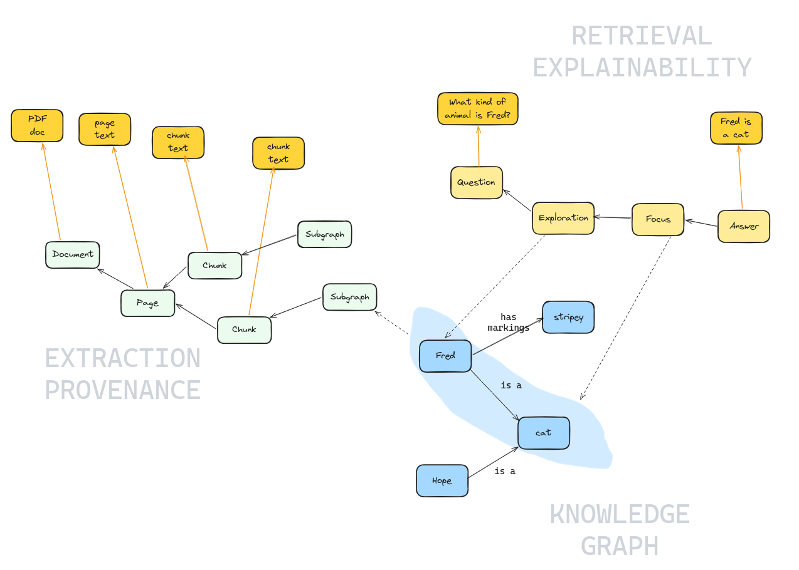

# Explainability

AI systems that can't explain their reasoning are hard to trust.
TrustGraph provides end-to-end explainability, tracing every answer back
through the reasoning pipeline to its source documents.  This covers
two distinct concerns: *extraction provenance* (where did the knowledge
come from?) and *query-time explainability* (how was the answer derived?).

## Why Explainability Matters

When an AI system gives you an answer, you need to be able to ask:

- **Which documents** contributed to this answer?
- **Which facts** were selected from the knowledge graph?
- **Why** were those facts chosen over others?
- **What reasoning** led to the final response?

Without this, you're left with a black box.  In regulated industries —
financial services, healthcare, legal — auditable AI reasoning is not
optional, it's a requirement.  Even outside regulated contexts,
explainability builds confidence in AI outputs and helps identify when
the system is drawing on incorrect or outdated information.

## Named Graphs

To understand how TrustGraph stores explainability data, it helps to
understand **named graphs**.

In standard RDF, a knowledge graph is a collection of triples:
subject-predicate-object statements.  Named graphs extend this by
allowing triples to be grouped into separate, labelled collections within
the same store.  Each named graph has a URI identifier, and triples
belong to a specific graph.  Think of it like tables in a database —
the data lives in the same system, but is logically separated.

TrustGraph uses three named graphs:

| Graph | Purpose |
|-------|---------|
| *(default)* | Core knowledge facts — the entities and relationships extracted from documents |
| `urn:graph:source` | Extraction provenance — the lineage from documents through to extracted edges |
| `urn:graph:retrieval` | Query-time explainability — the reasoning traces from RAG and Agent queries |

This separation means explainability metadata doesn't pollute the
knowledge graph used for retrieval, but remains queryable through the
same interfaces.  You can query the default graph for knowledge, the
source graph for provenance, or the retrieval graph for reasoning
traces — all through the same API.

## Context Graph

This diagram shows how the three layers of TrustGraph's data model
connect together.  Nodes in the graph store are shown in green, blue, and
yellow.  The dark orange boxes represent content stored in an **object
store** (the raw text of documents, pages, chunks, and answers) rather
than in the graph — the orange arrows show how graph nodes reference
their corresponding object-store content.

- **Extraction Provenance** (left, green) — tracks how knowledge entered
  the system.  A Document is broken into Pages, which are split into
  Chunks.  Each of these graph nodes references its text content in the
  object store (the original PDF, page text, chunk text).
- **Knowledge Graph** (bottom right, blue) — the core entities and
  relationships extracted from chunks.  In this example, *Fred is a cat*
  with *stripey markings*, and *Hope is also a cat*.  The dashed line from
  a Chunk to the knowledge graph shows where extracted facts originated.
- **Retrieval Explainability** (top right, yellow) — traces the reasoning
  path when a query is answered.  A Question flows through Exploration
  and Focus stages to produce an Answer.  The blue highlight shows which
  knowledge graph edges were selected during the Focus stage, and dashed
  lines connect those edges back to the retrieval trace.  The question
  text and answer text are stored in the object store.

The key insight is that all three layers are queryable through the same
graph store.  Given an answer, you can follow the retrieval trace to see
which edges were used, then follow the extraction provenance to find the
source document and chunk — a complete audit trail from answer to source.

## Extraction Provenance

Extraction provenance tracks **how knowledge entered the system**.  When
documents are processed through the extraction pipeline, TrustGraph
records the full derivation chain using the
[W3C PROV-O](https://www.w3.org/TR/prov-o/) standard vocabulary.

<!-- placeholder: diagram showing the extraction provenance hierarchy.
     Vertical chain with arrows labelled "prov:wasDerivedFrom" between
     each level:
       Document (PDF/text)
         -> Page 1, Page 2, ...
           -> Chunk 1a, Chunk 1b, ...
             -> Subgraph (extracted edges)
     Label the arrows "prov:wasDerivedFrom".
     Show "urn:graph:source" as the containing named graph. -->

The chain has four levels:

- **Document** — the original uploaded file (PDF, text, etc.)
- **Pages** — individual pages extracted from the document
- **Chunks** — text segments produced by the chunker
- **Subgraphs** — groups of edges extracted from each chunk by the LLM

Each level is linked to its parent by `prov:wasDerivedFrom` relationships,
all stored in the `urn:graph:source` named graph.  Given any edge in the
knowledge graph, you can follow this chain backwards to find the exact
chunk of text it was extracted from, which page that chunk came from, and
which document that page belongs to.

## Query-Time Explainability

Query-time explainability traces **how an answer was derived**.  When a
GraphRAG, Document RAG, or Agent query runs with explainability enabled,
TrustGraph records each stage of the reasoning process into the
`urn:graph:retrieval` named graph.

### GraphRAG

GraphRAG queries produce a multi-stage reasoning trace:

<!-- placeholder: diagram showing the GraphRAG explainability pipeline
     as a horizontal flowchart with 5 stages connected by arrows:
       Question -> Grounding -> Exploration -> Focus -> Synthesis
     Below each stage, brief annotation:
       Question: "original query"
       Grounding: "concept extraction"
       Exploration: "graph traversal"
       Focus: "edge selection + reasoning"
       Synthesis: "answer generation"
     Show "urn:graph:retrieval" as the containing named graph. -->

1. **Question** — the original query, timestamped
2. **Grounding** — concepts extracted from the question that seed the
   graph search
3. **Exploration** — graph traversal results: which entities were found
   as entry points, how many edges were discovered
4. **Focus** — the critical stage: which edges were selected from the
   exploration, and the LLM's reasoning for selecting each one
5. **Synthesis** — the final answer, linked to the document context used

The Focus stage is particularly valuable.  It records not just *which*
edges were selected, but *why* each was chosen.  The LLM provides
per-edge reasoning, making it possible to understand and challenge the
selection process.

### Document RAG

Document RAG traces follow a simpler pattern:

1. **Question** — the original query
2. **Exploration** — which document chunks were retrieved by similarity
3. **Synthesis** — the generated answer

### Agent

Agent queries using the ReAct framework record each iteration of the
agent's reasoning loop:

<!-- placeholder: diagram showing Agent explainability as a flowchart:
       Question -> [Iteration 1] -> [Iteration 2] -> ... -> Conclusion
     Each iteration box contains three sub-items:
       Thought (what the agent is thinking)
       Action (what tool/query it invokes)
       Observation (what it learned)
     Show "urn:graph:retrieval" as the containing named graph. -->

1. **Question** — the session start
2. **Iterations** — each reasoning step records the agent's thought
   process, the action taken (tool call, knowledge query), and the
   observation received
3. **Conclusion** — the final synthesised answer

## Connecting the Two Layers

The real power of TrustGraph's explainability comes from connecting
query-time traces with extraction provenance.

Consider a GraphRAG query.  The Focus stage records which edges were
selected to answer the question.  Each of those edges exists in the
default knowledge graph.  But in `urn:graph:source`, reified versions of
those same edges are linked via `prov:wasDerivedFrom` to their source
chunks and documents.

<!-- placeholder: diagram showing the two layers connected.
     Top layer (urn:graph:retrieval):
       Question -> Grounding -> Exploration -> Focus -> Synthesis
     Focus has arrows pointing down to specific edges.
     Bottom layer (urn:graph:source):
       Edge -> Subgraph -> Chunk -> Page -> Document
     The arrows from Focus cross the boundary between the two layers,
     connecting to the Edge level in the bottom layer.
     Label the crossing arrows "reified triple lookup". -->

By following both chains, you get a complete audit trail:

> **User question** → concept grounding → graph exploration →
> edge selection (with reasoning) → **specific edge** →
> subgraph → chunk → page → **source document**

Every link in this chain is recorded, queryable, and persistent.

## Explainability Traces are Persistent

Reasoning traces are not ephemeral — they are stored as standard RDF
triples in the `urn:graph:retrieval` named graph and remain available
for later review.  This means you can:

- Review how past questions were answered
- Audit the reasoning process after the fact
- Compare how different questions used different parts of the knowledge
  graph
- Build dashboards or reports over the explainability data

## Next Steps

To see explainability in practice:

- **[Explainability guide](../guides/explainability/)** — walkthrough
  using the Workbench
- **[Explainability using CLI](../guides/explainability-cli/)** —
  walkthrough using command-line tools
