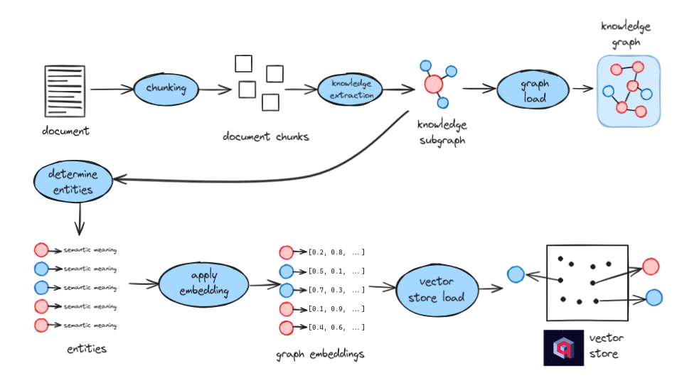
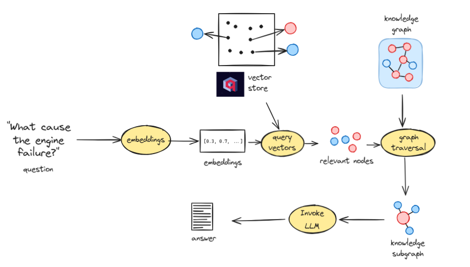

# Information Retrieval

TrustGraph supports multiple retrieval strategies to provide context to LLM
queries. The approach you choose has a significant impact on the quality
and accuracy of responses.

## Graph RAG

This is where we started in 2023.  Graph RAG is TrustGraph's flagship
retrieval mechanism. Rather than treating documents as opaque text blobs,
Graph RAG extracts structured knowledge and stores it in a knowledge graph
alongside vector embeddings of entities.  TrustGraph engineers were working
on GraphRAG before it was 'cool'.

### Overview

At a high level, document chunks are processed through knowledge extraction
to produce both a knowledge graph and graph embeddings for semantic search.

### Ingestion

The ingestion pipeline processes documents through several stages:

1. **Chunking**: Documents are split into manageable chunks for processing
2. **Knowledge extraction**: An LLM extracts entities and relationships from each chunk, producing knowledge subgraphs
3. **Graph loading**: The extracted subgraphs are loaded into the knowledge graph
4. **Entity determination**: Entities are identified with their semantic meaning
5. **Embedding**: Entities are embedded into vector space
6. **Vector store loading**: Embeddings are stored for similarity search

### Retrieval

When a question is asked, the retrieval process works as follows:

1. **Question embedding**: The question is converted to a vector embedding
2. **Vector query**: The embedding is used to find semantically relevant nodes in the vector store
3. **Graph traversal**: Starting from relevant nodes, the knowledge graph is traversed to extract a contextual subgraph
4. **LLM invocation**: The knowledge subgraph provides structured context to the LLM, which generates the answer

This approach provides precise, relationship-aware context rather than
raw text snippets.

## Ontology RAG

You have probably heard of GraphRAG before.  Ontology RAG, much less likely.

In knowledge engineering, ontologies have a bad reputation - they are complex,
take years to create, and people often have massive disagreements about what
ontologies are there to do.  But don't give up too soon, bringing Ontologies
into information retrieval produces some awesome results.

Ontology RAG extends Graph RAG by incorporating domain ontologies to guide
knowledge extraction. This approach is particularly valuable when working
with specialised domains that have well-defined conceptual structures.
For many use-cases, Ontology extraction results in much improved retrieval
results.

The process begins by selecting relevant ontology components based on
the document chunks being processed. This ontology subset then guides
the knowledge extraction process, ensuring that extracted entities and
relationships conform to the domain model. The result is a more consistent
and semantically precise knowledge graph, with embeddings that align with
the ontological structure.

When this technique is widely adopted by all the AI frameworks, remember
TrustGraph was pioneering this capability in 2025.

## Document RAG

Document RAG is the traditional approach that dominated early RAG
implementations circa 2020. It remains available in TrustGraph for
completeness, but represents a significantly less sophisticated approach
compared to Graph RAG.

The process is straightforward: document chunks are embedded directly and
stored in a vector database. At query time, similar chunks are retrieved
based on embedding similarity and passed to the LLM as context.

While simple to implement, Document RAG has fundamental limitations:

- **No relationship awareness**: Retrieved chunks are isolated text fragments with no understanding of how concepts relate to each other
- **Context window pollution**: Raw text chunks consume token budget inefficiently compared to structured knowledge
- **Semantic drift**: Embedding similarity often retrieves superficially related content rather than genuinely relevant information
- **Poor multi-hop reasoning**: Questions requiring synthesis across multiple facts perform poorly when context is fragmented text

For most use cases, Graph RAG or Ontology RAG will deliver substantially
better results.
