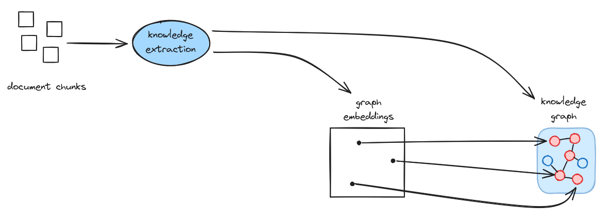
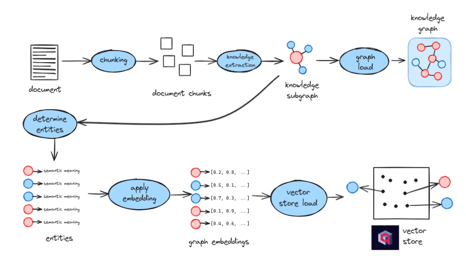
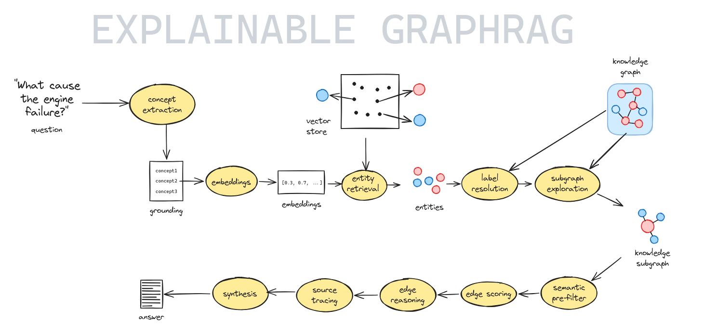
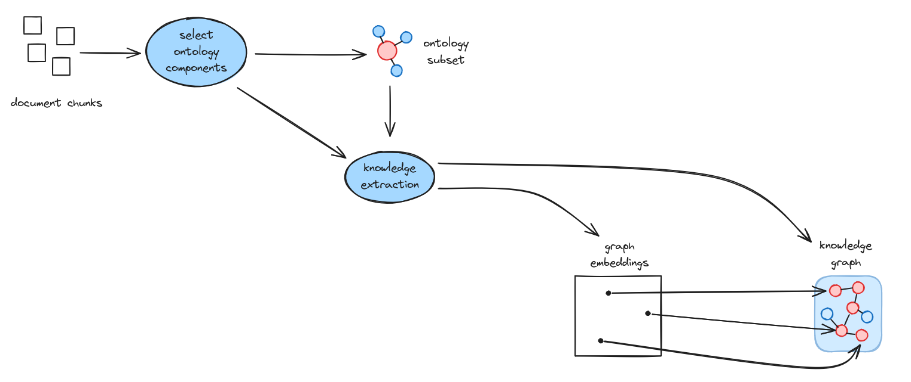
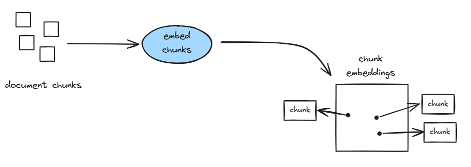

# Information Retrieval

TrustGraph supports multiple retrieval strategies to provide context to LLM
queries. The approach you choose has a significant impact on the quality
and accuracy of responses.

## Explainable GraphRAG

This is where we started in 2023.  GraphRAG is TrustGraph's flagship
retrieval mechanism. Rather than treating documents as opaque text blobs,
GraphRAG extracts structured knowledge and stores it in a knowledge graph
alongside vector embeddings of entities.  TrustGraph engineers were working
on GraphRAG before it was 'cool'.

TrustGraph's implementation goes well beyond basic GraphRAG.  The retrieval
pipeline incorporates LLM-driven concept extraction, relevance scoring,
edge reasoning, document provenance tracing, and full explainability -
making it a truly explainable GraphRAG system.

### Overview

At a high level, document chunks are processed through knowledge extraction
to produce both a knowledge graph and graph embeddings for semantic search.

### Ingestion

The ingestion pipeline processes documents through several stages:

1. **Chunking**: Documents are split into manageable chunks for processing
2. **Knowledge extraction**: An LLM extracts entities and relationships from each chunk, producing knowledge subgraphs
3. **Graph loading**: The extracted subgraphs are loaded into the knowledge graph
4. **Entity determination**: Entities are identified with their semantic meaning
5. **Embedding**: Entities are embedded into vector space
6. **Vector store loading**: Embeddings are stored for similarity search

### Retrieval

When a question is asked, the explainable GraphRAG retrieval pipeline works
through the following stages:

1. **Concept extraction**: An LLM analyses the question and breaks it down
   into key concepts, providing more nuanced search terms than raw query
   embedding alone
2. **Concept embedding**: The extracted concepts are converted to vector
   embeddings for semantic search
3. **Entity retrieval**: For each concept, the graph embeddings store is
   queried to find semantically relevant entities, with deduplication across
   concepts
4. **Subgraph exploration**: Starting from the retrieved entities, the
   knowledge graph is traversed in batches to a configurable depth,
   collecting a subgraph of related entities and relationships
5. **Semantic pre-filtering**: If the explored subgraph is large, edge
   descriptions are embedded and scored by cosine similarity to the query
   concepts, trimming the subgraph to a manageable size
6. **LLM edge scoring**: An LLM assigns relevance scores to each edge in
   the subgraph, selecting the most pertinent relationships for the query
7. **Edge reasoning**: An LLM provides explanations for why each selected
   edge is relevant to the question, building a reasoning map
8. **Document tracing**: Selected edges are traced back through provenance
   chains to their source documents, enabling full attribution
9. **Answer synthesis**: The scored edges, reasoning, and source document
   metadata are provided to an LLM which generates the final answer
10. **Explainability**: Throughout the pipeline, provenance triples are
    emitted recording the question, extracted concepts, graph exploration,
    edge selection with reasoning, and the synthesised answer - providing a
    complete audit trail for every retrieval

Steps 7 and 8 run concurrently for efficiency.

This approach provides precise, relationship-aware context with full
explainability and source attribution, rather than raw text snippets.

## Ontology RAG

You have probably heard of GraphRAG before.  Ontology RAG, much less likely.
So, let's cover the basics.

### Ontologies

Ontologies are structured frameworks that formally define the concepts,
relationships, and rules within a specific domain of knowledge. They provide a
standardised vocabulary and logical structure for representing how entities
relate to each other, enabling both humans and computers to share a consistent
understanding of complex information.  It's like a database schema, but
for human knowledge.

In knowledge engineering, ontologies have a bad reputation - they are complex,
take years to create, and people often have massive disagreements about what
ontologies are there to do.  Biologists famously disagree about what
constitutes a 'cell'.

But this isn't to say there's 'flaw' - there's nothing broken about ontology
technology.  The real issue is that human knowledge is a profoundly complex
experience.  When we try to classify human knowledge, we can't eliminate the
fundamental human experiences which come with trying to make sense of the
world around us.

So, don't give up too soon, bringing ontologies into information retrieval
produces some awesome results.

### Ontology RAG

Ontology RAG extends Graph RAG by incorporating domain ontologies to guide
knowledge extraction. This approach is particularly valuable when working
with specialised domains that have well-defined conceptual structures.
For many use-cases, Ontology extraction results in much improved retrieval
results.

Early attempts at using ontologies in knowledge extraction attempted to
guide extraction by loading the full ontology into an LLM context window.
Here be dragons: Good ontologies are big, and this can easily flood the
context window.  In a nutshell, the TrustGraph approach is to apply
the GraphRAG algorithm itself to ontologies stored as graph - an information
retrieval operation is used to work out the correct subset of ontology
components to use for knowledge extraction.

The process begins by selecting relevant ontology components based on the
document chunks being processed. This ontology subset then guides the
knowledge extraction process, ensuring that extracted entities and
relationships conform to the domain model. The result is a more consistent and
semantically precise knowledge graph, with embeddings that align with the
ontological structure.

Ontology RAG relies on having ontologies.  For general purpose text,
classifying everything in the world into ontologies would be a
Herculean task, so you would stick with GraphRAG for this.

When this technique is widely adopted by all the AI frameworks, remember
TrustGraph was pioneering this capability in 2025!  😀

## Explainable Document RAG

Document RAG is the traditional approach that dominated early RAG
implementations circa 2020. While conceptually simpler than GraphRAG,
TrustGraph's implementation enhances the basic approach with LLM-driven
concept extraction for grounding and full explainability tracking, making
it an explainable Document RAG system.

### Ingestion

The ingestion pipeline for explainable Document RAG is straightforward: document chunks
are embedded directly and stored in a vector database.

### Retrieval

When a question is asked, the explainable Document RAG retrieval pipeline works through
the following stages:

1. **Concept extraction**: An LLM analyses the question and extracts key
   concepts, grounding the search in meaningful terms rather than relying on
   raw query embedding
2. **Concept embedding**: The extracted concepts are converted to vector
   embeddings
3. **Chunk retrieval**: For each concept, the document embeddings store is
   queried to find semantically relevant chunks, with deduplication across
   concepts to avoid repetition
4. **Answer synthesis**: The retrieved chunks and the original query are
   provided to an LLM which generates the final answer, with support for
   streaming responses
5. **Explainability**: Provenance triples are emitted at each stage -
   recording the question, extracted concepts (grounding), retrieved chunks
   (exploration), and the synthesised answer - providing a complete audit
   trail

### Comparison with GraphRAG

While explainable Document RAG now benefits from concept extraction and explainability,
it still has inherent limitations compared to GraphRAG:

- **No relationship awareness**: Retrieved chunks are isolated text fragments with no understanding of how concepts relate to each other
- **Context window pollution**: Raw text chunks consume token budget inefficiently compared to structured knowledge
- **Poor multi-hop reasoning**: Questions requiring synthesis across multiple facts perform poorly when context is fragmented text

For most use cases, explainable GraphRAG or Ontology RAG will deliver
substantially better results.
