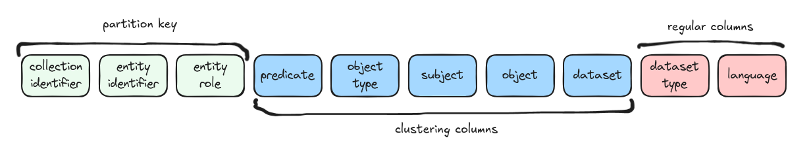
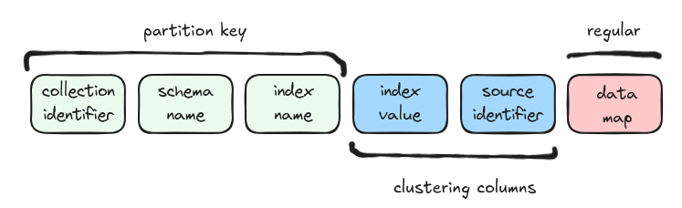

# Storage

TrustGraph uses several storage backends, each chosen for a specific
role.  This page describes what is stored, where, and why.

## Context Graph

The context graph is the central knowledge structure in TrustGraph.
It is stored in the graph store (Cassandra) and contains three named
graphs:

| Named Graph | Purpose |
|-------------|---------|
| *(default)* | **Knowledge graph** — the entities and relationships extracted from documents |
| `urn:graph:source` | **Extraction provenance** — the lineage from source documents through pages and chunks to extracted edges, using the W3C PROV-O vocabulary |
| `urn:graph:retrieval` | **Retrieval explainability** — reasoning traces recorded during GraphRAG, Document RAG, and Agent queries |

All three graphs are queryable through the same interfaces.  This
separation keeps provenance and explainability metadata out of the
knowledge graph used for retrieval, while still making it accessible
for auditing and analysis.  See [Explainability](../explainability/)
for a detailed walkthrough of how these graphs connect.

### Entity-Centric Graph

When Cassandra is used as the graph store, TrustGraph layers an
entity-centric graph schema on top of Cassandra's table model.

The table is partitioned by **collection identifier**, **entity
identifier**, and **entity role** — meaning all triples involving a
given entity in a given collection are co-located on the same
Cassandra partition.  This makes entity-neighbourhood lookups (the
most common graph traversal pattern) fast single-partition reads.

The clustering columns (**predicate**, **object type**, **subject**,
**object**, **dataset**) order the triples within a partition, allowing
efficient range scans over a entity's relationships.  Regular columns
(**dataset type**, **language**) carry additional metadata.

## Graph Embeddings (Qdrant)

Entities from the knowledge graph are embedded into vector space and
stored in Qdrant.  When a GraphRAG query arrives, these embeddings are
used to find semantically similar entities as entry points for graph
traversal.

## Document Embeddings (Qdrant)

Document chunks produced during extraction are independently embedded and
stored in Qdrant.  Document RAG queries use these embeddings to retrieve
the most relevant chunks by semantic similarity, bypassing the knowledge
graph entirely.

## Row Store (Cassandra)

Structured data — tables, rows, and schema-based extractions (XML, JSON,
CSV, tabular data) — is stored in Cassandra's structure store.

The row table is partitioned by **collection identifier**, **schema
name**, and **index name**.  Clustering columns (**index value**,
**source identifier**) allow range queries within an index.  The **data
map** regular column holds the row payload.

Multi-index support means structured extracts can define multiple indexes
per schema without requiring manual Cassandra table modifications.

## Object Store (Librarian)

Large content — source documents, page text, chunk text, question and
answer text — is stored in an S3-compatible object store (Garage) rather
than the graph.  The **librarian** service manages the lifecycle of these
objects: upload (including multipart streaming for large files), metadata
tracking, content retrieval, and deletion.

Graph nodes reference their corresponding object-store content by URI.
This keeps the graph store lean (identifiers and relationships only)
while allowing full content to be fetched on demand.
